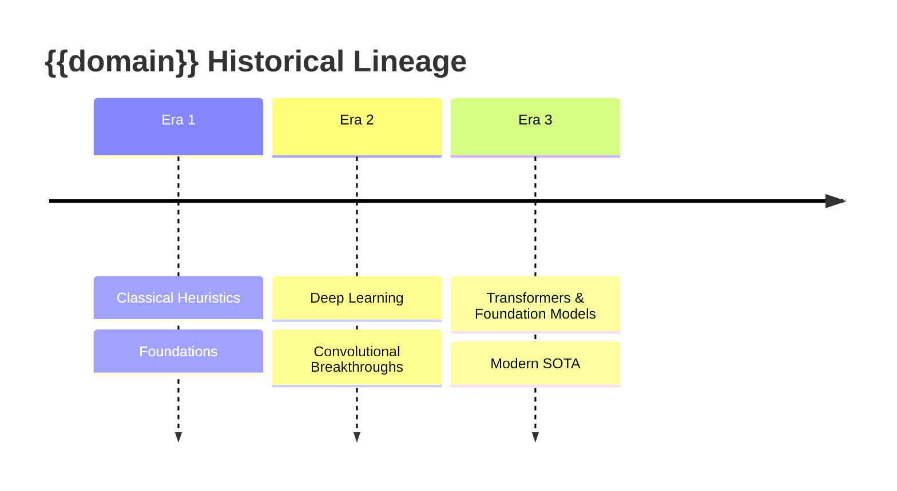
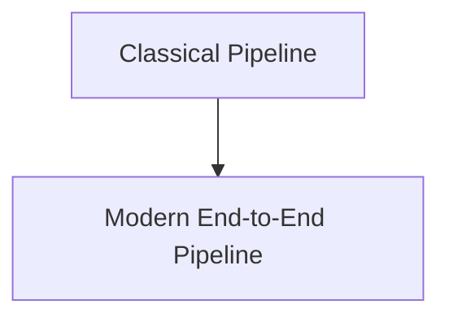

# 📜 {{domain}}: Historical Evolution & Paradigm Shifts

> [!NOTE] Guide Scope
> A didactic guide dissecting how this field transitioned across historical eras: from classical mathematical formulations to deep learning and foundation paradigms. Link back to parent MOC: [[{{domain_path}}/{{domain}}-moc|{{domain}} Map of Content]].

## 1. Timeline of Historical Eras

---

## 2. Deep Paradigm Shifts & Mathematical Transitions

- **Classical Formulations**:
- **The Convolutional & Dense Era**:
- **The Modern Attention / Implicit / Foundation Era**:

> [!WARNING] Paradigm Transition Risks
> Models trained in one paradigm rarely transfer cleanly to another without re-calibration. Beware of implicit assumptions baked into data pipelines (e.g., anchor box priors in YOLO-era pipelines applied to anchor-free DETR derivatives).

---

## 3. Structural Architectural Comparison

| Dimension | Classical Paradigm | First-Gen Deep Learning | Modern SOTA Foundation Paradigm |
| :--- | :--- | :--- | :--- |
| ... | ... | ... | ... |

> [!TIP] Migration Insight
> When porting a classical pipeline to a modern one, isolate pre/post-processing stages first — they account for the majority of latency regressions during migration and are easiest to swap without touching model weights.

---

## 4. Key Papers & Inflection Points

| Year | Paper / System | Paradigm Shift | Venue |
| :--- | :--- | :--- | :--- |
| ... | ... | ... | ... |

> [!NOTE] Paper Curation Note
> Include only papers that caused measurable downstream adoption (follow-up citations, major repo forks, benchmark leaderboard disruption). Avoid including incremental ablation studies here.
