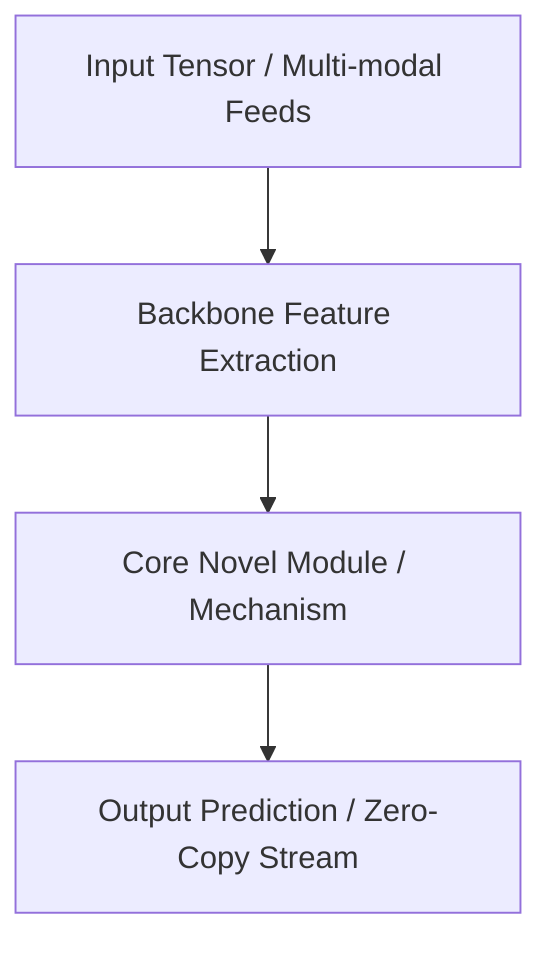

# 🔬 {{title}}

## 1. Executive Brief & Significance
High-level overview: who developed it, why it exists, and the specific failure mode of prior architectures that it resolves.



---

## 2. Core Architectural Mechanics
Deep-dive into the internal mathematics and operator design:
- Mathematical formulation.
- Attention / Convolutional kernel dynamics.
- Loss formulation and training supervision.

---

## 3. Quantitative SOTA Benchmark Profile
| Variant | Benchmark Dataset | Primary Metric | Latency (FP16 ms) | Hardware Profile | NMS / Post-Processing |
| :--- | :--- | :--- | :--- | :--- | :--- |
| ... | ... | ... | ... | ... | ... |

---

## 4. Engineering Implementation & Deployment Recipe
### A. Minimal Reproducible Example
```python
# Verifiable standalone execution snippet
```

### B. Hardware Acceleration & Export (TensorRT / ONNX / Vulkan / FPGA)
```bash
# Export and compilation commands
```

---

## 5. Commercial Readiness & License Audit
- **License**: `{{license}}`
- **Commercial Permissibility**: Closed-source SaaS / Embedded firmware suitability.
- **Copyleft / Trademark Gotchas**:
- **Official Repository**: [{{repo_url}}]({{repo_url}})
