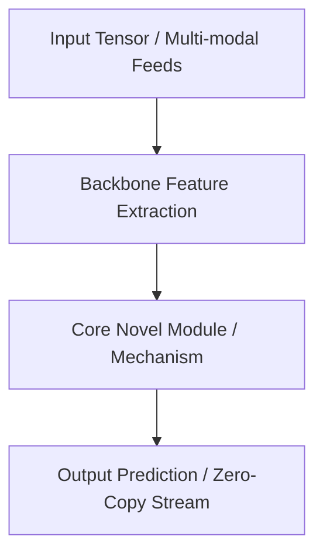

# 🔬 {{title}}

> [!NOTE] Significance
> High-level overview: who developed it, why it exists, and the specific failure mode of prior architectures that it resolves. Link back to parent MOC: [[{{domain_path}}/{{domain}}-moc|{{domain}} Map of Content]].

## 1. Executive Brief & Significance



---

## 2. Core Architectural Mechanics

> [!NOTE] Architecture Deep-Dive
> Document the internal mathematics and operator design precisely. Imprecise descriptions lead to incorrect re-implementations.

- **Mathematical formulation**:
- **Attention / Convolutional kernel dynamics**:
- **Loss formulation and training supervision**:

> [!WARNING] Hardware Constraints
> Note any operations that are non-trivially slow on specific accelerators (e.g., gather/scatter on Jetson, dynamic shapes on TensorRT <8.6, attention with non-contiguous strides).

---

## 3. Quantitative SOTA Benchmark Profile

| Variant | Benchmark Dataset | Primary Metric | Latency (FP16 ms) | Hardware Profile | NMS / Post-Processing |
| :--- | :--- | :--- | :--- | :--- | :--- |
| ... | ... | ... | ... | ... | ... |

> [!WARNING] Benchmark Replication Pitfalls
> Published latency typically excludes pre/post-processing. Re-measure end-to-end on your target hardware with your batch size before committing to a model selection.

---

## 4. Engineering Implementation & Deployment Recipe

### A. Minimal Reproducible Example

```python
# Verifiable standalone execution snippet
```

### B. Hardware Acceleration & Export (TensorRT / ONNX / Vulkan / FPGA)

```bash
# Export and compilation commands
```

> [!TIP] Quantization & Zero-Copy
> Export to ONNX first and validate parity (cosine similarity >0.999) before TensorRT compilation. Use `trt.BuilderFlag.FP16` or `INT8` with a calibration dataset. Allocate output buffers with `cudaMallocHost` and use streams to overlap compute with DMA transfer.

---

## 5. Commercial Readiness & License Audit

> [!WARNING] License Gotchas
> Verify the license of every dependency (backbone weights, loss functions, data augmentation libraries) independently — composite license restrictions apply.

- **License**: `{{license}}`
- **Commercial Permissibility**: Closed-source SaaS / Embedded firmware suitability.
- **Copyleft / Trademark Gotchas**:
- **Official Repository**: [{{repo_url}}]({{repo_url}})
- **Paper**: [{{paper_url}}]({{paper_url}})
