# 🌐 Topics Vault & Domain Playbooks Master MOC

The **Topics Vault** houses comprehensive, production-grade engineering playbooks across 20 distinct computer vision, physical AI, and edge deployment disciplines. Each topic includes historical lineages, mathematical foundations, production pipelines, open research problems, and classical/geometric hybrid methods.

---

## 🗺️ Visual Domain Map

```mermaid
flowchart TD
    classDef topic fill:#1E222A,stroke:#4C566A,stroke-width:1px,color:#ECEFF4;
    classDef sensor fill:#2E3440,stroke:#88C0D0,stroke-width:2px,color:#88C0D0;
    classDef core fill:#2E3440,stroke:#EBCB8B,stroke-width:2px,color:#EBCB8B;
    classDef edge fill:#2E3440,stroke:#A3BE8C,stroke-width:2px,color:#A3BE8C;

    Root["Perception & Physical AI Ecosystem"]:::core

    Root --> Sensory["Sensory Modalities"]:::sensor
    Root --> CoreVision["Core Vision Tasks"]:::core
    Root --> SpatialRobot["Spatial AI & Robotics"]:::core
    Root --> EdgeDeploy["Edge Runtimes & Safety"]:::edge

    Sensory --> T1["LiDAR Perception"]:::sensor
    Sensory --> T2["Active 3D Sensing"]:::sensor
    Sensory --> T3["Thermal & Hyperspectral"]:::sensor
    Sensory --> T4["Neuromorphic Vision"]:::sensor
    Sensory --> T5["Sensor Fusion"]:::sensor

    CoreVision --> T6["Object Detection"]:::core
    CoreVision --> T7["Object Segmentation"]:::core
    CoreVision --> T8["Object Classification"]:::core
    CoreVision --> T9["Video Tracking"]:::core
    CoreVision --> T10["Optical & Scene Flow"]:::core

    SpatialRobot --> T11["6-DoF Pose Estimation"]:::core
    SpatialRobot --> T12["SLAM & Spatial AI"]:::core
    SpatialRobot --> T13["Visual Guidance"]:::core
    SpatialRobot --> T14["VLA & Physical AI"]:::core

    EdgeDeploy --> T15["GPU Deployment"]:::edge
    EdgeDeploy --> T16["FPGA Deployment"]:::edge
    EdgeDeploy --> T17["Real-Time Systems"]:::edge
    EdgeDeploy --> T18["Safety & Verification"]:::edge
    EdgeDeploy --> T19["Data Quality"]:::edge
    EdgeDeploy --> T20["Explainability"]:::edge
```



---

## 📚 Master Directory of the 20 Topic Domains

| # | Domain Topic | Directory Path | Master Topic Hub | Core Engineering Focus |
| :-: | :--- | :--- | :--- | :--- |
| 1 | **Object Detection** | `topics/object-detection/` | [[topics/object-detection/00-object-detection-moc\|Object Detection MOC]] | NMS-free set prediction, anchor-free heads, SAHI tiling, TensorRT engines |
| 2 | **Object Segmentation** | `topics/object-segmentation/` | [[topics/object-segmentation/00-object-segmentation-moc\|Object Segmentation MOC]] | Interactive SAM prompt decoders, bilateral real-time masks, panoptic heads |
| 3 | **Object Classification** | `topics/object-classification/` | [[topics/object-classification/00-object-classification-moc\|Object Classification MOC]] | Self-supervised representations, structural reparameterization, INT8 PTQ |
| 4 | **Video Tracking** | `topics/video-tracking/` | [[topics/video-tracking/00-video-tracking-moc\|Video Tracking MOC]] | Decoupled Kalman association, observation-centric recovery, long-range flow |
| 5 | **6-DoF Pose Estimation** | `topics/6dof-pose-estimation/` | [[topics/6dof-pose-estimation/00-6dof-pose-estimation-moc\|6-DoF Pose Estimation MOC]] | CAD mesh alignment, EPnP solvers, Lie algebra SO(3)/SE(3) optimization |
| 6 | **LiDAR Perception** | `topics/lidar-perception/` | [[topics/lidar-perception/00-lidar-perception-moc\|LiDAR Perception MOC]] | Dynamic hash voxelization, equal-work grouping, point-voxel abstraction |
| 7 | **Sensor Fusion** | `topics/sensor-fusion/` | [[topics/sensor-fusion/00-sensor-fusion-moc\|Sensor Fusion MOC]] | Asynchronous spatial-temporal calibration, BEV pooling, radar-camera fusion |
| 8 | **FPGA Deployment** | `topics/fpga-deployment/` | [[topics/fpga-deployment/00-fpga-deployment-moc\|FPGA Deployment MOC]] | AMD Versal Gen 2 AIE-ML v2, Quark sub-byte quantization, XIR compilers |
| 9 | **GPU Deployment** | `topics/gpu-deployment/` | [[topics/gpu-deployment/00-gpu-deployment-moc\|GPU Deployment MOC]] | TensorRT 10, CUDA Graphs, strongly typed engines, zero-copy pinned VRAM |
| 10 | **Real-Time Systems** | `topics/real-time-systems/` | [[topics/real-time-systems/00-real-time-systems-moc\|Real-Time Systems MOC]] | PREEMPT_RT deterministic kernels, RMS/EDF scheduling, zero-copy lock-free IPC |
| 11 | **SLAM & Spatial Perception** | `topics/slam-and-spatial-perception/` | [[topics/slam-and-spatial-perception/00-slam-and-spatial-perception-moc\|SLAM MOC]] | 3D Gaussian Splatting, dense bundle adjustment, loop closure verification |
| 12 | **Visual Guidance & Robotics** | `topics/visual-guidance-and-robotics/` | [[topics/visual-guidance-and-robotics/00-visual-guidance-and-robotics-moc\|Visual Guidance MOC]] | Eye-in-hand visual servoing (PBVS/IBVS), interaction matrices, robotic arms |
| 13 | **Active 3D Sensing** | `topics/active-3d-sensing-and-structured-light/` | [[topics/active-3d-sensing-and-structured-light/00-active-3d-sensing-and-structured-light-moc\|Active 3D Sensing MOC]] | Phase-shifting fringe projection, multi-frequency phase unwrapping, ToF |
| 14 | **Optical & Scene Flow** | `topics/optical-and-scene-flow-perception/` | [[topics/optical-and-scene-flow-perception/00-optical-and-scene-flow-perception-moc\|Optical Flow MOC]] | 4D all-pairs correlation pyramids, iterative GRU updates, 3D scene flow |
| 15 | **VLA & Physical AI Robotics**| `topics/vla-and-physical-ai-robotics/` | [[topics/vla-and-physical-ai-robotics/00-vla-and-physical-ai-robotics-moc\|VLA Robotics MOC]] | Flow-matching diffusion policies, continuous action chunking, Open X-Embodiment |
| 16 | **Thermal & Hyperspectral** | `topics/thermal-and-hyperspectral-vision/` | [[topics/thermal-and-hyperspectral-vision/00-thermal-and-hyperspectral-vision-moc\|Thermal Vision MOC]] | LWIR radiometric temperature recovery, spectral unmixing, multimodal fusion |
| 17 | **Event-Based Neuromorphic** | `topics/event-based-neuromorphic-vision/` | [[topics/event-based-neuromorphic-vision/00-event-based-neuromorphic-vision-moc\|Neuromorphic Vision MOC]] | Asynchronous microsecond events, spatio-temporal event surfaces, low-power |
| 18 | **Explainability & Interpretability**| `topics/explainability-and-interpretability/` | [[topics/explainability-and-interpretability/00-explainability-and-interpretability-moc\|Explainability MOC]] | Concept Bottleneck Models, mechanistic interpretability, attribution maps |
| 19 | **Safety & Verification** | `topics/safety-verification-and-robustness/` | [[topics/safety-verification-and-robustness/00-safety-verification-and-robustness-moc\|Safety Verification MOC]] | Alpha-Beta-CROWN formal bounds, Control Barrier Functions (CBF-QP), Sim2Real |
| 20 | **Data Quality & Verification** | `topics/data-quality-and-verification/` | [[topics/data-quality-and-verification/00-data-quality-and-verification-moc\|Data Quality MOC]] | Confident learning, label noise auditing, out-of-distribution detection |

---

## 🔍 Dataview Dynamic Query

```dataview
TABLE domain AS "Perception Domain", updated AS "Last Verified", tags AS "Tags"
FROM "topics"
WHERE file.name = "README"
SORT file.folder ASC
```
