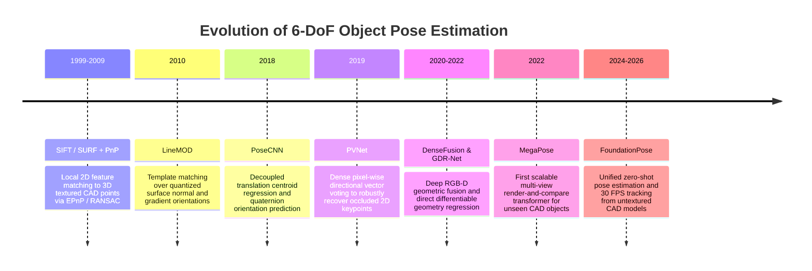
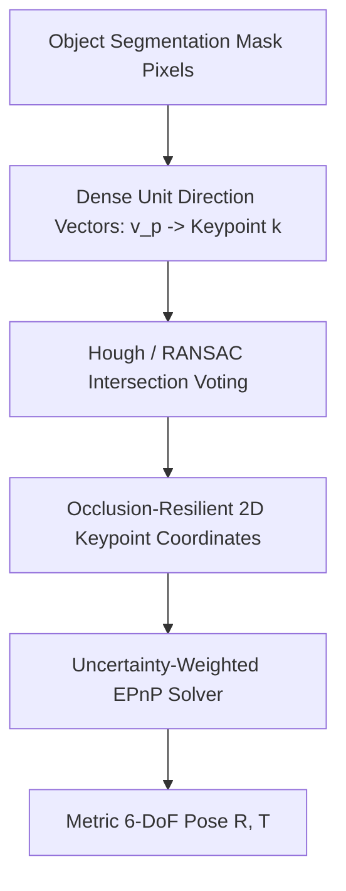

# 📜 6-DoF Pose Estimation: Historical Evolution & Paradigms

A didactic guide charting the mathematical and architectural journey of estimating 3D translation ($X, Y, Z$) and 3D rotation ($R \in SO(3)$): from classical hand-crafted 3D point features and PnP solvers to deep vector field voting, differentiable render-and-compare, and zero-shot foundation models.

Related notes: [[topics/6dof-pose-estimation/00-6dof-pose-estimation-moc|6-DoF Pose Estimation MOC]], [[topics/sensor-fusion/00-sensor-fusion-moc|Sensor Fusion MOC]].

---

## 1. Evolution Timeline: From SIFT-PnP to Foundation 3D Transformers

---

## 2. Core Paradigm Breakthroughs Explained

### Breakthrough A: Classical Perspective-n-Point (PnP) Formulation
Given $N \ge 3$ calibrated 3D object coordinate points $P_i = [X_i, Y_i, Z_i]^T$ and their observed 2D perspective projections $p_i = [u_i, v_i]^T$, PnP solves the exterior orientation transformation $[R \mid T]$ that minimizes reprojection error:
$$\min_{R \in SO(3), T \in \mathbb{R}^3} \sum_{i=1}^N \left\| p_i - \pi(K (R P_i + T)) \right\|^2$$
- **Limitation**: Classic keypoint detectors (SIFT/ORB) fail completely on textureless metallic parts, shiny injection-molded plastics, and severe occlusions.

---

### Breakthrough B: Vector-Field Keypoint Voting (PVNet, 2019)
Directly regressing 2D keypoint coordinates $(u, v)$ with a CNN fails when the keypoint is occluded behind another object. PVNet forces every pixel belonging to the object to predict a 2D unit vector pointing towards the true 3D keypoint location:

---

### Breakthrough C: The Render-and-Compare Paradigm (MegaPose & FoundationPose)
Direct neural network regression of 3D rotations from a single image struggles with millimeter-level robotic tolerances. Modern foundation models use an iterative feedback loop:
1. **Pose Initialization**: Predict a coarse initial hypothesis $[R_0 \mid T_0]$.
2. **GPU Rendering**: Differentiably render a synthetic view of the 3D CAD mesh under hypothesis $[R_k \mid T_k]$.
3. **Discrepancy Network**: Compare the rendered synthetic image against the actual physical sensor RGB-D observation.
4. **Iterative Refinement**: Predict a residual update $\Delta R \in SO(3), \Delta T \in \mathbb{R}^3$ until convergence.
