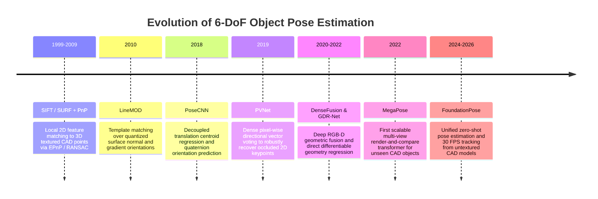
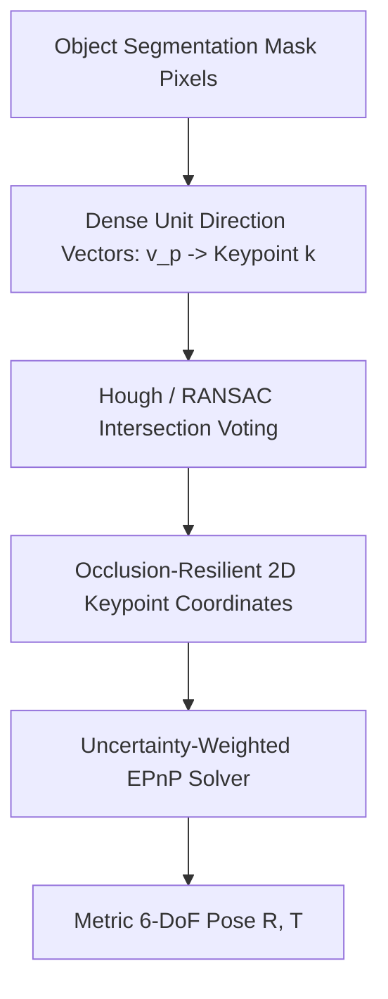
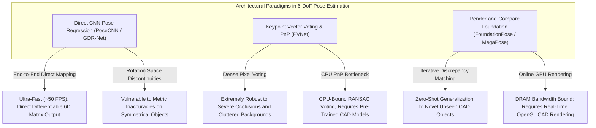

# 📜 6-DoF Pose Estimation: Historical Evolution & Paradigms

A didactic guide charting the mathematical and architectural journey of estimating 3D translation ($X, Y, Z$) and 3D rotation ($R \in SO(3)$): from classical hand-crafted 3D point features and PnP solvers to deep vector field voting, differentiable render-and-compare, and zero-shot foundation models.

Related notes: [[topics/6dof-pose-estimation/00-6dof-pose-estimation-moc|6-DoF Pose Estimation MOC]], [[topics/sensor-fusion/00-sensor-fusion-moc|Sensor Fusion MOC]].

---

## 1. Evolution Timeline: From SIFT-PnP to Foundation 3D Transformers

---

## 2. Core Paradigm Breakthroughs Explained

### Breakthrough A: Classical Perspective-n-Point (PnP) Formulation
Given $N \ge 3$ calibrated 3D object coordinate points $P_i = [X_i, Y_i, Z_i]^T$ and their observed 2D perspective projections $p_i = [u_i, v_i]^T$, PnP solves the exterior orientation transformation $[R \mid T]$ that minimizes reprojection error:
$$\min_{R \in SO(3), T \in \mathbb{R}^3} \sum_{i=1}^N \left\| p_i - \pi(K (R P_i + T)) \right\|^2$$
- **Limitation**: Classic keypoint detectors (SIFT/ORB) fail completely on textureless metallic parts, shiny injection-molded plastics, and severe occlusions.

---

### Breakthrough B: Vector-Field Keypoint Voting (PVNet, 2019)
Directly regressing 2D keypoint coordinates $(u, v)$ with a CNN fails when the keypoint is occluded behind another object. PVNet forces every pixel belonging to the object to predict a 2D unit vector pointing towards the true 3D keypoint location:

---

### Breakthrough C: The Render-and-Compare Paradigm (MegaPose & FoundationPose)
Direct neural network regression of 3D rotations from a single image struggles with millimeter-level robotic tolerances. Modern foundation models use an iterative feedback loop:
1. **Pose Initialization**: Predict a coarse initial hypothesis $[R_0 \mid T_0]$.
2. **GPU Rendering**: Differentiably render a synthetic view of the 3D CAD mesh under hypothesis $[R_k \mid T_k]$.
3. **Discrepancy Network**: Compare the rendered synthetic image against the actual physical sensor RGB-D observation.
4. **Iterative Refinement**: Predict a residual update $\Delta R \in SO(3), \Delta T \in \mathbb{R}^3$ until convergence.

---

## 3. Intensive Architectural Taxonomy: Convolutional vs Transformer vs Hybrid Sub-Modules

Estimating metric 6-DoF object poses ($R \in SO(3), T \in \mathbb{R}^3$) has progressed from direct CNN regression of discontinuous quaternion spaces to dense vector voting PnP geometry, hybrid RGB-D point cloud fusion, and foundation render-and-compare transformer refinement loops.

### Comparative Sub-Module Architectural Matrix

| Model Name & Year | Architectural Paradigm | Backbone Sub-Module | Neck / Feature Aggregator | Encoder Sub-Module | Decoder / Head Sub-Module | Primary Bottleneck & Edge Suitability |
| :--- | :--- | :--- | :--- | :--- | :--- | :--- |
| **PoseCNN** (2018) | Pure ConvNet | VGG-16 / ResNet-50 Convolutional Stages | Multi-Scale Feature Extraction (Concatenation of Conv4 and Conv5) | Standard $3\times3$ Convolutional Layers with ReLU | 3-Branch Decoupled Head: Semantic Segmentation Mask + 3D Centroid Regression + 4D Quaternion ($SO(3)$) Regression | **Compute & Topology Bound**: Direct quaternion regression suffers from $SO(3)$ antipodal representation discontinuities ($q \equiv -q$); requires post-processing ICP for precision. |
| **PVNet** (2019) | Pure ConvNet | ResNet-18 Hierarchical Convolutional Backbone | Feature Pyramid Network (FPN) with top-down skip connections | Standard Convolutional Residual Blocks | Dense Unit Direction Vector Head ($2K$ channels for $K=8$ keypoints) + Hough / RANSAC Voting + Uncertainty EPnP Solver | **CPU RANSAC Bound**: Highly robust to heavy occlusion and truncation; inference is real-time (~25–40 FPS), but bottlenecked by CPU Hough voting for keypoint hypothesis accumulation. |
| **DenseFusion** (2019) | Hybrid 2D-3D ConvNet | Dual Backbone: ResNet-18 (RGB) + PointNet-like Point MLP (Depth Cloud) | Dense Pixel-to-Point Cross-Modal Feature Embedding Layer | Convolutional and Point-Wise Shared MLPs with Color-Geometry Fusion | Per-Point 6-DoF Pose Hypothesis Regression + Confidence Scoring Head + Iterative Refinement Network | **Memory Bandwidth Bound**: Direct RGB-D fusion at every pixel/point; real-time execution (~50 FPS); well-suited for embedded robotic arms with depth cameras. |
| **GDR-Net** (2021) | Pure / Hybrid ConvNet | ResNet-34 / ConvNeXt Backbone | Multi-Scale Feature Aggregator with Bi-directional connections | Convolutional Residual Blocks | Surface Region & Dense Coordinate Head (Dense Correspondence Map $M_{2D\text{-}3D}$) + Patch-PnP Differentiable Solver | **Compute & Edge Friendly**: End-to-end differentiable geometric estimation; eliminates external non-differentiable PnP solvers; runs at >30 FPS on embedded edge GPUs. |
| **CosyPose** (2020) | Pure ConvNet | ResNet-50 Feature Extractor on multi-view image crops | Multi-Scale RoI Pooling Neck | Convolutional Residual Stages with LayerNorm | Iterative Render-and-Compare Refiner: Predicts $\Delta R \in SO(3)$ (using continuous 6D rotation representation) and $\Delta T$ | **Rendering Latency Bound**: High multi-object precision across scenes; bottlenecked by external GPU OpenGL/Vulkan synthetic mesh rendering per object iteration. |
| **MegaPose** (2022) | Hybrid Conv-Transformer | Dual ResNet-50 / ConvNeXt Encoders (Sensor Observation + Rendered Hypothesis) | Feature Concatenation + Multi-Head Cross-Attention Bridge | Convolutional Feature Extraction + Cross-View Transformer Layers | Coarse Hypothesis Classifier Head + Iterative 6D Continuous Pose Refinement Network | **Compute & VRAM Bound**: First scalable zero-shot CAD model pose estimator; requires rendering CAD models at runtime; high VRAM footprint during multi-view batching. |
| **FoundationPose** (2024–2026) | Foundation ViT + Hybrid Transformer | Vision Foundation Transformer (DINOv2 Isotropic Patch14 Backbone) + ConvNeXt-Large | Multi-Scale Cross-Attention Feature Aggregator | DINOv2 Self-Attention Blocks + Geometry-Aware Cross-Modal Fusion | Unified Dual-Head: Contrastive Neural Evaluation Score Head + Iterative 6-DoF Displacement Refiner (30 FPS Tracking Mode) | **DRAM Bandwidth & Rendering Bound**: State-of-the-art zero-shot pose estimation and tracking on unseen CAD models; model size (~1.2B params) demands modern edge GPUs (Jetson Orin). |
| **ZePHyR** (2021) | Pure Geometric / Conv Hybrid | Lightweight ResNet Feature Extractor | Surface Normal and Point-Pair Feature Aggregator | Sparse Geometric Scoring Layers | Hypothesis Filter Network scoring Candidate Poses against Point Cloud Observations | **CPU / Search Bound**: Fast candidate hypothesis generation; bottlenecked by dense surface normal scoring in cluttered scenes with reflective metals. |

### Didactic Architectural Trade-Off Analysis

#### 1. Direct Rotation Regression vs. 2D-3D Keypoint Geometry (PnP)
- **Direct SO(3) Parameterization Issues**: Early networks directly regressed 4D unit quaternions $\mathbf{q} = [w, x, y, z]^T$ or 3D Euler angles. However, as proved by Zhou et al. (2019), any continuous rotation representation in $\mathbb{R}^n$ for $n \le 4$ contains topological discontinuities where small changes in object orientation cause discontinuous jumps in target parameter space. Modern regression networks adopt the **continuous 6D rotation representation**:
  $$R = f([\mathbf{a}_1, \mathbf{a}_2]) = \left[ \frac{\mathbf{a}_1}{\|\mathbf{a}_1\|}, \; \frac{\mathbf{a}_2 - (\mathbf{b}_1^T \mathbf{a}_2)\mathbf{b}_1}{\|\mathbf{a}_2 - (\mathbf{b}_1^T \mathbf{a}_2)\mathbf{b}_1\|}, \; \mathbf{b}_1 \times \mathbf{b}_2 \right] \in SO(3)$$
  which enforces a smooth mapping across the entire $SO(3)$ manifold.
- **Dense Keypoint Voting (PVNet)** bypasses rotation parameterization entirely by predicting 2D unit vector fields $\mathbf{v}_k(p)$ pointing to $K$ predefined 3D CAD keypoints. Even when 80% of an object is occluded, unoccluded surface pixels vote for the hidden keypoint locations with high confidence, after which an uncertainty-weighted EPnP solver deterministically computes the metric pose $[R \mid T]$.

#### 2. Object-Specific CAD Training vs. Zero-Shot Foundation Models
- **Object-Specific Models (PVNet, DenseFusion)** require retraining network weights for every new industrial part or household object.
- **Zero-Shot Foundation Architectures (MegaPose, FoundationPose)** accept arbitrary untextured CAD meshes at test time. By passing both the physical RGB-D camera observation and a real-time GPU-rendered hypothesis of the CAD model through large foundation vision transformers (DINOv2), cross-attention layers directly compute feature discrepancies to drive iterative $\Delta R, \Delta T$ gradient updates.

#### 3. Computational Bottlenecks on Embedded Robotics
- **Online Differentiable Rendering**: Foundation models require rendering synthetic views of CAD models during the inference loop (typically 3–5 refinement iterations per object). On embedded robot compute units (e.g. Jetson AGX Orin), GPU-to-CPU texture buffer synchronization and rasterization overhead can consume up to 40% of total frame latency.
- **Quantization in Geometric Matching**: While the feature extraction backbones can be quantized to INT8, the final iterative pose update heads and PnP covariance matrices must remain in FP32 to avoid millimeter-level robotic grasping drift.

