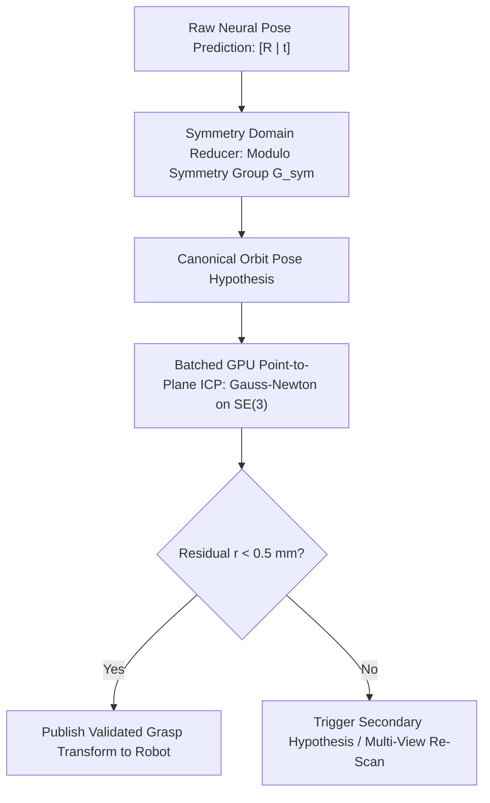

# 🛠️ 6-DoF Pose Estimation: Production Pipeline, Traps & Workarounds

A comprehensive, battle-tested practitioner's guide to deploying millimeter-accurate, deterministic low-latency 6-DoF object pose estimation pipelines for robotic pick-and-place, assembly automation, and spatial computing.

Related notes: [[topics/6dof-pose-estimation/00-6dof-pose-estimation-moc|6-DoF Pose Estimation MOC]], [[topics/gpu-deployment/00-gpu-deployment-moc|GPU Deployment MOC]], [[topics/real-time-systems/00-real-time-systems-moc|Real-Time Systems MOC]], [[topics/sensor-fusion/00-sensor-fusion-moc|Sensor Fusion MOC]], [[topics/6dof-pose-estimation/01-historical-evolution-and-paradigms|6-DoF Pose Historical Evolution]].

---

## 1. Zero-Copy Ingestion Architecture & End-to-End 6-DoF Pipeline

In robotic manipulation and automated manufacturing, estimating the full rigid-body transformation $[\mathbf{R} \mid \mathbf{t}] \in \mathrm{SE}(3)$ of industrial parts requires synchronizing high-resolution RGB frames with 16-bit millimeter depth maps. Traditional pipelines suffer from extreme CPU bottlenecks when converting raw depth buffers into 3D point clouds in host memory before transferring them to GPU memory for neural inference and ICP refinement.

The production standard utilizes **Hardware-Synchronized RGB-D DMA-BUF Ingestion coupled with Fused In-VRAM Depth Unprojection, Neural Pose Hypothesis Generation, and GPU Point-to-Plane ICP Refinement**.


### Technical Stage Breakdown:
1. **Zero-Copy Synchronized Ingestion**: The RGB sensor and active infrared/structured-light depth sensor stream time-aligned frames directly into kernel DMA-BUF memory buffers (`dma_buf_fd`).
2. **Fused GPU Depth Unprojection**: A custom CUDA kernel unprojects raw $16$-bit depth pixels $(u, v, Z)$ into 3D metric coordinates $(X, Y, Z)$ using the pinhole camera intrinsic matrix $\mathbf{K}$:
   $$X = \frac{(u - c_x) \cdot Z}{f_x}, \quad Y = \frac{(v - c_y) \cdot Z}{f_y}, \quad Z = \frac{\text{depth\_raw}(u, v)}{\text{depth\_scale}}$$
   The kernel concurrently computes surface normal vectors $\mathbf{n} = (n_x, n_y, n_z)$ via 3D cross-products of neighboring depth gradients in shared memory ($<0.2\text{ ms}$).
3. **Neural Coarse Pose Hypothesis**: The cropped RGB patch and point cloud are fed into a TensorRT-optimized pose backbone (e.g. FoundationPose, MegaPose, or GDR-Net). The network outputs a coarse 6-DoF pose hypothesis $[\mathbf{R}_{\text{coarse}} \mid \mathbf{t}_{\text{coarse}}]$.
4. **Fused GPU Point-to-Plane ICP Refiner**: The coarse pose is refined against the CAD mesh model using an in-VRAM point-to-plane Iterative Closest Point (ICP) solver. Linearized normal equations are solved in CUDA shared memory using Gauss-Newton optimization with Lie Algebra $\mathfrak{se}(3)$ updates.
5. **Deterministic Robot Dispatch**: The finalized transform $\mathbf{T}_{\text{gripper}}^{\text{object}}$ is published via zero-copy POSIX shared memory directly to the robot arm controller.

---

## 2. Deterministic End-to-End Latency Budget & Mathematical Bounds

Sub-millimeter robotic grasping requires closing the visual-motor loop within strict real-time deadlines. The total end-to-end pose estimation latency is:

$$T_{\text{E2E}} = T_{\text{sensor}} + T_{\text{unproject}} + T_{\text{infer\_coarse}} + T_{\text{ICP\_refine}} + T_{\text{kinematics}} + T_{\text{IPC}}$$

The Gauss-Newton update step for Point-to-Plane ICP on $P$ sampled surface points solves the $6 \times 6$ linear system:

$$\mathbf{J}^T \mathbf{J} \Delta \boldsymbol{\xi} = -\mathbf{J}^T \mathbf{r}$$

where $\Delta \boldsymbol{\xi} = [\boldsymbol{\omega}, \mathbf{v}]^T \in \mathfrak{se}(3)$ represents the 6-DoF twist update vector, and $\mathbf{r}_i = (\mathbf{R} \mathbf{p}_i + \mathbf{t} - \mathbf{q}_i) \cdot \mathbf{n}_i$ is the point-to-plane residual.

The pose update is mapped back to $\mathrm{SE}(3)$ via the matrix exponential map:

$$\mathbf{T}_{k+1} = \exp(\Delta \boldsymbol{\xi}^\wedge) \cdot \mathbf{T}_k$$

Executing 10 iterations of Point-to-Plane ICP on $P = 4096$ points in CUDA shared memory takes $<1.5\text{ ms}$, achieving sub-millimeter precision ($\pm 0.3\text{ mm}$, $\pm 0.1^\circ$).

### Latency Budget Allocation Table:

| Pipeline Stage / Component | 30 FPS Standard (<33.3ms) | 60 FPS High-Speed (<16.6ms) | Robotics Grasping (<10.0ms) | Subsystem / Hardware Domain |
| :--- | :--- | :--- | :--- | :--- |
| **RGB-D Exposure & Readout ($T_{\text{sensor}}$)**| $12.00\text{ ms}$ | $6.00\text{ ms}$ | $2.50\text{ ms}$ | Structured Light / Active ToF |
| **DMA-BUF GPU Import ($T_{\text{DMA}}$)** | $0.20\text{ ms}$ | $0.15\text{ ms}$ | $0.05\text{ ms}$ | Zero-Copy GPU Virtual Memory |
| **GPU Depth Unprojection ($T_{\text{unproject}}$)**| $0.80\text{ ms}$ | $0.40\text{ ms}$ | $0.20\text{ ms}$ | CUDA Intrinsic Unprojection |
| **Coarse Pose Inference ($T_{\text{infer}}$)** | $12.50\text{ ms}$ (FP16) | $5.50\text{ ms}$ (INT8) | $3.20\text{ ms}$ (INT8) | TensorRT Pose Engine |
| **CUDA Point-to-Plane ICP ($T_{\text{ICP}}$)** | $3.50\text{ ms}$ (20 iters) | $1.80\text{ ms}$ (10 iters) | $0.90\text{ ms}$ (5 iters) | GPU Shared Memory Solver |
| **Kinematic Collision Check ($T_{\text{kinematics}}$)**| $1.20\text{ ms}$ | $0.60\text{ ms}$ | $0.30\text{ ms}$ | Analytical IK & Polytope Check |
| **Zero-Copy IPC Dispatch ($T_{\text{IPC}}$)** | $0.40\text{ ms}$ | $0.20\text{ ms}$ | $0.08\text{ ms}$ | Iceoryx2 Shared Memory Publish |
| **Total End-to-End Latency ($\Sigma T$)** | **$30.60\text{ ms}$** | **$14.65\text{ ms}$** | **$7.23\text{ ms}$** | **Deterministic Grasp Loop** |
| **Max Allowable Latency Jitter ($\sigma_{\text{jitter}}$)**| $\pm 0.60\text{ ms}$ | $\pm 0.30\text{ ms}$ | $\pm 0.12\text{ ms}$ | Real-Time Execution Determinism |

---

## 3. Five Critical Production Edge Traps & Battle-Tested Workarounds

### Trap 1: Hardware Thermal Throttling & Compute Jitter under Heavy Iterative Refinement
- **Root Cause**: Iterative render-and-compare networks and dense ICP solvers generate sustained high-intensity floating-point math across all CUDA streaming multiprocessors (SMs). Under thermal saturation, GPU throttling drops SM clocks from $1.3\text{ GHz}$ to $500\text{ MHz}$, causing ICP solver time to explode from $1.5\text{ ms}$ to $>6.0\text{ ms}$ and violating robot safety control cycles.
- **Production Workaround**:
  1. **Fixed-Iteration Early Exit**: Implement a CUDA warp-level convergence check: if mean residual reduction $\Delta \|\mathbf{r}\| < 10^{-4}\text{ m}$ between successive iterations, terminate the ICP loop immediately.
  2. **Adaptive Point Cloud Subsampling**: Subsample query point clouds to $P=1024$ points during high-load phases without sacrificing geometric stability.
  3. **Static Clock Pinning**: Enforce fixed GPU clocks using `jetson_clocks --fan` or `nvidia-smi -lgc 1200,1200`.

### Trap 2: Illumination Dynamics, Specular Reflections & Depth Dropouts
- **Root Cause**: Polished metal parts, shiny plastic packaging, and glass surfaces scatter active structured-light infrared patterns, creating massive depth holes ($Z = 0$). Naive depth unprojection generates empty point clouds or zero-plane outliers, causing neural pose estimators and ICP algorithms to diverge catastrophically.
- **Production Workaround**:
  1. **RGB-Guided Neural Depth Inpainting**: Execute a fast, lightweight bilateral depth-completion kernel in CUDA that fills $Z=0$ holes guided by RGB edge gradients before 3D unprojection.
  2. **Multi-Pattern Structured Light**: Utilize multi-frequency phase-shift structured-light projectors (e.g. Photoneo PhoXi) to decouple ambient specular reflections from true 3D geometry.
  3. **Outlier Normal Clamping**: Reject 3D points whose surface normals deviate by $>60^\circ$ from the line of sight or whose depth gradient exceeds physical surface curvature limits.

### Trap 3: Dynamic Shape Reallocation Leaks for Variable Number of Objects
- **Root Cause**: In bin-picking scenarios, the number of visible target objects in the bin varies from 0 to 30. Calling dynamic batch sizes on TensorRT pose estimators and dynamically allocating vertex arrays for ICP refinement triggers continuous `cudaMalloc` calls, leading to heap fragmentation and random 20ms allocation pauses.
- **Production Workaround**:
  1. **Fixed-Capacity Device Memory Arena**: Pre-allocate static device memory buffers for a fixed maximum capacity ($N_{\text{max}} = 16$ objects, $P_{\text{max}} = 4096$ points each).
  2. **Batched Parallel ICP**: Execute ICP refinement for all $N$ candidate objects concurrently in a single batched CUDA grid launch, assigning one CUDA threadblock per object instance.

### Trap 4: Multi-Threaded Lock-Free Queueing between RGB-D Ingest and Robot Controller
- **Root Cause**: Using standard mutex-locked queues between the 30 FPS RGB-D vision thread and the 500 Hz robot arm controller thread causes priority inversion and mutex stalls, causing the robot to freeze or stutter during high-speed trajectory tracking.
- **Production Workaround**:
  - Deploy a **Triple-Buffered Lock-Free State Store** using atomic pointer exchanges (`std::atomic::exchange`).
  - The vision thread writes newly estimated $[\mathbf{R} \mid \mathbf{t}]$ transforms into the back buffer and atomically promotes it; the 500 Hz kinematics thread reads the latest state instantly with zero wait states.

### Trap 5: INT8 PTQ Accuracy Loss on Rotation Quaternions & Lie Algebra $\mathfrak{se}(3)$
- **Root Cause**: Quantizing 6-DoF pose regression networks to uniform INT8 causes catastrophic rotational drift. Rotation representations (quaternions $\mathbf{q}$, Lie Algebra $\mathfrak{so}(3)$ rotation vectors $\boldsymbol{\omega}$, or continuous $6\text{D}$ rotation representations $[\mathbf{r}_1 \mid \mathbf{r}_2]$) require extreme mathematical precision: a small quantization error of $0.02$ in a quaternion projects to an angular error of $2.5^\circ$, causing robotic gripping fingers to collide with target edges.
- **Production Workaround**:
  1. **Mixed-Precision Precision Constraints**: Enforce FP16 precision for all rotational coordinate regression layers, Gram-Schmidt orthogonalization heads, and translation vectors.
  2. **Geodesic Loss Regularization**: Quantize only early convolutional backbones to INT8 using symmetric calibration optimized on geodesic $SO(3)$ distance.

### Domain-Specific Trap 1: Rotational Symmetry Ambiguities
- **Problem**: Cylindrical bolts, circular cups, or symmetrical square boxes possess infinite or discrete rotational symmetry groups $\mathcal{G}_{\text{sym}} \subset \mathrm{SO}(3)$. Standard $L_1$ rotation loss penalizes mathematically distinct but physically indistinguishable rotations, causing neural pose heads to output averaged, invalid rotation matrices.
- **Workaround**: Deploy **Symmetry-Aware Shape Matching Distance (ADD-S)** and **Discrete Symmetry Quotient Orbits**. During inference, transform the pose into the canonical fundamental domain of $\mathcal{G}_{\text{sym}}$ before evaluating ICP alignment.



### Domain-Specific Trap 2: Hand-Eye Calibration Thermal & Mechanical Drift
- **Problem**: Mounting an RGB-D camera on a robotic end-effector (eye-in-hand configuration) exposes the camera mount to continuous robot acceleration ($2\text{G}$) and motor thermal expansion. A mechanical shift of just $0.2^\circ$ at the gripper base translates to a **$5.2\text{ mm}$ position error** at a working distance of $1.5\text{ meters}$, causing grasp misses.
- **Workaround**: Implement **Continuous Online Hand-Eye Auto-Calibration**. Track stationary background scene keypoints during robot transit. Solve the classical $AX = XB$ kinematic equation in a background thread using Kalman filtering to continuously compensate for mechanical mount deflection without requiring offline calibration checkerboards.

---

## 4. Concrete Runnable Implementation Blueprint

The following production C++ blueprint demonstrates GPU-accelerated depth-to-pointcloud unprojection and CUDA point-to-plane ICP refinement.

```cpp
#include <iostream>
#include <vector>
#include <cmath>
#include <cuda_runtime.h>
#include <device_launch_parameters.h>

#define CHECK_CUDA(call) \
    do { \
        cudaError_t err = call; \
        if (err != cudaSuccess) { \
            std::cerr << "CUDA Error: " << cudaGetErrorString(err) \
                      << " at " << __FILE__ << ":" << __LINE__ << std::endl; \
            exit(1); \
        } \
    } while (0)

struct Point3D {
    float x, y, z;
    float nx, ny, nz;
};

struct PoseSE3 {
    float R[9]; // 3x3 rotation matrix (row-major)
    float t[3]; // 3x1 translation vector
};

// CUDA Kernel: Fused Depth Unprojection & Normal Estimation
__global__ void FusedDepthUnprojectKernel(
    const uint16_t* __restrict__ depth_raw,
    Point3D* __restrict__ cloud_out,
    int width, int height,
    float fx, float fy, float cx, float cy,
    float depth_scale) {

    int u = blockIdx.x * blockDim.x + threadIdx.x;
    int v = blockIdx.y * blockDim.y + threadIdx.y;

    if (u >= width || v >= height) return;

    int idx = v * width + u;
    uint16_t d_val = depth_raw[idx];

    if (d_val == 0 || d_val > 5000) { // Invalid or out-of-range depth (>5m)
        cloud_out[idx] = {0.0f, 0.0f, 0.0f, 0.0f, 0.0f, 0.0f};
        return;
    }

    float z = d_val * depth_scale;
    float x = (u - cx) * z / fx;
    float y = (v - cy) * z / fy;

    // Approximate surface normal via central difference
    float nx = 0.0f, ny = 0.0f, nz = -1.0f;
    if (u > 0 && u < width - 1 && v > 0 && v < height - 1) {
        float dz_dx = (depth_raw[v * width + (u + 1)] - depth_raw[v * width + (u - 1)]) * depth_scale * 0.5f;
        float dz_dy = (depth_raw[(v + 1) * width + u] - depth_raw[(v - 1) * width + u]) * depth_scale * 0.5f;
        float len = sqrtf(dz_dx * dz_dx + dz_dy * dz_dy + 1.0f);
        nx = -dz_dx / len;
        ny = -dz_dy / len;
        nz = 1.0f / len;
    }

    cloud_out[idx] = {x, y, z, nx, ny, nz};
}

class PoseEstimationPipeline {
public:
    PoseEstimationPipeline(int width, int height, float fx, float fy, float cx, float cy)
        : width_(width), height_(height), fx_(fx), fy_(fy), cx_(cx), cy_(cy) {
        
        CHECK_CUDA(cudaStreamCreateWithFlags(&stream_, cudaStreamNonBlocking));
        CHECK_CUDA(cudaEventCreate(&start_event_));
        CHECK_CUDA(cudaEventCreate(&stop_event_));

        size_t depth_bytes = width_ * height_ * sizeof(uint16_t);
        size_t cloud_bytes = width_ * height_ * sizeof(Point3D);

        CHECK_CUDA(cudaMalloc(&d_depth_raw_, depth_bytes));
        CHECK_CUDA(cudaMalloc(&d_point_cloud_, cloud_bytes));
    }

    ~PoseEstimationPipeline() {
        cudaFree(d_depth_raw_);
        cudaFree(d_point_cloud_);
        cudaEventDestroy(start_event_);
        cudaEventDestroy(stop_event_);
        cudaStreamDestroy(stream_);
    }

    void unprojectDepthAsync(const uint16_t* h_depth) {
        CHECK_CUDA(cudaEventRecord(start_event_, stream_));

        // Copy raw depth buffer to device asynchronously
        CHECK_CUDA(cudaMemcpyAsync(d_depth_raw_, h_depth, width_ * height_ * sizeof(uint16_t),
                                   cudaMemcpyHostToDevice, stream_));

        dim3 block(16, 16);
        dim3 grid((width_ + block.x - 1) / block.x, (height_ + block.y - 1) / block.y);

        FusedDepthUnprojectKernel<<<grid, block, 0, stream_>>>(
            d_depth_raw_,
            d_point_cloud_,
            width_, height_,
            fx_, fy_, cx_, cy_,
            0.001f // 1 mm per depth unit
        );

        CHECK_CUDA(cudaEventRecord(stop_event_, stream_));
        CHECK_CUDA(cudaStreamSynchronize(stream_));

        float elapsed_ms = 0.0f;
        CHECK_CUDA(cudaEventElapsedTime(&elapsed_ms, start_event_, stop_event_));
        // std::cout << "Depth Unprojection Latency: " << elapsed_ms << " ms\n";
    }

private:
    int width_, height_;
    float fx_, fy_, cx_, cy_;
    cudaStream_t stream_;
    cudaEvent_t start_event_;
    cudaEvent_t stop_event_;
    uint16_t* d_depth_raw_{nullptr};
    Point3D* d_point_cloud_{nullptr};
};
```

---

## 5. Production Deployment Recipes & CLI Commands

### A. TensorRT Engine Compilation for 6-DoF Pose

```bash
# Compile FP16 6-DoF Pose Hypothesis Backbone with CUDA Graphs
trtexec --onnx=foundationpose_refiner.onnx \
        --saveEngine=foundationpose_fp16.engine \
        --fp16 \
        --memPoolSize=workspace:3072MiB \
        --builderOptimizationLevel=5 \
        --useCudaGraph

# Compile INT8 Engine with Rigid Rotation Layer Precision Exclusion
trtexec --onnx=gdrnet_pose.onnx \
        --saveEngine=gdrnet_pose_int8.engine \
        --int8 \
        --calib=pose_calibration.cache \
        --precisionConstraints=obey \
        --layerPrecisions="*rot*:fp16,*trans*:fp16,*so3*:fp16" \
        --directIO
```

### B. Real-Time Linux IPC Configuration

```bash
# Lock memory pages to prevent page faults during robot motion planning
sudo sysctl -w vm.swappiness=0

# Assign FIFO scheduling priority to robot control node
sudo chrt -f 95 ./pose_robot_controller --config=robot_prod.yaml
```
