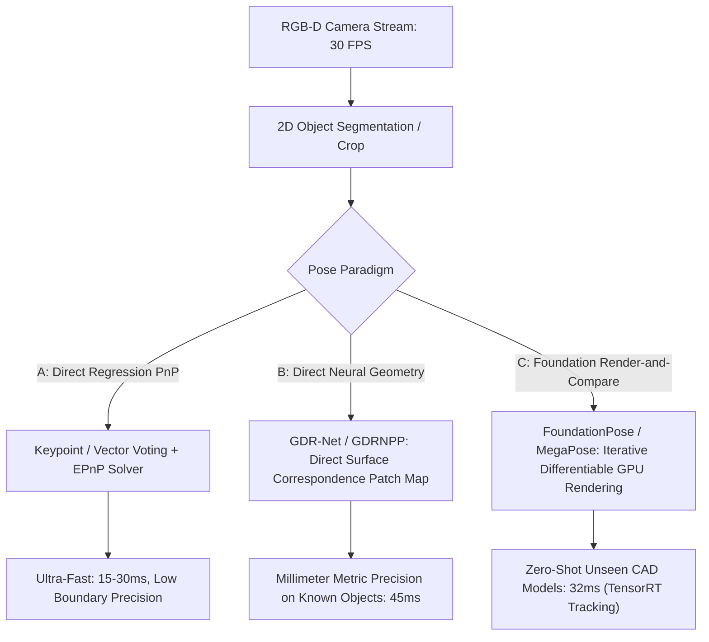

# ⚙️ 6-DoF Pose Estimation: PnP Solvers, Isaac ROS & Open Frontiers

A deep systems analysis of 6-DoF pose estimation pipelines, direct geometry vs. iterative render-and-compare refinement, NVIDIA Isaac ROS TensorRT deployment, and unsolved frontiers on the BOP Challenge leaderboard.

Related notes: [[topics/6dof-pose-estimation/00-6dof-pose-estimation-moc|6-DoF Pose MOC]], [[architectures/pose-and-robotics-manipulation/foundationpose-and-megapose|FoundationPose & MegaPose Deep-Dive]].

---

## 1. 6-DoF Pipeline Paradigms Compared

### Deep Architectural Trade-Off Matrix
| Pose Paradigm | Exemplar Models | Input Modality | Unseen Object Zero-Shot? | Robotic Assembly Accuracy | Real-Time 30 FPS Feasible? |
| :--- | :--- | :--- | :--- | :--- | :--- |
| **Direct PnP Vector Voting** | PVNet, DenseFusion | RGB / RGB-D | No (Requires CAD retrain) | Moderate ($3-5\text{ mm}$) | **Yes** ($>40\text{ FPS}$) |
| **Direct Geometry Regression**| GDR-Net, GDRNPP | RGB-D | No (Single class focus) | High ($1-2\text{ mm}$) | **Yes** ($25-30\text{ FPS}$) |
| **Render-and-Compare Refiner** | MegaPose, FoundationPose | RGB-D + Mesh | **Yes** (Zero-shot novel CAD)| **Highest** ($<1\text{ mm}$) | **Yes** (32 ms via Isaac ROS) |

---

## 2. NVIDIA Isaac ROS & TensorRT Edge Acceleration

Deploying iterative foundation models (FoundationPose) on robotic arms (Jetson AGX Orin) requires bypassing Python overhead:
- **Isaac ROS FoundationPose Node**: Offloads differentiable rendering onto GPU hardware rasterization pipelines (`nvbench` / OpenGL compute shaders).
- Executes score networks and iterative refinement using INT8/FP16 TensorRT engines with locked CUDA Graph replays, achieving steady **31 FPS (32 ms)** robotic pick-and-place tracking.

---

## 3. Current Open Problems in 6-DoF Pose Estimation (2026 BOP Frontiers)

### 🔴 Problem 1: Rotational Ambiguities & Multimodal Pose Distributions (BOP-Distrib)
- **The Failure Mode**: Objects with continuous symmetry (cylinders, spheres) or discrete symmetry (cubes, gears, hex bolts) have multiple physically indistinguishable 3D rotations. Predicting a single deterministic rotation $R \in SO(3)$ causes regression loss to average across modes, outputting invalid interior poses.
- **Recent Frontier Solutions (2025–2026)**:
  - **Pose Distribution Estimation (BOP-Distrib)**: Predicting continuous probability distributions over $SO(3)$ using Bingham distributions or diffusion policies over rotation manifolds rather than point estimates.

---

### 🔴 Problem 2: Specular Reflections, Textureless Steel & High Clutter
- **The Failure Mode**: Machined aluminum parts and stamped sheet metal reflect environment lighting, corrupting depth sensor Time-of-Flight (ToF) beams and washing out RGB textures.
- **Why Classical Keypoints Fail**: SIFT/ORB find zero inliers. Direct depth ICP diverges on scattered multipath return noise.
- **Recent Frontier Solutions**:
  - **Multi-View Hypothesis Voting (WAPR.v2 / FRTPose)**: Integrating observations across multiple synchronized cameras on the robot cell to disambiguate specular reflections.

---

### 🔴 Problem 3: Beyond Rigid Bodies (Articulated & Deformable 6-DoF Tracking)
- **The Failure Mode**: Industrial tooling frequently contains hinges, joints, and deformable cables (scissors, pliers, charging cables). Rigid $SE(3)$ transformation assumptions fail completely.
- **Active Research Direction**: Category-level articulated 6-DoF pose estimation predicting joint kinematic angles alongside base coordinate frames.
