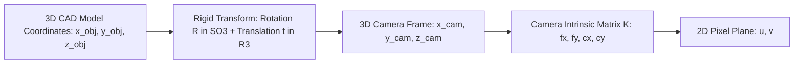
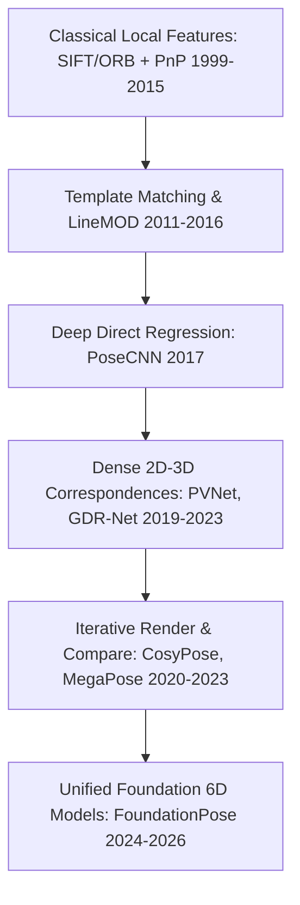
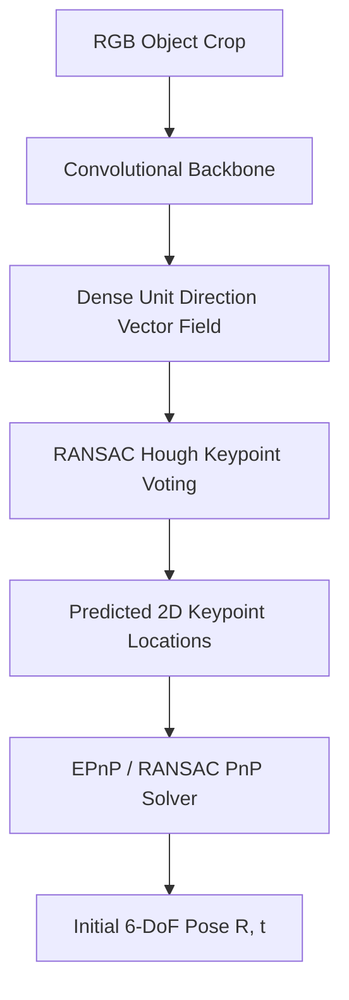
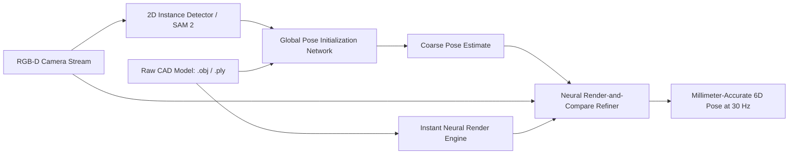

# 6-DoF Pose Estimation: Historical Evolution & Geometric Paradigms

A didactic exploration of how computer vision estimates 3D spatial position and orientation: from classical feature matching and Perspective-n-Point (PnP) solvers to dense correspondence regression, symmetry handling, and zero-shot foundation models (FoundationPose).

Related notes: [[topics/6dof-pose-estimation/README|6-DoF Pose Estimation Playbook]], [[topics/lidar-perception/README|LiDAR Perception]].

---

## 1. Mathematical Formulation

Estimating the 6-DoF pose of an object means finding a rigid transformation $[R \mid t]$ that maps 3D points from object CAD model coordinates $p_{\text{obj}} = (x, y, z)^T$ to camera optical coordinates $p_{\text{cam}}$:

$$p_{\text{cam}} = R \cdot p_{\text{obj}} + t, \quad R \in SO(3), \quad t \in \mathbb{R}^3$$

And projecting to 2D image coordinates $(u, v)$ via the camera intrinsic matrix $K$:
$$s \begin{bmatrix} u \\ v \\ 1 \end{bmatrix} = K \begin{bmatrix} R & t \end{bmatrix} \begin{bmatrix} x \\ y \\ z \\ 1 \end{bmatrix}$$

---

## 2. Historical Paradigms

### Paradigm 1: Classical 2D-to-3D Keypoints & PnP (1999–2015)
- Extract scale-invariant feature keypoints (SIFT, SURF, ORB) on the RGB image.
- Match descriptors against pre-computed 3D CAD surface keypoints.
- Solve for $[R \mid t]$ using **Perspective-n-Point (PnP)** with RANSAC.
- *Failure Mode*: Textureless industrial parts (e.g. smooth metallic cylinders, plastic casings) produce zero distinctive keypoints.

### Paradigm 2: Dense Deep Keypoint Voting (PVNet & GDR-Net, 2019–2023)
Instead of relying on natural texture corners, train a deep network to predict 2D unit vector direction fields pointing toward predefined 3D object keypoints.
- Uses **Hough Voting** to find keypoint intersections even under severe occlusion.
- Solves PnP using the voted 2D coordinates.

---

## 3. The Symmetry Dilemma & Loss Functions

Symmetric objects (e.g. cups, bolts, ball bearings) present infinite valid rotational orientations that produce visually identical 2D images.
- If an algorithm uses standard L1/L2 loss on quaternions:
  $$\mathcal{L}_{\text{naive}} = \|q_{\text{pred}} - q_{\text{gt}}\|^2$$
  The model experiences catastrophic gradient oscillation because two identical visual appearances produce opposing target quaternions.

### Modern Solutions:
1. **ADD-S Loss (Average Distance of 3D Points for Symmetric Objects)**:
   $$\mathcal{L}_{\text{ADD-S}} = \frac{1}{m} \sum_{x_1 \in \mathcal{M}} \min_{x_2 \in \mathcal{M}} \| (R x_1 + t) - (\tilde{R} x_2 + \tilde{t}) \|$$
   Computes the average distance to the *closest* model point rather than 1-to-1 corresponding points.
2. **Continuous 6D Rotation Representation (Zhou et al., CVPR 2019)**:
   Quaternions and Euler angles suffer from topological discontinuities in $\mathbb{R}^3$ and $\mathbb{R}^4$. Modern networks predict a continuous 6D vector (the first two column vectors of the rotation matrix) and perform Gram-Schmidt orthogonalization to construct an orthonormal $3 \times 3$ rotation matrix in $SO(3)$.

---

## 4. The FoundationPose Paradigm (2024–2026)

Wen et al. eliminated the requirement of training specialized neural networks for each unique object CAD model.

By combining synthetic online rendering with score-based neural surface alignment, **FoundationPose** achieves zero-shot generalization across arbitrary novel objects at 32 ms latency.
