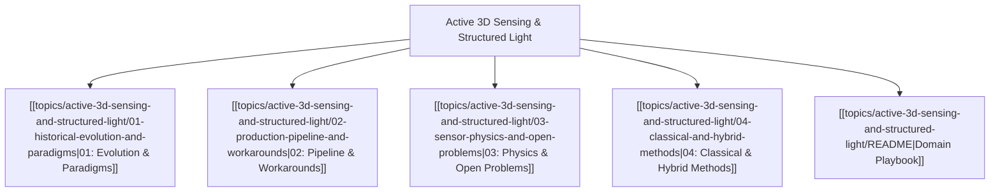

# 🔦 Active 3D Sensing & Structured Light MOC

## Overview
Active 3D Sensing projects structured photonic patterns (infrared dot matrices, sinusoidal phase-shift fringes) or emits amplitude-modulated continuous-wave (AMCW) light pulses to recover metric sub-millimeter 3D depth. Unlike passive stereo that collapses on textureless surfaces (white walls, metal sheets), active illumination forces synthetic spatial contrast.

---

## 🗺️ Master Domain Map

---

## 📚 Core Chapter Navigation
- [[topics/active-3d-sensing-and-structured-light/01-historical-evolution-and-paradigms|01: Historical Evolution & Paradigms]]: From single laser stripe triangulation (1970s) to PrimeSense pseudorandom speckle (Kinect v1) and indirect Time-of-Flight (iToF, Kinect v2, Azure Kinect).
- [[topics/active-3d-sensing-and-structured-light/02-production-pipeline-and-workarounds|02: Production Pipeline & Workarounds]]: RealSense D435/D455 stereo matching with speckle projectors, multi-frequency phase unwrapping, and flying pixel suppression.
- [[topics/active-3d-sensing-and-structured-light/03-sensor-physics-and-open-problems|03: Sensor Physics & Open Problems]]: Multi-path interference (MPI) in concave corners, specular inter-reflections, and outdoor solar ambient saturation.
- [[topics/active-3d-sensing-and-structured-light/04-classical-and-hybrid-methods|04: Classical & Hybrid Methods]]: Mathematical derivation of 4-step sinusoidal phase shifting ($\Delta\phi = \arctan\frac{I_4 - I_2}{I_1 - I_3}$) and hybrid deep ToF depth completion.
- [[topics/active-3d-sensing-and-structured-light/README|Domain Playbook]]: RealSense SDK (librealsense), OpenNI2, and industrial metrology sensors (Zivid, Photoneo).

---

## 🔗 Cross-Domain Obsidian Links
- Complements [[topics/6dof-pose-estimation/00-6dof-pose-estimation-moc|6-DoF Pose Estimation MOC]] for high-precision robotic bin picking ($<0.5\text{ mm}$ point clouds).
- Bridges with [[topics/lidar-perception/00-lidar-perception-moc|LiDAR Perception MOC]] for near-range high-density geometric reconstruction.
