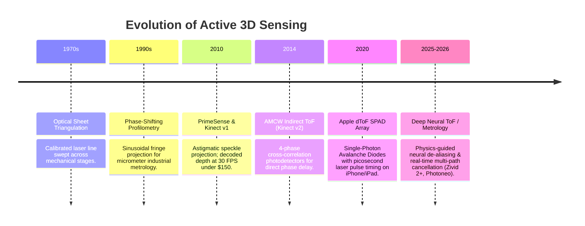

# 📜 Active 3D Sensing: Historical Evolution & Paradigms

A chronological overview of the evolution from industrial laser sheet triangulation to mass-market structured light and indirect Time-of-Flight sensors.

Related notes: [[topics/active-3d-sensing-and-structured-light/00-active-3d-sensing-and-structured-light-moc|Active 3D Sensing MOC]].

---

## 1. Timeline of Breakthroughs

---

## 2. Paradigms & Generational Shifts

- **1st Generation: Mechanical Laser Triangulation (1970s–1990s)**:
  - High accuracy ($<10\,\mu\text{m}$) but required continuous mechanical translation or galvo-mirrors, limiting throughput to static inspection.
- **2nd Generation: Pseudorandom Speckle & Consumer Structured Light (2010)**:
  - Diffractive Optical Elements (DOE) split an IR laser into 30,000 distinct dots. Triangulation between camera and projector yielded dense depth maps at $30\text{ Hz}$, launching modern RGB-D SLAM.
- **3rd Generation: Indirect & Direct Time-of-Flight (2014–2022)**:
  - Measuring the phase shift $\Delta\phi$ of modulated infrared illumination ($20-100\text{ MHz}$) eliminated baseline geometry constraints, enabling compact form factors.
- **4th Generation: AI-Enhanced Metrology & Multi-Path Deconvolution (2024–2026)**:
  - End-to-end neural networks trained with synthetic photorealistic physics engines (Unreal Engine 5 / Mitsuba 3) solving multi-path scattering in real time.
