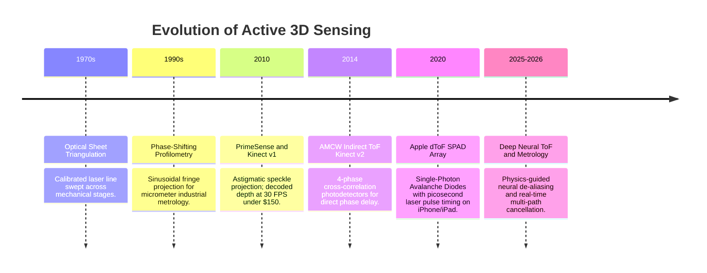

# 📜 Active 3D Sensing: Historical Evolution & Paradigms

A chronological overview of the evolution from industrial laser sheet triangulation to mass-market structured light and indirect Time-of-Flight sensors.

Related notes: [[topics/active-3d-sensing-and-structured-light/00-active-3d-sensing-and-structured-light-moc|Active 3D Sensing MOC]].

---

## 1. Timeline of Breakthroughs

---

## 2. Paradigms & Generational Shifts

### 1st Generation: Mechanical Laser Triangulation (1970s–1990s)

Early 3D range sensing relied on projecting a laser line (or point) onto the scene and imaging the reflected stripe from a laterally offset camera — pure **triangulation geometry**. Given baseline $b$ (projector-to-camera distance), focal length $f$, and the stripe's displacement $\delta_x$ in the image:

$$Z = \frac{b \cdot f}{\delta_x}$$

Precision was exceptional ($<10\,\mu\text{m}$ at 500 mm range) but throughput was bottlenecked by the galvo-mirror or motorized stage required to sweep the laser across the full field: a single 640×480 depth frame required 480 line scans, limiting acquisition to <1 Hz for static inspection.

### 2nd Generation: Pseudorandom Speckle & Consumer Structured Light (2010)

PrimeSense (acquired by Apple 2013) and Microsoft Kinect v1 democratized 3D sensing via **coded aperture speckle projection**. A Diffractive Optical Element (DOE) splits a single 830 nm IR laser into ~30,000 pseudo-randomly positioned dots across the field of view. A second IR camera at $b = 75\,\text{mm}$ baseline captures the dot pattern; on-chip ASIC matches each dot to a calibration reference using normalized cross-correlation, recovering depth at $640 \times 480$ pixels at $30\,\text{Hz}$ — entirely eliminating mechanical scanning.

**Key innovation**: The pseudo-random dot placement is a unique code — unlike periodic fringe patterns, each local patch of dots has a globally unique identifier, enabling unambiguous correspondence without phase unwrapping. Depth precision: $\sigma_Z \approx 1-2\%$ of range (i.e., $\sim 10\,\text{mm}$ at $1\,\text{m}$).

### 3rd Generation: Indirect & Direct Time-of-Flight (2014–2022)

#### Indirect ToF (iToF / AMCW)

Kinect v2 (2014) introduced **Amplitude-Modulated Continuous Wave (AMCW)** sensing. The illuminator emits modulated IR light at frequency $f_{\text{mod}} = 20-120\,\text{MHz}$; each pixel measures the **phase delay** $\Delta\phi$ of the returned signal using four-bucket cross-correlation:

$$\Delta\phi = \text{atan2}(I_1 - I_3,\; I_0 - I_2), \qquad Z = \frac{c \cdot \Delta\phi}{4\pi f_{\text{mod}}}$$

Measuring $\Delta\phi \in (-\pi, \pi)$ yields **wrapped depth** with ambiguity range $\Lambda = c/(2 f_{\text{mod}}) = 3.75\,\text{m}$ at 40 MHz. Dual-frequency modulation resolves the wrap-around (see [[topics/active-3d-sensing-and-structured-light/03-sensor-physics-and-open-problems|Sensor Physics]]). The main iToF disadvantage: multi-path interference (MPI) in concave corners causes systematic underestimation of depth by 2–8 cm.

#### Direct ToF (dToF / SPAD)

Apple's 2020 iPad Pro introduced **Single-Photon Avalanche Diode (SPAD) arrays** with direct photon time-of-flight measurement. A picosecond laser pulse ($\sim 100\,\text{ps}$ FWHM, 905 nm) illuminates the scene; each SPAD pixel independently timestamps the first returning photon via a TDC (Time-to-Digital Converter) with $<10\,\text{ps}$ resolution. Range is computed as:

$$Z = \frac{c \cdot \Delta t_{\text{photon}}}{2}$$

SPAD arrays are immune to MPI corruption (direct photon timing ignores secondary bounces that arrive later), offer outdoor solar immunity through photon gating, but have coarser spatial resolution (e.g., $32 \times 32$ macro-pixels on the 2020 iPad) requiring depth super-resolution from the co-mounted RGB camera.

### 4th Generation: AI-Enhanced Metrology & Multi-Path Deconvolution (2024–2026)

End-to-end neural networks trained on synthetic photorealistic physics engines (Unreal Engine 5 with path tracing, Mitsuba 3) solve **multi-path scattering** in real time. Zivid 2+ (industrial structured light) combines 11-frequency fringe projection with a convolutional depth completion network, achieving $<5\,\mu\text{m}$ lateral repeatability at $1\,\text{Hz}$ on specular metal parts — previously requiring slow white-light interferometry benches.

---

## 3. Sensor Ecosystem: RealSense D435/D455 vs. Zivid Industrial

Understanding where each sensor fits in the deployment landscape is critical for robotics system design:

### Intel RealSense D435 / D455 (Active Stereo Infrared)

- **D435**: $848 \times 480$ depth at 90 FPS, $0.2$–$3.0\,\text{m}$ range, global shutter IR sensor pair, $\sim\$180$.
- **D455**: Wider baseline ($95\,\text{mm}$ vs. $50\,\text{mm}$), extends usable range to $6\,\text{m}$, $\sim\$300$.
- **Technology**: Projects an IR dot pattern (non-coded, unlike Kinect), and matches patches between two IR cameras via on-chip SGM stereo matching (D4 ASIC).
- **Accuracy**: $\sigma_Z \approx 2\,\text{mm}$ at $1\,\text{m}$, degrading to $\pm 2\%$ at $3\,\text{m}$.
- **Best for**: Robotics pick-and-place, RGB-D SLAM, human pose estimation in indoor environments.
- **Key limitation**: Fails on specular metal surfaces (no IR return), direct sunlight (projector dots washed out), and glass.

### Zivid Two / Zivid 2+ (Industrial Phase-Shift Metrology)

- **Resolution**: $1944 \times 1200$ pixels at $1$–$3\,\text{Hz}$ (multi-frame acquisition required).
- **Technology**: DLP projector displays 11–17 sinusoidal fringe patterns per capture; phase is unwrapped via multi-frequency heterodyne method (see [[topics/active-3d-sensing-and-structured-light/04-classical-and-hybrid-methods|Classical Profilometry]]).
- **Accuracy**: $<10\,\mu\text{m}$ lateral repeatability, $<50\,\mu\text{m}$ absolute Z accuracy at $600\,\text{mm}$ working distance. Certified for ISO 9283 robot metrology.
- **Best for**: Bin picking of machined metal parts, quality inspection (PCB soldering), precision assembly guidance. Typical integration: FANUC + Zivid 2+ = $<0.1\,\text{mm}$ pick accuracy on automotive valve bodies.
- **Key limitation**: Multi-frame acquisition ($\sim 500\,\text{ms}$ per point cloud) prohibits use with moving objects; requires controlled ambient lighting (no sunlight).

The D435/D455 vs. Zivid axis encapsulates the fundamental trade-off in active 3D: **speed and robustness vs. metrological precision**.
