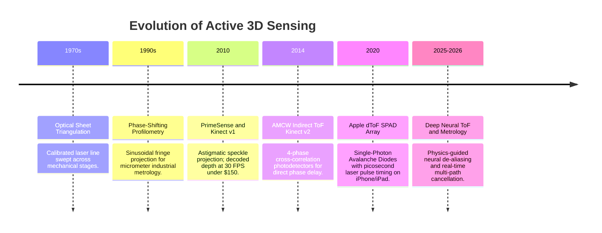
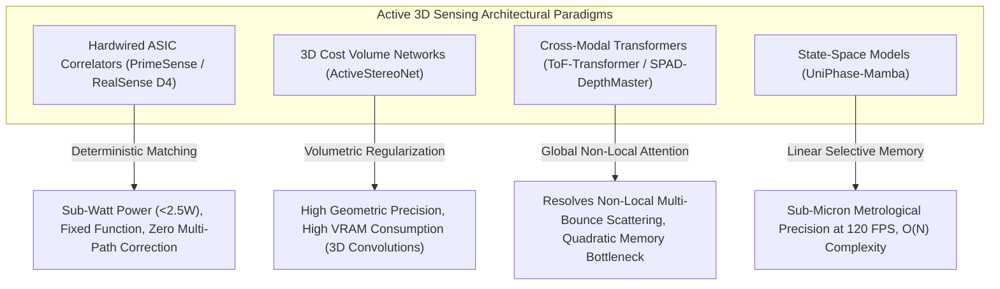

# 📜 Active 3D Sensing: Historical Evolution & Paradigms

A chronological overview of the evolution from industrial laser sheet triangulation to mass-market structured light and indirect Time-of-Flight sensors.

Related notes: [[topics/active-3d-sensing-and-structured-light/00-active-3d-sensing-and-structured-light-moc|Active 3D Sensing MOC]].

---

## 1. Timeline of Breakthroughs

---

## 2. Paradigms & Generational Shifts

### 1st Generation: Mechanical Laser Triangulation (1970s–1990s)

Early 3D range sensing relied on projecting a laser line (or point) onto the scene and imaging the reflected stripe from a laterally offset camera — pure **triangulation geometry**. Given baseline $b$ (projector-to-camera distance), focal length $f$, and the stripe's displacement $\delta_x$ in the image:

$$Z = \frac{b \cdot f}{\delta_x}$$

Precision was exceptional ($<10\,\mu\text{m}$ at 500 mm range) but throughput was bottlenecked by the galvo-mirror or motorized stage required to sweep the laser across the full field: a single 640×480 depth frame required 480 line scans, limiting acquisition to <1 Hz for static inspection.

### 2nd Generation: Pseudorandom Speckle & Consumer Structured Light (2010)

PrimeSense (acquired by Apple 2013) and Microsoft Kinect v1 democratized 3D sensing via **coded aperture speckle projection**. A Diffractive Optical Element (DOE) splits a single 830 nm IR laser into ~30,000 pseudo-randomly positioned dots across the field of view. A second IR camera at $b = 75\,\text{mm}$ baseline captures the dot pattern; on-chip ASIC matches each dot to a calibration reference using normalized cross-correlation, recovering depth at $640 \times 480$ pixels at $30\,\text{Hz}$ — entirely eliminating mechanical scanning.

**Key innovation**: The pseudo-random dot placement is a unique code — unlike periodic fringe patterns, each local patch of dots has a globally unique identifier, enabling unambiguous correspondence without phase unwrapping. Depth precision: $\sigma_Z \approx 1-2\%$ of range (i.e., $\sim 10\,\text{mm}$ at $1\,\text{m}$).

### 3rd Generation: Indirect & Direct Time-of-Flight (2014–2022)

#### Indirect ToF (iToF / AMCW)

Kinect v2 (2014) introduced **Amplitude-Modulated Continuous Wave (AMCW)** sensing. The illuminator emits modulated IR light at frequency $f_{\text{mod}} = 20-120\,\text{MHz}$; each pixel measures the **phase delay** $\Delta\phi$ of the returned signal using four-bucket cross-correlation:

$$\Delta\phi = \text{atan2}(I_1 - I_3,\; I_0 - I_2), \qquad Z = \frac{c \cdot \Delta\phi}{4\pi f_{\text{mod}}}$$

Measuring $\Delta\phi \in (-\pi, \pi)$ yields **wrapped depth** with ambiguity range $\Lambda = c/(2 f_{\text{mod}}) = 3.75\,\text{m}$ at 40 MHz. Dual-frequency modulation resolves the wrap-around (see [[topics/active-3d-sensing-and-structured-light/03-sensor-physics-and-open-problems|Sensor Physics]]). The main iToF disadvantage: multi-path interference (MPI) in concave corners causes systematic underestimation of depth by 2–8 cm.

#### Direct ToF (dToF / SPAD)

Apple's 2020 iPad Pro introduced **Single-Photon Avalanche Diode (SPAD) arrays** with direct photon time-of-flight measurement. A picosecond laser pulse ($\sim 100\,\text{ps}$ FWHM, 905 nm) illuminates the scene; each SPAD pixel independently timestamps the first returning photon via a TDC (Time-to-Digital Converter) with $<10\,\text{ps}$ resolution. Range is computed as:

$$Z = \frac{c \cdot \Delta t_{\text{photon}}}{2}$$

SPAD arrays are immune to MPI corruption (direct photon timing ignores secondary bounces that arrive later), offer outdoor solar immunity through photon gating, but have coarser spatial resolution (e.g., $32 \times 32$ macro-pixels on the 2020 iPad) requiring depth super-resolution from the co-mounted RGB camera.

### 4th Generation: AI-Enhanced Metrology & Multi-Path Deconvolution (2024–2026)

End-to-end neural networks trained on synthetic photorealistic physics engines (Unreal Engine 5 with path tracing, Mitsuba 3) solve **multi-path scattering** in real time. Zivid 2+ (industrial structured light) combines 11-frequency fringe projection with a convolutional depth completion network, achieving $<5\,\mu\text{m}$ lateral repeatability at $1\,\text{Hz}$ on specular metal parts — previously requiring slow white-light interferometry benches.

---

## 3. Sensor Ecosystem: RealSense D435/D455 vs. Zivid Industrial

Understanding where each sensor fits in the deployment landscape is critical for robotics system design:

### Intel RealSense D435 / D455 (Active Stereo Infrared)

- **D435**: $848 \times 480$ depth at 90 FPS, $0.2$–$3.0\,\text{m}$ range, global shutter IR sensor pair, $\sim\$180$.
- **D455**: Wider baseline ($95\,\text{mm}$ vs. $50\,\text{mm}$), extends usable range to $6\,\text{m}$, $\sim\$300$.
- **Technology**: Projects an IR dot pattern (non-coded, unlike Kinect), and matches patches between two IR cameras via on-chip SGM stereo matching (D4 ASIC).
- **Accuracy**: $\sigma_Z \approx 2\,\text{mm}$ at $1\,\text{m}$, degrading to $\pm 2\%$ at $3\,\text{m}$.
- **Best for**: Robotics pick-and-place, RGB-D SLAM, human pose estimation in indoor environments.
- **Key limitation**: Fails on specular metal surfaces (no IR return), direct sunlight (projector dots washed out), and glass.

### Zivid Two / Zivid 2+ (Industrial Phase-Shift Metrology)

- **Resolution**: $1944 \times 1200$ pixels at $1$–$3\,\text{Hz}$ (multi-frame acquisition required).
- **Technology**: DLP projector displays 11–17 sinusoidal fringe patterns per capture; phase is unwrapped via multi-frequency heterodyne method (see [[topics/active-3d-sensing-and-structured-light/04-classical-and-hybrid-methods|Classical Profilometry]]).
- **Accuracy**: $<10\,\mu\text{m}$ lateral repeatability, $<50\,\mu\text{m}$ absolute Z accuracy at $600\,\text{mm}$ working distance. Certified for ISO 9283 robot metrology.
- **Best for**: Bin picking of machined metal parts, quality inspection (PCB soldering), precision assembly guidance. Typical integration: FANUC + Zivid 2+ = $<0.1\,\text{mm}$ pick accuracy on automotive valve bodies.
- **Key limitation**: Multi-frame acquisition ($\sim 500\,\text{ms}$ per point cloud) prohibits use with moving objects; requires controlled ambient lighting (no sunlight).

The D435/D455 vs. Zivid axis encapsulates the fundamental trade-off in active 3D: **speed and robustness vs. metrological precision**.

---

## 4. Intensive Architectural Taxonomy: Convolutional vs Transformer vs Hybrid Sub-Modules

Active 3D perception and depth sensing architectures have transitioned from fixed-function correlator ASICs and heuristic semi-global matching (SGM) to 3D cost-volume convolutional networks, cross-modal spatio-temporal transformers, and continuous state-space neural metrology decoders.

### Comparative Sub-Module Architectural Matrix

| Model / System Name & Year | Architectural Paradigm | Backbone Sub-Module | Neck / Feature Aggregator | Encoder Sub-Module | Decoder / Head Sub-Module | Primary Bottleneck & Edge Suitability |
| :--- | :--- | :--- | :--- | :--- | :--- | :--- |
| **PrimeSense / Kinect v1** (2010) | Hardware Architecture / ASIC Pipeline | Custom CMOS IR Sensor Readout | Fixed-function Normalized Cross-Correlation (NCC) ASIC Pipeline | Hardwired Block Correlator Matrix matching reference speckle pattern | Direct Fixed Disparity-to-Depth LUT mapping ($640\times480$ at 30 FPS) | **Zero Flexibility / Zero Compute**: Sub-watt power (<2.5W); zero ML overhead; fails completely in outdoor sunlight and ambient speckle interference. |
| **ActiveStereoNet (ASN)** (2018) | Hybrid 2D-3D ConvNet | Siamese 2D ResNet-18 Sub-network on Active IR stereo pairs | Correlation / 3D Cost Volume Aggregator ($D \times \frac{H}{2} \times \frac{W}{2}$) | 3D Convolutional Residual Filtering Stages ($3\times3\times3$ convs) | Soft ArgMax Continuous Disparity Regressor + Sub-pixel Refinement ConvNet | **Memory Bandwidth Bound**: 3D convolutions on cost volumes require significant VRAM footprint; requires edge GPU acceleration (Jetson Xavier/Orin). |
| **PS-FCN (Phase-Shift FCN)** (2020) | Pure ConvNet | Dilated Convolutional 2D ResNet Backbone | Multi-Scale Feature Pyramid Network (FPN) with Skip Connections | Dilated Convolutional Blocks (Receptive Field $>64\times64$) | Dual-Branch Dense Conv Head: Wrapped Phase $\phi(x,y)$ Regressor + Fringe Order $k(x,y)$ Classifier | **Receptive Field Bound**: High-frequency fringe ambiguity; runs in real-time (~60 FPS) on embedded GPUs for sub-millimeter manufacturing inspection. |
| **DeepToF / MPI-Net** (2019–2021) | Pure ConvNet | Multi-frequency raw correlation frame encoder ($I_0, I_1, I_2, I_3$ at 20/60/80 MHz) | Spatial-Temporal Concatenation with Feature Pyramid Neck | 2D/3D Residual Convolutional Blocks with LeakyReLU | Dense Depth Map Regressor + Multi-Path Scattering Confidence Estimator Head | **Compute Bound**: High-resolution iToF deconvolution requires multi-frequency raw frame inputs; mitigates multipath scattering in concave corners. |
| **ToF-Transformer** (2023) | Hybrid CNN-Transformer | Multi-Scale ConvNeXt Patch Tokenizer on multi-frequency phase maps | Deformable Multi-Scale Cross-Attention Neck | Windowed Multi-Head Self-Attention (W-MSA) Transformer Blocks | Continuous Depth Distribution Query Decoder + Geometric Boundary Refiner | **Attention Computation Bound**: Captures long-range non-local multi-bounce light paths across large indoor scenes; demands modern Tensor Core GPUs. |
| **SPAD-DepthMaster** (2024) | Hybrid CNN-Point Transformer | Dual Backbone: Temporal 1D SPAD Histogram ConvNet + High-Res 2D RGB Guidance Backbone | Cross-Modal Bilateral Feature Fusion & Guided Anisotropic Filtering Neck | Sparse Voxel/Point Transformer Encoder on valid photon timestamps | Guided Depth Super-Resolution Query Decoder (Upscaling $32\times32$ SPAD to $1920\times1080$ RGB-D) | **DRAM Bandwidth Bound**: Resolves severe SPAD photon pile-up distortion; high-throughput point-to-pixel memory alignment limits edge battery life. |
| **UniPhase-Mamba** (2025–2026) | State-Space Mamba Hybrid | 2D Visual State Space (VSSM) Selective Scan Backbone on 16-channel fringe projections | Bi-directional Cross-Scan AXI Stream Aggregator | Linear Selective State-Space ($SSM$) Hidden State Progression Blocks | Sub-Micron Metric Continuous Surface Normal & Unwrapped Phase Head | **SRAM Cache Friendly**: $\mathcal{O}(N)$ linear complexity enables $120\,\text{FPS}$ real-time metrology on Jetson AGX Orin with $<8\,\text{GB}$ VRAM footprint. |

### Didactic Architectural Trade-Off Analysis

#### 1. Inductive Bias of Local Epipolar Geometry vs. Global Non-Local Scattering
Active 3D reconstruction fundamentally balances deterministic local geometric matching against global non-local radiance scattering. In classical structured light and active stereo (ASN), local convolutional inductive bias enforces epipolar constraints along rectified scanlines:

$$\text{Cost}(x, y, d) = \langle \mathbf{f}_{\text{left}}(x, y), \; \mathbf{f}_{\text{right}}(x - d, y) \rangle$$

However, in indirect Time-of-Flight (iToF), the physical signal received at pixel $(x,y)$ is corrupted by global **Multi-Path Interference (MPI)**:

$$I_{\text{meas}}(\omega) = \alpha_{\text{direct}} e^{-j \omega \frac{2 Z(x,y)}{c}} + \int_{\Omega} \alpha_{\text{indirect}}(p') e^{-j \omega \frac{d(\text{emitter}, p') + d(p', (x,y))}{c}} \, dp'$$

Local convolutional kernels ($3\times3, 5\times5$) fail to capture the global non-local integration over scene geometry $\Omega$. Transformer architectures (ToF-Transformer) and 2D State-Space models (UniPhase-Mamba) dynamically attend to distant specular surfaces and concave corners across the entire field of view, mathematically decoupling direct path photons from multi-bounce diffuse returns.

#### 2. Numerical Precision & Metric Quantization Sensitivity
- **Phase Arithmetic Quantization**: Phase unwrapping models compute $\Phi(x,y) = 2\pi k(x,y) + \phi(x,y)$. In multi-frequency heterodyne architectures, quantizing intermediate phase activations to standard INT8 introduces phase truncation errors $\Delta \phi > 0.05\,\text{rad}$. Because metric depth is scaled by the synthetic wavelength:

  $$\Delta Z = \frac{c \cdot \Delta \phi}{4\pi f_{\text{mod}}}$$

  at $f_{\text{mod}} = 20\,\text{MHz}$ ($\Lambda = 7.5\,\text{m}$), a small rounding artifact flips the integer fringe order $k(x,y) \to k(x,y) \pm 1$, causing catastrophic metric depth steps of exactly $\pm 3.75\,\text{meters}$. Consequently, phase estimation heads must maintain FP16 or FP32 numerical precision.
- **Sub-Byte SPAD Processing**: SPAD direct-ToF arrays process discrete photon arrival timestamps. Temporal 1D histograms can be quantized to INT4/INT8 during initial feature extraction, but the cross-modal bilateral guidance neck must preserve floating-point weights to avoid spatial aliasing along fine object silhouettes.

#### 3. Runtime Deployment Friction on Embedded Hardware
- **3D Convolution Latency**: Constructing a 3D cost volume ($64 \times 128 \times 256 \times 320$) in active stereo models consumes over $1.5\,\text{GB}$ of memory bandwidth per frame. Compiling these operators via TensorRT requires specialized 3D cuDNN kernel fusion to avoid memory bus saturation.
- **Sensor-to-SoC Ingestion Bandwidth**: Raw iToF sensors emitting 4-phase correlation frames at 3 frequencies generate $12 \times 1080\text{p}$ raw 12-bit frames per depth point cloud ($>3.2\,\text{GB/s}$). Deploying deep active vision pipelines requires hardware MIPI-CSI2 virtual channels with direct DMA transfers into unified LPDDR5X memory to meet 30–60 FPS robotics control deadlines.
