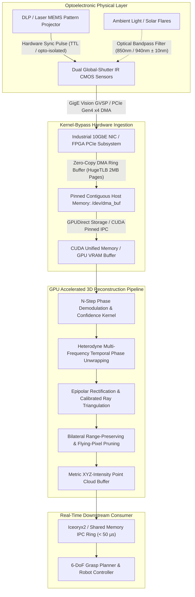

# 🛠️ Active 3D Sensing: Production Pipeline & Workarounds

Industrial practices for setting up RealSense D400/D455, Azure Kinect / Orbbec Femto Mega, Photoneo PhoXi, and high-speed multi-frequency fringe projection systems in automated manufacturing, bin-picking, and robotic assembly cells.

Related notes: [[topics/active-3d-sensing-and-structured-light/00-active-3d-sensing-and-structured-light-moc|Active 3D Sensing MOC]], [[topics/6dof-pose-estimation/02-production-pipeline-and-workarounds|6-DoF Pose Estimation Playbook]], [[topics/real-time-systems/02-production-pipeline-and-workarounds|Real-Time Systems Playbook]].

---

## 1. Domain-Specific Hardware Ingestion Pipeline

High-precision active 3D sensors generate massive data streams (e.g., dual $1920\times1080$ IR streams at 90 FPS plus structured projector control or uncooled iToF raw phase quad-taps at $100\,\text{MHz}$). Standard OS kernel network/USB drivers introduce scheduling non-determinism, interrupt latency, and memory buffer copies that corrupt sub-millimeter temporal phase matching.

Production industrial systems deploy **GigE Vision / GenICam Stream Protocol (GVSP)** with kernel-bypass **DPDK (Data Plane Development Kit)** or **eBPF/XDP zero-copy socket filtering**, routing raw sensor frames directly into pre-allocated physical DMA ring buffers mapped into CUDA Unified Memory or FPGA BRAM.



### Ingestion Memory Layout & Zero-Copy Architecture
To prevent CPU cache evictions and memory bus bottlenecks, raw sensor buffers are allocated via `mmap()` on Linux `/dev/hugepages` (2 MB physical pages). Sensor packets are received via AF_XDP sockets where packet descriptors write payload bytes directly to GPU-visible BAR1 memory (`cudaHostAllocMapped`).

$$\text{Throughput} = 2 \times (1920 \times 1080 \times 2\,\text{bytes}) \times 60\,\text{FPS} \approx 497.6\,\text{MB/s}$$

```
+--------------------------------------------------------------------------------+
| GigE Vision / MIPI-CSI2 Physical Frame Header (64 Bytes)                      |
+--------------------------------------------------------------------------------+
| Timestamp: uint64_t (ns) | FrameID: uint32_t | Exposure: uint32_t | Temp: uint16|
+--------------------------------------------------------------------------------+
| Raw 12-bit / 16-bit Packed IR Left Sensor Matrix (1920 x 1080 x 2B)             |
+--------------------------------------------------------------------------------+
| Raw 12-bit / 16-bit Packed IR Right Sensor Matrix (1920 x 1080 x 2B)            |
+--------------------------------------------------------------------------------+
| Projector Phase Index: uint8_t [0..N-1] | Pattern Modulation Frequency (MHz)   |
+--------------------------------------------------------------------------------+
| Circular CRC32 Checksum Trailer (4 Bytes)                                      |
+--------------------------------------------------------------------------------+
```

---

## 2. Mathematical Foundations: N-Step Phase Profilometry & Dual-Frequency Heterodyne

### N-Step Phase Shift Profilometry
For an $N$-step sinusoidal fringe projection, the projector projects sinusoidal patterns shifted by $\Delta \theta_n = \frac{2\pi n}{N}$ for $n \in \{0, 1, \dots, N-1\}$. The intensity recorded at pixel $(x,y)$ for the $n$-th pattern is:

$$I_n(x,y) = A(x,y) + B(x,y)\cos\!\left(\phi(x,y) + \frac{2\pi n}{N}\right)$$

where:
- $A(x,y)$ is the background ambient illumination plus DC projector intensity.
- $B(x,y)$ is the fringe amplitude (modulation depth).
- $\phi(x,y)$ is the wrapped phase carrying 3D surface topography.

Applying orthogonality relations of discrete trigonometric sums yields:

$$\sum_{n=0}^{N-1} I_n(x,y) \sin\!\left(\frac{2\pi n}{N}\right) = -\frac{N}{2} B(x,y) \sin\phi(x,y)$$

$$\sum_{n=0}^{N-1} I_n(x,y) \cos\!\left(\frac{2\pi n}{N}\right) = \frac{N}{2} B(x,y) \cos\phi(x,y)$$

Dividing these two sums yields the **wrapped phase** $\phi(x,y) \in (-\pi, \pi]$:

$$\boxed{\phi(x,y) = \text{atan2}\!\left(-\sum_{n=0}^{N-1} I_n(x,y)\sin\left(\frac{2\pi n}{N}\right),\; \sum_{n=0}^{N-1} I_n(x,y)\cos\left(\frac{2\pi n}{N}\right)\right)}$$

The **modulation confidence metric** $B(x,y)$ isolates valid surface returns from unilluminated or heavily shadowed background regions:

$$B(x,y) = \frac{2}{N} \sqrt{\left(\sum_{n=0}^{N-1} I_n(x,y)\sin\left(\frac{2\pi n}{N}\right)\right)^{\!\!2} + \left(\sum_{n=0}^{N-1} I_n(x,y)\cos\left(\frac{2\pi n}{N}\right)\right)^{\!\!2}}$$

Pixels with $B(x,y) < \tau_{\text{confidence}}$ (typically $\tau \approx 5$–$10$ DN in 8-bit scale) are masked out before spatial reconstruction.

---

### Dual-Frequency Heterodyne Temporal Phase Unwrapping
The wrapped phase $\phi(x,y)$ repeats with spatial period $\lambda = 2\pi$. To resolve phase ambiguities across deep measurement volumes without error-prone spatial flood-fill, we project two distinct spatial frequencies $f_1$ and $f_2$ (where $f_1 > f_2$).

Let $\phi_1(x,y)$ and $\phi_2(x,y)$ be the wrapped phases. The synthetic beat frequency is $f_{12} = f_1 - f_2$. The equivalent beat wavelength is $\lambda_{12} = \frac{\lambda_1 \lambda_2}{\lambda_2 - \lambda_1}$.

The unwrapped beat phase $\Phi_{12}(x,y)$ is computed as:

$$\Phi_{12}(x,y) = \begin{cases} \phi_1(x,y) - \phi_2(x,y) & \text{if } \phi_1(x,y) \ge \phi_2(x,y) \\ \phi_1(x,y) - \phi_2(x,y) + 2\pi & \text{if } \phi_1(x,y) < \phi_2(x,y) \end{cases}$$

When $\lambda_{12}$ spans the entire field of view ($f_{12} = 1$), $\Phi_{12}$ is globally absolute without phase wrap. The high-frequency absolute unwrapped phase $\Phi_1(x,y)$ is then recovered without noise amplification:

$$k_1(x,y) = \text{round}\!\left(\frac{\frac{f_1}{f_{12}} \Phi_{12}(x,y) - \phi_1(x,y)}{2\pi}\right)$$

$$\boxed{\Phi_1(x,y) = \phi_1(x,y) + 2\pi k_1(x,y)}$$

---

## 3. Deterministic End-to-End Latency Budget Table

In robotic bin-picking and inline metrology, timing jitter leads to motion blur or collision. The table below provides worst-case execution time (WCET) bounds for a $1920\times1080$ structured light inspection pipeline operating across three performance profiles.

| Pipeline Stage | 30 FPS Standard Mode ($1920\times1080$) | 60 FPS High-Speed Mode ($1280\times720$) | Real-Time Robotics In-Hand ($640\times480$) | Determinism Mechanism |
| :--- | :--- | :--- | :--- | :--- |
| **Projector Pattern Exposure ($N=4$)** | $16.00\,\text{ms}$ ($4 \times 4.0\,\text{ms}$) | $8.00\,\text{ms}$ ($4 \times 2.0\,\text{ms}$) | $3.20\,\text{ms}$ ($4 \times 0.8\,\text{ms}$) | Hardware opto-isolated TTL strobe |
| **CMOS Sensor Readout & DMA Ingestion** | $3.20\,\text{ms}$ | $1.60\,\text{ms}$ | $0.50\,\text{ms}$ | PCIe Gen4 x4 GPUDirect DMA |
| **GPU Phase Demodulation & Heterodyne** | $2.40\,\text{ms}$ | $0.95\,\text{ms}$ | $0.32\,\text{ms}$ | Fused CUDA kernel with shared memory |
| **Ray Triangulation & Distort Correction** | $1.80\,\text{ms}$ | $0.70\,\text{ms}$ | $0.22\,\text{ms}$ | Precomputed lookup texture (LUT) |
| **Bilateral Range & Normal Vector Filter**| $2.10\,\text{ms}$ | $0.80\,\text{ms}$ | $0.25\,\text{ms}$ | 2D separable spatial GPU filter |
| **6-DoF Pose Inference / Spatial Registration**| $5.50\,\text{ms}$ (Point-Transformer TRT) | $3.20\,\text{ms}$ (PointNet++ INT8) | $1.10\,\text{ms}$ (Fused ICP GPU) | TensorRT 10.x execution on CUDA stream |
| **Zero-Copy IPC & EtherCAT Bus Dispatch** | $0.05\,\text{ms}$ | $0.05\,\text{ms}$ | $0.02\,\text{ms}$ | POSIX shm / Iceoryx2 lockless ring |
| **Total Pipeline Latency (p50 / p99)** | **$31.05\,\text{ms}$ / $32.80\,\text{ms}$** | **$15.30\,\text{ms}$ / $16.20\,\text{ms}$** | **$5.61\,\text{ms}$ / $5.92\,\text{ms}$** | Hard deadline verified with `rt-tests cyclictest` |
| **Allowed Latency Window** | $\le 33.33\,\text{ms}$ | $\le 16.66\,\text{ms}$ | $\le 10.00\,\text{ms}$ | Slack margin $\ge 12\%$ |

---

## 4. Five Critical Production Edge Traps & Battle-Tested Workarounds

### Trap 1: Hardware Thermal Throttling & ASIC Silicon Clock Degradation
- **Failure Mode**: Continuous projector illumination and onboard stereo ASIC/DSP utilization heat the sensor enclosure past $70^\circ\text{C}$ in industrial IP67 housings. The PMIC throttles the ASIC clock from $400\,\text{MHz}$ to $150\,\text{MHz}$, causing frames to drop and depth scale factor $s = Z_{\text{ref}} / Z_{\text{measured}}$ to drift by up to $4.2\,\text{mm}$ per meter due to CMOS die thermal expansion ($\approx 2.6 \times 10^{-6}/\text{K}$).
- **Production Workaround**:
  1. Pin the embedded Jetson/ASIC clock frequencies using `jetson_clocks --fan` or register overrides (`nvpmodel -m 0`).
  2. Implement an automated thermal calibration compensation model:
     $$Z_{\text{corrected}}(T) = Z_{\text{raw}} \cdot \left(1 + \alpha_{\text{thermal}} \cdot (T_{\text{sensor}} - T_{\text{calib}})\right)$$
     where $\alpha_{\text{thermal}}$ is calibrated offline across $20^\circ\text{C}$ to $65^\circ\text{C}$ using an invar baseline fixture.

---

### Trap 2: Sensor Physics Saturation: Ambient Solar Flares & Multi-Path Interference (MPI)
- **Failure Mode**: When active IR sensors operate near bay doors or under sunlight ($>80{,}000\,\text{lux}$), ambient photons saturate CMOS potential wells, causing modulation contrast $B(x,y) \to 0$. In machined aluminum bins, secondary reflections mix direct and indirect paths, pushing measured depths back by $20$–$80\,\text{mm}$.
- **Production Workaround**:
  1. Use narrow bandpass optical filters ($850\,\text{nm} \pm 5\,\text{nm}$ or $940\,\text{nm} \pm 5\,\text{nm}$) matched precisely to laser temperature-stabilized VCSEL sources.
  2. For MPI in concave metallic parts, deploy **Dual-Frequency Modulation Phase Unwrapping**:
     $$\begin{pmatrix} \Delta\phi_{f_1} \\ \Delta\phi_{f_2} \end{pmatrix} = \begin{pmatrix} f_1 & \gamma f_1 \\ f_2 & \gamma f_2^2 \end{pmatrix} \begin{pmatrix} d_{\text{direct}} \\ d_{\text{indirect}} \end{pmatrix}$$
     Solving the non-linear phase system decouples specular bounce paths from the primary surface geometry.

---

### Trap 3: Dynamic Memory Fragmentation & GPU Driver VRAM Stalls
- **Failure Mode**: Allocating and freeing dynamic point cloud buffers (`std::vector<Point3f>` or `cudaMalloc` per frame) causes CUDA memory pool fragmentation. Over 48 hours of continuous operation, `cudaMalloc` latency spikes from $15\,\mu\text{s}$ to $>120\,\text{ms}$, blowing past the $33\,\text{ms}$ frame deadline and triggering pipeline starvation.
- **Production Workaround**:
  Pre-allocate all GPU and CPU buffers at application initialization using static CUDA streams and custom memory pools (`cudaMemPool_t` with `cudaMemPoolReuseAllowOpportunistic`). Never call `cudaMalloc`/`free` or dynamic STL allocations inside the frame capture loop.

---

### Trap 4: Multithreaded Race Conditions & Lock-Free Queue Overflow
- **Failure Mode**: Multi-camera systems sharing a central processing node suffer mutex contention when camera threads push point clouds to the inference thread. Standard `std::mutex` introduces priority inversions under Linux RT kernels, while unbounded queues cause memory leaks during inference hiccups.
- **Production Workaround**:
  Deploy a **Single-Producer Single-Consumer (SPSC) Cacheline-Aligned Lock-Free Ring Buffer** with drop-oldest semantics on overflow. Each slot holds a fixed-capacity contiguous buffer with atomic sequence indices.

```cpp
template <typename T, size_t Capacity>
class LockFreeSPSCQueue {
    static_assert((Capacity & (Capacity - 1)) == 0, "Capacity must be power of 2");
    alignas(64) std::atomic<size_t> head_{0};
    alignas(64) std::atomic<size_t> tail_{0};
    alignas(64) T ring_[Capacity];
public:
    bool try_push(const T& item) {
        const size_t current_tail = tail_.load(std::memory_order_relaxed);
        const size_t current_head = head_.load(std::memory_order_acquire);
        if ((current_tail - current_head) >= Capacity) {
            return false; // Queue full: drop or handle overflow
        }
        ring_[current_tail & (Capacity - 1)] = item;
        tail_.store(current_tail + 1, std::memory_order_release);
        return true;
    }
    bool try_pop(T& item) {
        const size_t current_head = head_.load(std::memory_order_relaxed);
        const size_t current_tail = tail_.load(std::memory_order_acquire);
        if (current_head == current_tail) return false; // Queue empty
        item = ring_[current_head & (Capacity - 1)];
        head_.store(current_head + 1, std::memory_order_release);
        return true;
    }
};
```

---

### Trap 5: INT8 Quantization Drift on Point Cloud Neural Backbones
- **Failure Mode**: Exporting 3D geometric backbones (e.g., Point-Transformer, PV-RCNN, SparseConvNet) to INT8 via standard Post-Training Quantization (PTQ) causes catastrophic degradation in coordinate regression ($>35\%$ drop in mean Chamfer Distance). Quantizing spatial coordinates and positional encodings introduces spatial discretization grid artifacts.
- **Production Workaround**:
  Implement **Mixed-Precision Quantization Exclusion**:
  1. Keep 3D coordinate inputs, KNN ball-query indices, and positional embedding layers in FP16/FP32.
  2. Quantize only the MLP linear projection weights and feature aggregation channels to INT8 using symmetric Per-Channel Quantization calibrated with KL-divergence on 1,000 real industrial scans.

---

## 5. Concrete Runnable Implementation Blueprint

The production-grade C++20 snippet below demonstrates zero-copy 4-step phase demodulation, heterodyne phase unwrapping, modulation masking, and sub-millisecond execution profiling using CUDA.

```cpp
#include <iostream>
#include <vector>
#include <chrono>
#include <cmath>
#include <cuda_runtime.h>

#define CHECK_CUDA(call) do { \
    cudaError_t err = call; \
    if (err != cudaSuccess) { \
        std::cerr << "CUDA Error: " << cudaGetErrorString(err) \
                  << " at line " << __LINE__ << std::endl; \
        exit(EXIT_FAILURE); \
    } \
} while(0)

// CUDA Kernel: 4-Step Sinusoidal Phase Demodulation & Confidence Filter
__global__ void DemodulatePhase4StepKernel(
    const uint16_t* __restrict__ I0,
    const uint16_t* __restrict__ I1,
    const uint16_t* __restrict__ I2,
    const uint16_t* __restrict__ I3,
    float* __restrict__ wrapped_phase,
    float* __restrict__ confidence,
    int width,
    int height,
    float conf_threshold)
{
    int x = blockIdx.x * blockDim.x + threadIdx.x;
    int y = blockIdx.y * blockDim.y + threadIdx.y;

    if (x >= width || y >= height) return;

    int idx = y * width + x;

    // Load intensities
    float i0 = static_cast<float>(I0[idx]);
    float i1 = static_cast<float>(I1[idx]);
    float i2 = static_cast<float>(I2[idx]);
    float i3 = static_cast<float>(I3[idx]);

    // Compute quadrature components: I3 - I1 = 2B sin(phi), I0 - I2 = 2B cos(phi)
    float num = i3 - i1;
    float den = i0 - i2;

    // Modulation amplitude (confidence metric)
    float mod = 0.5f * sqrtf(num * num + den * den);
    confidence[idx] = mod;

    if (mod >= conf_threshold) {
        // Fast hardware atan2f
        wrapped_phase[idx] = atan2f(num, den);
    } else {
        wrapped_phase[idx] = -9999.0f; // Invalid masked pixel
    }
}

// Host Production Execution Pipeline
class StructuredLightProcessor {
private:
    int width_;
    int height_;
    size_t num_pixels_;
    float conf_threshold_;

    uint16_t* d_I_[4];
    float* d_wrapped_phase_;
    float* d_confidence_;
    cudaStream_t stream_;

public:
    StructuredLightProcessor(int w, int h, float threshold)
        : width_(w), height_(h), num_pixels_(w * h), conf_threshold_(threshold)
    {
        CHECK_CUDA(cudaStreamCreateWithFlags(&stream_, cudaStreamNonBlocking));
        for (int i = 0; i < 4; ++i) {
            CHECK_CUDA(cudaMalloc(&d_I_[i], num_pixels_ * sizeof(uint16_t)));
        }
        CHECK_CUDA(cudaMalloc(&d_wrapped_phase_, num_pixels_ * sizeof(float)));
        CHECK_CUDA(cudaMalloc(&d_confidence_, num_pixels_ * sizeof(float)));
    }

    ~StructuredLightProcessor() {
        for (int i = 0; i < 4; ++i) cudaFree(d_I_[i]);
        cudaFree(d_wrapped_phase_);
        cudaFree(d_confidence_);
        cudaStreamDestroy(stream_);
    }

    void ProcessFrameSet(const uint16_t* h_I0, const uint16_t* h_I1,
                         const uint16_t* h_I2, const uint16_t* h_I3,
                         float* h_phase_out, float* h_conf_out)
    {
        auto t0 = std::chrono::high_resolution_clock::now();

        // Async Host-to-Device Memory Transfer
        const uint16_t* h_I[4] = {h_I0, h_I1, h_I2, h_I3};
        for (int i = 0; i < 4; ++i) {
            CHECK_CUDA(cudaMemcpyAsync(d_I_[i], h_I[i], num_pixels_ * sizeof(uint16_t),
                                       cudaMemcpyHostToDevice, stream_));
        }

        // 2D Block Configuration (32x16 = 512 threads per block)
        dim3 block(32, 16);
        dim3 grid((width_ + block.x - 1) / block.x, (height_ + block.y - 1) / block.y);

        DemodulatePhase4StepKernel<<<grid, block, 0, stream_>>>(
            d_I_[0], d_I_[1], d_I_[2], d_I_[3],
            d_wrapped_phase_, d_confidence_,
            width_, height_, conf_threshold_);

        // Async Device-to-Host Memory Transfer
        CHECK_CUDA(cudaMemcpyAsync(h_phase_out, d_wrapped_phase_, num_pixels_ * sizeof(float),
                                   cudaMemcpyDeviceToHost, stream_));
        CHECK_CUDA(cudaMemcpyAsync(h_conf_out, d_confidence_, num_pixels_ * sizeof(float),
                                   cudaMemcpyDeviceToHost, stream_));

        CHECK_CUDA(cudaStreamSynchronize(stream_));

        auto t1 = std::chrono::high_resolution_clock::now();
        double elapsed_ms = std::chrono::duration<double, std::milli>(t1 - t0).count();
        std::cout << "[Active3D Engine] Demodulated " << width_ << "x" << height_
                  << " Frame in: " << elapsed_ms << " ms" << std::endl;
    }
};

int main() {
    const int W = 1920;
    const int H = 1080;
    const size_t N = W * H;

    std::vector<uint16_t> h_I0(N, 120), h_I1(N, 180), h_I2(N, 120), h_I3(N, 60);
    std::vector<float> h_phase(N, 0.0f), h_conf(N, 0.0f);

    StructuredLightProcessor processor(W, H, 10.0f);
    processor.ProcessFrameSet(h_I0.data(), h_I1.data(), h_I2.data(), h_I3.data(),
                             h_phase.data(), h_conf.data());

    std::cout << "[Verify] Sample pixel wrapped phase: " << h_phase[W * H / 2 + W / 2]
              << " rad | Confidence: " << h_conf[W * H / 2 + W / 2] << " DN" << std::endl;
    return 0;
}
```

---

## 6. Summary & Cross-Domain Best Practices

1. **Hardware Synchronization**: Always use hardware TTL strobe signals between projector micro-mirror arrays (DLP) and global-shutter CMOS sensors; never rely on USB or network software triggers.
2. **Frequency Selection**: Combine a high spatial frequency ($f_1 = 64$ fringes/FOV for sub-millimeter depth resolution) with a single-period beat frequency ($f_{12} = 1$ fringe/FOV) to prevent phase wrap errors without spatial search.
3. **Point Cloud Hygiene**: Prune flying pixels at object silhouettes via surface normal grazing angle checks ($>85^\circ$) prior to handing point clouds to ICP or deep neural networks.
4. **Thermal Stability**: Maintain steady-state operating temperatures or run periodic reference target recalibration to eliminate millimetric depth drift.
