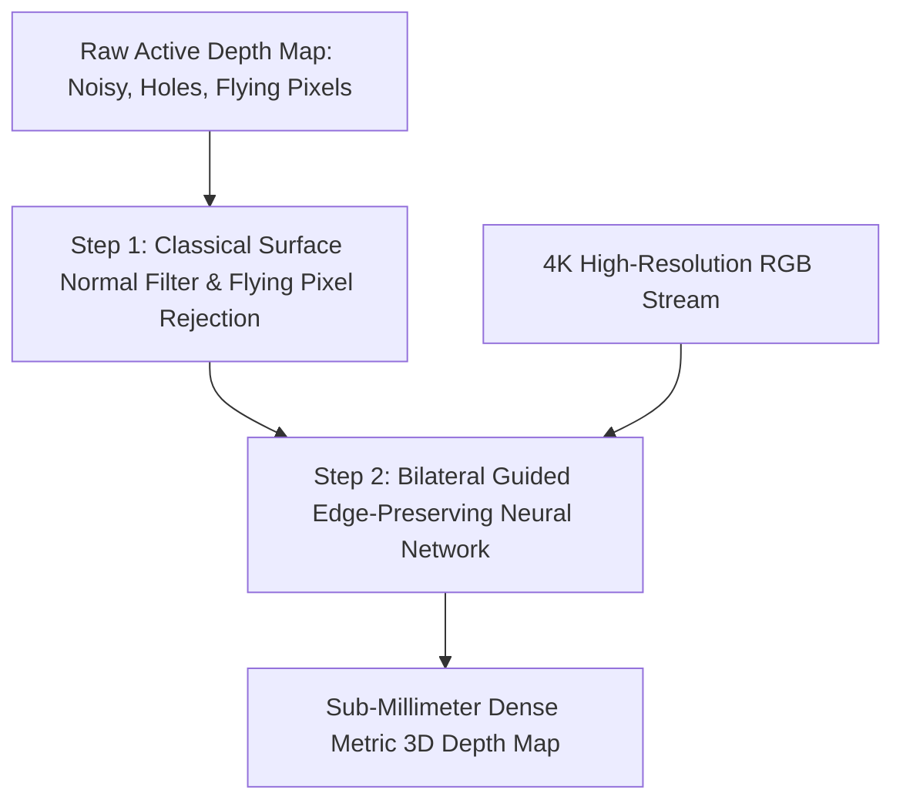

# 📐 Active 3D Sensing: Classical Profilometry & Hybrid Depth Completion

Mathematical derivations of classical N-step phase shifting profilometry and modern hybrid sparse-to-dense neural depth completion pipelines.

Related notes: [[topics/active-3d-sensing-and-structured-light/00-active-3d-sensing-and-structured-light-moc|Active 3D Sensing MOC]].

---

## 1. Classical N-Step Sinusoidal Phase-Shifting Profilometry

In standard fringe projection profilometry, a digital light projector displays a series of $N$ sinusoidal fringe patterns with phase shifts $\delta_n = \frac{2\pi n}{N}$ ($n = 0, 1, \dots, N-1$):
$$I_n(x, y) = A(x, y) + B(x, y) \cos\left( \phi(x, y) + \frac{2\pi n}{N} \right)$$
Where:
- $A(x, y)$: Background ambient illumination.
- $B(x, y)$: Fringe modulation amplitude (reflectivity/contrast).
- $\phi(x, y)$: Wrapped phase containing 3D geometric surface height.

### Exact Mathematical Derivation for $N = 4$ (Four-Step Phase Shift):
Expanding for $n \in \{0, 1, 2, 3\}$ with phase shifts $0, \frac{\pi}{2}, \pi, \frac{3\pi}{2}$:
$$I_0 = A + B \cos(\phi)$$
$$I_1 = A - B \sin(\phi)$$
$$I_2 = A - B \cos(\phi)$$
$$I_3 = A + B \sin(\phi)$$

Taking differences:
$$I_3 - I_1 = 2 B \sin(\phi)$$
$$I_0 - I_2 = 2 B \cos(\phi)$$

Dividing yields the **wrapped phase** in closed form:
$$\phi(x, y) = \text{atan2}(I_3 - I_1, \ I_0 - I_2)$$

The fringe modulation amplitude (confidence metric) is:
$$B(x, y) = \frac{1}{2} \sqrt{(I_3 - I_1)^2 + (I_0 - I_2)^2}$$
Any pixel where $B(x, y) < B_{\text{threshold}}$ is flagged as invalid (shadowed or non-reflective), providing zero-false-positive metric depth.

---

## 2. Production Hybrid Pattern: Sparse ToF + Dense Guided Depth Completion

Active depth sensors often produce sparse, noisy, or edge-blurred depth maps. Modern edge systems pair a low-power active sensor (SPAD array or coarse ToF) with a high-resolution RGB camera using a lightweight guided depth completion network (e.g. MobileDepth, Depth Anything V2 Guided).

### Key Engineering Benefits:
- Preserves sharp object silhouette boundaries from high-resolution visible texture.
- Anchors metric depth scale from the active physical sensor, preventing scale drift common in purely passive monocular depth estimators.
