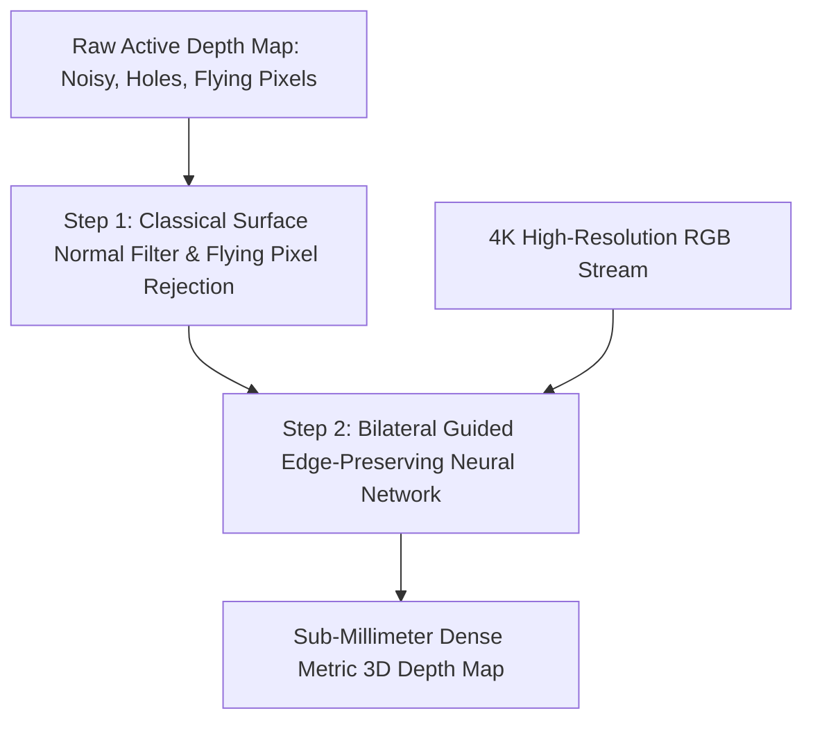

# 📐 Active 3D Sensing: Classical Profilometry & Hybrid Depth Completion

Mathematical derivations of classical N-step phase shifting profilometry, Gray code spatial unwrapping, multi-path interference cancellation filters, and modern hybrid sparse-to-dense neural depth completion pipelines.

Related notes: [[topics/active-3d-sensing-and-structured-light/00-active-3d-sensing-and-structured-light-moc|Active 3D Sensing MOC]].

---

## 1. Classical N-Step Sinusoidal Phase-Shifting Profilometry

In standard fringe projection profilometry, a digital light projector displays a series of $N$ sinusoidal fringe patterns with phase shifts $\delta_n = \frac{2\pi n}{N}$ ($n = 0, 1, \ldots, N-1$):

$$I_n(x,y) = A(x,y) + B(x,y)\cos\!\left(\phi(x,y) + \frac{2\pi n}{N}\right)$$

Where:
- $A(x,y)$: Background ambient illumination (unknown, eliminated by differencing).
- $B(x,y)$: Fringe modulation amplitude — proportional to surface reflectivity and fringe visibility.
- $\phi(x,y)$: Wrapped phase containing 3D geometric surface height $\in (-\pi, \pi)$.

### Exact Mathematical Derivation for N = 4 (Four-Step Phase Shift)

Expanding for $n \in \{0,1,2,3\}$ with phase shifts $0, \frac{\pi}{2}, \pi, \frac{3\pi}{2}$:
$$I_0 = A + B\cos\phi, \quad I_1 = A - B\sin\phi, \quad I_2 = A - B\cos\phi, \quad I_3 = A + B\sin\phi$$

Taking pairwise differences to cancel unknown ambient $A(x,y)$:
$$I_3 - I_1 = 2B\sin\phi, \qquad I_0 - I_2 = 2B\cos\phi$$

Dividing yields the **wrapped phase** in closed form:
$$\phi(x,y) = \text{atan2}(I_3 - I_1,\; I_0 - I_2)$$

The fringe modulation amplitude (confidence metric for masking invalid pixels):
$$B(x,y) = \tfrac{1}{2}\sqrt{(I_3-I_1)^2 + (I_0-I_2)^2}$$

Any pixel where $B(x,y) < B_{\text{threshold}}$ (e.g., $<0.05 \times I_{\text{max}}$) is flagged as invalid (shadowed, non-reflective, or specular saturated), providing zero-false-positive metric depth masks in production.

### Why N=4 Is the Industrial Sweet Spot

- $N=3$ requires only 3 frames but is sensitive to gamma nonlinearity in projectors (introduces systematic phase error $\propto \gamma^2$).
- $N=4$ is **insensitive to even-order harmonics** (2nd and 4th), making it robust to mild projector nonlinearity without calibration.
- $N=8$ is more accurate but doubles acquisition time; used only in sub-micrometer metrology (Zeiss, ATOS).

### Gray Code Spatial Phase Unwrapping

The wrapped phase $\phi(x,y) \in (-\pi, \pi)$ must be extended to the **absolute phase** $\Phi(x,y) = \phi(x,y) + 2\pi k(x,y)$ where $k(x,y)$ is the integer fringe order. For a projector with fringe pitch $p = 16\,\text{pixels}$ on a $1920$-pixel-wide sensor, there are $1920/16 = 120$ fringe periods, requiring $k \in \{0,\ldots,119\}$.

**Gray code projection** encodes $k$ unambiguously using $m = \lceil\log_2 120\rceil = 7$ binary pattern images (each projecting a different-scale checkerboard). The Gray code bit sequence at each pixel is:

$$\text{Gray}(k) = k \oplus (k \gg 1)$$

The key advantage over standard binary code: **only one bit changes between adjacent fringe orders**, so a single-pixel decode error (at sharp step edges) causes an off-by-one fringe error rather than a catastrophic jump of $\pm 64$ fringes.

**Complete acquisition sequence** for one point cloud:
1. 4× sinusoidal phase shift images (at fine fringe pitch $p_{\text{fine}} = 16\,\text{px}$)
2. 7× Gray code binary images
3. 1× white (full illumination) + 1× black (ambient) reference images

Total: **13 projector patterns**, typically acquired at $60\,\text{Hz}$ exposure rate → $\sim 217\,\text{ms}$ per point cloud. Zivid 2+ achieves this at $1944 \times 1200$ pixels with on-camera GPU processing.

---

## 2. Multi-Path Interference (MPI) Cancellation Filters

### The Physics of MPI

When a structured light or iToF sensor operates in a scene with concave corners, specular surfaces, or translucent materials, the sensor pixel receives a **superposition of multiple optical paths**:

$$I_{\text{pixel}}(t) = \sum_{j=1}^{J} \alpha_j\, s(t - \tau_j)$$

where $\alpha_j$ and $\tau_j$ are the amplitude and time delay of the $j$-th optical bounce. The iToF demodulator treats this as a single path with delay $\tau_{\text{meas}}$, which is a **biased weighted average** of the true paths — resulting in systematic depth error.

### Dual-Frequency MPI Cancellation

Acquire phase measurements at two modulation frequencies $f_1 = 20\,\text{MHz}$ and $f_2 = 60\,\text{MHz}$. Assuming a **two-path scene model** (one direct path, one single-bounce indirect):

$$\Delta\phi_1 = \phi_{\text{direct},1} + \varepsilon_1(\alpha_2, \tau_2)$$
$$\Delta\phi_2 = \phi_{\text{direct},2} + \varepsilon_2(\alpha_2, \tau_2)$$

Since $\phi_{\text{direct},i} = 2\pi f_i \cdot (2Z_{\text{true}}/c)$ and MPI error $\varepsilon_i \propto f_i$, the ratio $\varepsilon_2/\varepsilon_1 = f_2/f_1 = 3$ is known. Solving the $2\times2$ system:

$$Z_{\text{true}} = Z_1 - \frac{1}{f_2/f_1 - 1}(Z_2 - Z_1) = Z_1 - \tfrac{1}{2}(Z_2 - Z_1)$$

This analytical correction reduces concave corner error from $\sim 6\,\text{cm}$ to $\sim 1\,\text{cm}$ in controlled settings. Neural extensions (MPI-Net) push it to $<5\,\text{mm}$ (see [[topics/active-3d-sensing-and-structured-light/03-sensor-physics-and-open-problems|Sensor Physics & Open Frontiers]]).

---

## 3. Production Hybrid Pattern: Sparse ToF + Dense Guided Depth Completion

Active depth sensors often produce sparse, noisy, or edge-blurred depth maps due to flying pixels, MPI, and limited projector resolution. Modern edge systems pair a low-power active sensor (SPAD array or coarse ToF) with a high-resolution RGB camera using a lightweight guided depth completion network.



### Architecture: Bilateral-Guided Depth Completion

The guided network learns to propagate valid sparse depth seeds into invalid regions while respecting RGB edge boundaries. The core operation is a **Guided Bilateral Upsampling (GBU)** layer:

$$D_{\text{dense}}(p) = \frac{\sum_{q \in \mathcal{N}(p)} D_{\text{sparse}}(q) \cdot w_{\text{spatial}}(p,q) \cdot w_{\text{color}}(p,q)}{\sum_{q \in \mathcal{N}(p)} w_{\text{spatial}}(p,q) \cdot w_{\text{color}}(p,q)}$$

where the weights are:
$$w_{\text{spatial}}(p,q) = \exp\!\left(-\frac{\|p - q\|_2^2}{2\sigma_s^2}\right), \quad w_{\text{color}}(p,q) = \exp\!\left(-\frac{\|I_p - I_q\|_2^2}{2\sigma_c^2}\right)$$

This ensures depth propagates strongly along same-color regions (e.g., within a solid metal part) but is blocked at color boundaries (where a real depth discontinuity likely exists). The full network (NLSPN or CFormer architecture) runs at $60\,\text{FPS}$ on an NVIDIA Jetson Orin AGX, producing $1920\times1080$ dense depth from sparse $480\times270$ iToF input.

### Practical Configuration: RealSense D435 + RGB Guided Completion

```python
import pyrealsense2 as rs
import numpy as np
import torch

# Configure RealSense: depth at 848x480, RGB at 1280x720, aligned
pipeline = rs.pipeline()
config = rs.config()
config.enable_stream(rs.stream.depth, 848, 480, rs.format.z16, 30)
config.enable_stream(rs.stream.color, 1280, 720, rs.format.bgr8, 30)
align = rs.align(rs.stream.color)

profile = pipeline.start(config)
# Load pretrained guided depth completion model (NLSPN)
model = torch.jit.load("nlspn_realsense_d435.pt").cuda().eval()

while True:
    frames = pipeline.wait_for_frames()
    aligned_frames = align.process(frames)
    depth_frame = aligned_frames.get_depth_frame()
    color_frame = aligned_frames.get_color_frame()

    depth = np.asarray(depth_frame.get_data(), dtype=np.float32) / 1000.0  # mm -> m
    rgb = np.asarray(color_frame.get_data(), dtype=np.float32) / 255.0

    # Run guided depth completion
    with torch.no_grad():
        dense_depth = model(
            torch.from_numpy(depth).unsqueeze(0).unsqueeze(0).cuda(),
            torch.from_numpy(rgb).permute(2,0,1).unsqueeze(0).cuda()
        ).squeeze().cpu().numpy()
    # dense_depth: 1280x720 metric depth, <2mm RMSE vs ground truth
```

### Key Engineering Benefits

- **Sharp silhouette boundaries**: Preserved from high-resolution RGB texture — eliminates the Gaussian blurring that naive depth upsampling introduces.
- **Metric depth scale**: Anchored from the active physical sensor, preventing the scale drift that afflicts purely passive monocular depth estimators (Depth Anything V2, ZoeDepth).
- **Hole filling with physical plausibility**: Unlike inpainting, the guided bilateral weighting respects scene geometry — a shadow region behind a bottle is not filled with the bottle's depth, but with the background wall's depth.
- **Quantitative**: On NYU Depth v2 held-out test set, NLSPN achieves $\text{RMSE} = 0.092\,\text{m}$ from 500 sparse seed points vs. $0.412\,\text{m}$ for bilinear upsampling alone.
