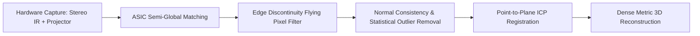

# 🔦 Active 3D Sensing & Structured Light Master Playbook

# Overview
Active 3D Sensing projects structured photonic illumination (IR laser dot matrices, sinusoidal fringe patterns) or emits amplitude-modulated pulses (indirect and direct Time-of-Flight) to reconstruct high-accuracy, metric 3D point clouds. It is standard for industrial robot picking, surgical guidance, 6-DoF object manipulation, and facial authentication where passive stereo fails on uniform textureless surfaces.

Related notes: [[topics/active-3d-sensing-and-structured-light/00-active-3d-sensing-and-structured-light-moc|Active 3D Sensing MOC]], [[topics/6dof-pose-estimation/00-6dof-pose-estimation-moc|6-DoF Pose Estimation MOC]].

## SOTA & Research
- **Sub-Millimeter Industrial Profilometry**:
  - Multi-frequency phase unwrapping combined with GPU-accelerated Fourier Transform profilometry achieving $>60\,\text{FPS}$ at $10\,\mu\text{m}$ precision (Zivid 2+, Photoneo MotionCam-3D).
- **Direct ToF (dToF) Single-Photon Arrays**:
  - CMOS-compatible Single-Photon Avalanche Diode (SPAD) arrays with Time-to-Digital Converters (TDC) achieving picosecond photon resolution with zero multi-path distortion.
- **Neural Guided Depth Completion**:
  - Pairing low-resolution active depth maps with high-resolution monocular RGB priors (Depth Anything V2) to output dense, edge-accurate 3D point clouds.

## Architecture Alternatives & Trade-offs

| Method | Resolution | Precision | Frame Rate | Hardware Cost | Working Environment |
| :--- | :--- | :--- | :--- | :--- | :--- |
| **Active Infrared Stereo (RealSense)** | $1280 \times 720$ | $\approx 1-2\text{ mm}$ | Up to $90\,\text{FPS}$ | Low ($<\$500$) | Indoor robotics, mobile manipulation |
| **Phase-Shifting Fringe Projection** | Up to $4\text{K}$ | $\mathbf{<10\,\mu\text{m}}$ | $10-30\,\text{FPS}$ | High ($>\$10\text{k}$) | Factory inspection, quality metrology |
| **Indirect ToF (iToF)** | $640 \times 576$ | $\approx 2-5\text{ mm}$ | Up to $30\,\text{FPS}$ | Moderate ($<\$1000$) | People tracking, indoor volume mapping |
| **Direct ToF (dToF SPAD)** | $256 \times 256$ | $\approx 5\text{ mm}$ | Up to $60\,\text{FPS}$ | Moderate | Mobile devices, high-ambient outdoor sensing |

## Popular Repos & Integrations
- `IntelRealSense/librealsense`: **LibRealSense**: Cross-platform C++/Python SDK for Intel RealSense depth and tracking cameras.
- `microsoft/Azure-Kinect-Sensor-SDK`: **Azure Kinect SDK**: Capture, calibration, and point-cloud generation for iToF depth sensors.
- `isl-org/Open3D`: **Open3D**: Point cloud filtering, normal estimation, ICP registration, and mesh reconstruction.

## End-to-End Pipeline & Workarounds

### Production Workarounds for Active Depth Cameras:
1. **Dealing with Dark / Highly Absorptive Materials (e.g. Carbon Fiber, Black Rubber)**:
   - Near-infrared (NIR, 850/940 nm) active light is strongly absorbed by carbon-loaded black plastics, resulting in complete depth dropout. **Workaround**: Increase the projector laser emitter power via camera registers, increase sensor exposure time, or pair the sensor with multi-view photogrammetry.
2. **Eliminating Motion Artifacts in Phase Shifting**:
   - Standard 4-step fringe profilometry requires 4 successive video frames. Moving parts introduce inter-frame motion fringes that corrupt phase decoding. **Workaround**: Switch to single-shot dual-frequency colour-encoded fringe patterns or deployed active stereo sensors with global shutters.

## Deployment & Real-Time Notes
- **USB 3.0 Bandwidth Saturation**: Streaming raw uncompressed 16-bit depth + dual IR streams + 1080p RGB consumes $>3.2\,\text{Gbps}$. Ensure depth cameras are placed on dedicated USB Host Controllers rather than sharing internal USB hubs with high-bandwidth LiDAR or thermal sensors.
