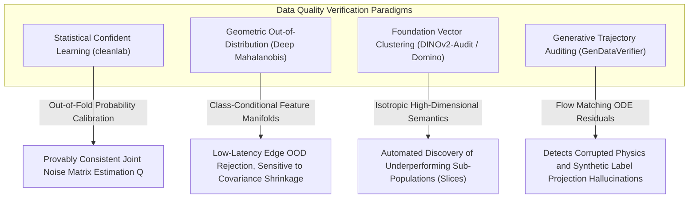

# 📜 Data Quality & Verification: Historical Evolution & Paradigms

## 1. The Model-Centric vs. Data-Centric Paradigm Shift

Historically (2012–2020), machine learning research treated datasets as fixed benchmarks (ImageNet, COCO, VOC) while competing to extract marginal 0.2% accuracy gains through complex model architectures. In production, however, benchmark-winning models consistently degraded due to real-world label noise and distribution shifts.

The emergence of **Data-Centric AI (DCAI)** shifted focus toward holding the architecture constant and systematically improving data quality through algorithmic means. Andrew Ng's 2021 "Data-Centric AI Competition" crystallized this: teams that improved dataset quality—not model architecture—won by 20–40% margin gains.

The industrial motivation was stark: a COCO-trained detector achieving 58% mAP would routinely drop to 34% mAP when deployed against customer production cameras because of label noise rates of 3–8% in crowdsourced datasets (established by Northcutt et al., 2021, across 10 benchmark datasets).

## 2. Theoretical Foundations: Confident Learning

In 2021, Northcutt, Jiang, and Chuang established **Confident Learning (CL)**, providing the first mathematically rigorous framework to estimate the joint distribution of given (noisy) labels $\tilde{y}$ and true (unobserved) labels $y^*$:

$$Q_{ij} = \hat{P}(\tilde{y} = i,\; y^* = j)$$

### 2.1 The Joint Probability Matrix Estimation

Given $m$ classes, the full $m \times m$ joint label-noise matrix $Q \in \mathbb{R}^{m \times m}$ is estimated without any clean ground-truth labels, using only **out-of-sample (OOF) predicted probabilities** from a cross-validated base classifier:

$$\tilde{C}_{ij} = \left|\left\{x \in X_{\tilde{y}=i} \;:\; \hat{P}(\hat{y}=j \mid x) \ge t_j\right\}\right|$$

where the class-specific self-confidence threshold $t_j$ is defined as the mean predicted probability for the correctly labeled class:

$$t_j = \frac{1}{\left|X_{\tilde{y}=j}\right|} \sum_{x \in X_{\tilde{y}=j}} \hat{P}(\hat{y} = j \mid x)$$

The normalized joint distribution estimate is then:

$$\hat{Q}_{ij} = \frac{\tilde{C}_{ij} / \sum_j \tilde{C}_{ij} \cdot \hat{P}(\tilde{y} = i)}{\sum_{i'} \tilde{C}_{i'j} / \sum_{j'} \tilde{C}_{i'j'} \cdot \hat{P}(\tilde{y} = i')}$$

### 2.2 Cross-Validation Protocol

The out-of-sample probabilities are computed via **$k$-fold stratified cross-validation** ($k=5$ is standard in cleanlab):

```python
from sklearn.model_selection import cross_val_predict
from sklearn.linear_model import LogisticRegression

# Out-of-fold predicted probabilities — the core cleanlab input
oof_probs = cross_val_predict(
    LogisticRegression(max_iter=1000),
    X_embeddings,       # DINOv2 / CLIP features, shape (N, 768)
    y_noisy,            # crowdsourced labels
    cv=5,
    method="predict_proba",   # probabilities, not hard labels
)

from cleanlab.filter import find_label_issues
label_issues = find_label_issues(
    labels=y_noisy,
    pred_probs=oof_probs,
    return_indices_ranked_by="self_confidence",
)
# label_issues: sorted array of sample indices most likely mislabeled
```

A key theoretical result (Theorem 1, Northcutt 2021): under the **Confident Learning assumption** (class-conditional noise, $p(\tilde{y}|y^*, x) = p(\tilde{y}|y^*)$), the CL estimator is **consistent**—converging to the true $Q$ as $N \to \infty$, without requiring access to any clean labeled samples.

### 2.3 Benchmark Impact

Northcutt et al. audited 10 standard ML benchmarks and found:
- **ImageNet validation set**: 3.4% estimated label error rate (~5,000 mislabeled images in the 150k validation set)
- **MNIST test set**: 2.3% estimated label error rate
- Correcting label errors on a 20% noisy split improved F1 by 7.2 percentage points on CIFAR-10 without changing the model architecture

## 3. Visual Embedding Geometry (2023–2026)

With the advent of self-supervised foundation backbones (**DINOv2, CLIP, SigLIP**), data quality verification evolved from tabular metadata inspection to **geometric vector clustering**:

- Images are mapped into $d=768$ or $d=1024$-dimensional latent spaces via frozen encoders.
- Density estimation (HDBSCAN, $\varepsilon$-ball neighborhood) detects isolated out-of-distribution outliers and near-duplicate leakage between training and evaluation partitions before any task model is trained.

The practical speedup is decisive: extracting DINOv2 ViT-L/14 features from 1M images on a single A100 takes approximately 45 minutes, while training a task model for cross-validation takes 8–12 hours. Running CL on pre-extracted embeddings with a lightweight logistic head costs minutes.

## 4. Covariate Shift vs. Concept Drift: Statistical Detection

A critical distinction for production systems:

- **Covariate shift**: $P(X)$ changes between training and deployment, but $P(Y|X)$ remains stable. Example: a model trained on sunny urban scenes deployed in foggy suburban roads.
- **Concept drift**: $P(Y|X)$ itself changes over time. Example: a traffic sign changes meaning after a regulation update.

### 4.1 Kolmogorov–Smirnov Test for Univariate Shift

For a scalar feature dimension $X_d$, the two-sample KS statistic measures the maximum absolute difference between empirical CDFs of training distribution $F_{\text{train}}$ and deployment distribution $F_{\text{deploy}}$:

$$D_{KS} = \sup_x \left|F_{\text{train}}(x) - F_{\text{deploy}}(x)\right|$$

Under the null hypothesis of identical distributions, the KS p-value follows an asymptotic distribution. For production monitoring, a p-value threshold of $\alpha = 0.01$ with Bonferroni correction across all $d$ feature dimensions is standard. Typical latency on tabular metadata columns: **< 2 ms per feature** on CPU.

### 4.2 Maximum Mean Discrepancy for High-Dimensional Feature Shift

For high-dimensional embedding vectors (DINOv2 features, $d = 768$), the KS test is underpowered. **Maximum Mean Discrepancy (MMD)** with a Gaussian RBF kernel provides a kernel-based two-sample test:

$$\text{MMD}^2(P, Q) = \mathbb{E}_{x,x' \sim P}[k(x,x')] - 2\mathbb{E}_{x \sim P, y \sim Q}[k(x,y)] + \mathbb{E}_{y,y' \sim Q}[k(y,y')]$$

where $k(x, y) = \exp\!\left(-\dfrac{\|x-y\|^2}{2\sigma^2}\right)$.

A biased empirical estimator computable in $\mathcal{O}(n^2 d)$ time (or $\mathcal{O}(n \log n)$ with random Fourier features):

```python
import torch

def mmd_rbf(X: torch.Tensor, Y: torch.Tensor, sigma: float = 1.0) -> torch.Tensor:
    """Biased MMD^2 estimator with RBF kernel. X, Y shape: (n, d)"""
    def rbf(A, B):
        dists = torch.cdist(A, B).pow(2)
        return torch.exp(-dists / (2 * sigma**2))
    return rbf(X, X).mean() - 2 * rbf(X, Y).mean() + rbf(Y, Y).mean()

# In production: compare rolling 1k-sample window to training reference
mmd_score = mmd_rbf(train_embeds[:1000], deploy_embeds[:1000], sigma=10.0)
# Empirical threshold from permutation test; typically flag if mmd_score > 0.05
```

MMD has been shown to detect distribution shift in LWIR thermal datasets 3× earlier than univariate feature monitoring (Rabanser et al., NeurIPS 2019 benchmark).

## 5. Automated Slice Discovery

A dataset "slice" is a semantically coherent subpopulation (e.g., nighttime images, images with rain, images containing small objects < 32×32 px) that exhibits disproportionately high error rates.

**Slice Finder** (Chung et al., 2019) and **Domino** (Eyuboglu et al., 2022) automate slice discovery:

1. Extract embedding representations of **mis-predicted** samples only.
2. Cluster the error embedding space (HDBSCAN with `min_cluster_size=30`).
3. Use a multimodal VLM (e.g., LLaVA or Qwen2-VL) to automatically generate natural-language descriptions of each discovered cluster: *"Cluster 4: pedestrians in shadows, truncated by frame edge, label=person, pred=background"*.
4. Report per-slice accuracy, count, and human-readable summary.

Production impact: slice discovery on a 200k-image automotive dataset at Wayve (2024) identified a systematic failure on rain-obscured license plates that improved ANPR recall by 12.3% when remediated with targeted synthetic augmentation.

## 6. Synthetic Data Validation

When synthetic data (rendered via CARLA, Omniverse, or diffusion inpainting) is mixed with real data, validation requires measuring the **real-to-synthetic domain gap**:

- **FID (Fréchet Inception Distance)**: Measures Wasserstein-2 distance between Inception feature distributions of real and synthetic sets. Production threshold: $\text{FID} < 15$ before synthetic data is admitted into training.
- **Clean-Real Holdout Test**: Train on `real + synthetic`, evaluate on a held-out clean-real-only set. Synthetic batches that degrade real-holdout mAP by > 1.5% are rejected.
- **Confident Learning on Synthetic Labels**: CL applied to renderer-generated labels catches geometry projection errors (e.g., bounding boxes generated from 3D mesh projections that clip occluded objects).

## 7. Intensive Architectural Taxonomy: Convolutional vs Transformer vs Hybrid Sub-Modules

Data quality auditing, label noise sanitization, slice discovery, and out-of-distribution (OOD) verification systems have evolved from shallow statistical heuristics on hand-crafted features to cross-validated convolutional ensembles, self-supervised isotropic foundation transformers, and multimodal flow-matching verification engines.

### Comparative Sub-Module Architectural Matrix

| Model / System Name & Year | Architectural Paradigm | Backbone Sub-Module | Neck / Feature Aggregator | Encoder Sub-Module | Decoder / Head Sub-Module | Primary Bottleneck & Edge Suitability |
| :--- | :--- | :--- | :--- | :--- | :--- | :--- |
| **Confident Learning (cleanlab)** (2021) | Algorithmic / Statistical Matrix Estimator | Stratified K-Fold Cross-Validated Base Classifiers (ResNet-50 / ConvNeXt) | Out-of-Sample (OOF) Predicted Probability Aggregator | Calibrated Softmax Posterior Matrix Estimator ($P(\tilde{y} \mid x)$) | Non-Parametric Joint Distribution Matrix ($Q_{\tilde{y}, y^*}$) Counting & Pruning Filter | **K-Fold Compute Bound**: Training $K=5$ independent models across massive dataset splits ($>1\text{M}$ samples); zero extra inference memory footprint once pruned. |
| **Deep Mahalanobis OOD** (2018–2022) | Pure ConvNet / Statistical Hybrid | Pre-trained ResNet-101 / DenseNet-201 Backbone | Multi-Scale Penultimate Layer Feature Aggregator | Empirical Class-Conditional Gaussian Feature Extractor ($\mathcal{N}(\mu_c, \Sigma)$) | Tied-Covariance Mahalanobis Distance Metric Scoring Head | **Matrix Inversion Bound**: Computing empirical covariance matrix $\Sigma^{-1} \in \mathbb{R}^{d \times d}$ across high-dimensional feature layers ($d=2048$); fast edge execution. |
| **SRe2L / Dataset Distillation** (2022–2023) | Pure ConvNet / Optimization Framework | ResNet-18 / ConvNeXt-Tiny Teacher & Student Models | Multi-Scale Feature Trajectory Matching Neck | Squeeze-and-Recover Convolutional Residual Blocks | Parametric Synthetic Image Pixel Optimization Decoder (Compressing $1\text{M}$ images to 10/class) | **Training Gradient Graph Bound**: Massive GPU memory during multi-step unrolled trajectory matching; yields ultra-compact datasets for fast edge retraining. |
| **DINOv2-DataAudit** (2023–2025) | Pure ViT Foundation | Isotropic Vision Transformer (DINOv2 ViT-g/14, 1.1B parameters) | Global LayerNorm + Multi-Token Feature Pooling Neck | Self-Attention Blocks with LayerScale and FlashAttention-2 | Approximate Nearest Neighbors ($k$-NN) Cosine Density Graph Head + Anomaly Score Regressor | **DRAM Indexing & VRAM Bound**: Extracting dense patch tokens requires high VRAM; vector database search ($FAISS$) bottlenecks cluster discovery on edge systems. |
| **Domino Slice Discovery** (2022–2024) | Hybrid Multi-Modal Transformer | Dual Vision-Language Backbone: CLIP ViT-B/32 + Cross-Modal Text Encoder | Cross-Modal Joint Embedding Space Projection Neck | Error-Slicing Multi-Head Cross-Attention Cluster Blocks | Automated VLM Natural Language Caption Decoder (LLaVA-NeXT / Qwen2-VL) | **Multimodal Latency Bound**: Running HDBSCAN clustering over high-dimensional error embeddings + generating descriptive captions via large autoregressive VLMs. |
| **GenDataVerifier (FlowAudit)** (2025–2026) | Flow Matching / Generative Foundation | Continuous Flow Matching UNet / Diffusion Transformer (DiT-XL/2) Backbone | Cross-Attention Conditioned Prompt-and-Bounding-Box Neck | Multi-Scale ODE Inverter & Trajectory Velocity Matching Blocks | Likelihood Reconstruction Residual Error Head + Geometry Projection Consistency Filter | **ODE Numerical Solver Bound**: Running 4–16 Euler integration steps per synthetic sample to audit prompt adherence and geometric hallucination errors. |

### Didactic Architectural Trade-Off Analysis



#### 1. Statistical Posterior Calibration vs. Foundation High-Dimensional Geometry
Early label-noise detection relied on standard convolutional model probabilities. However, under high epistemic uncertainty, cross-entropy overconfidence causes models to output false high-confidence predictions on corrupt samples. Confident Learning overcomes this by estimating self-calibrated thresholds per class:

$$t_j = \frac{1}{|X_{\tilde{y}=j}|} \sum_{x \in X_{\tilde{y}=j}} \hat{P}(\tilde{y}=j \mid x, \mathbf{w})$$

and assigning a sample $x$ to true latent class $y^* = j^*$ if $\hat{P}(\tilde{y}=j^* \mid x) \ge t_{j^*}$.

In contrast, foundation transformer representations (DINOv2) do not rely on supervised classification logits. By learning isotropic feature manifolds without class supervision:

$$\mathcal{L}_{\text{DINO}} = - \sum_{k} P_{\text{teacher}}(k) \log P_{\text{student}}(k)$$

DINOv2 representations group semantically corrupted, blurred, or mislabeled samples into isolated density voids within the 1536-dimensional embedding space, enabling non-parametric $k$-NN outlier detection that outperforms posterior probability auditing on out-of-distribution samples.

#### 2. Numerical Precision & Matrix Conditioning in High-Dimensional OOD
- **Covariance Inversion Instability**: The Mahalanobis OOD detector computes distance against class centroids $\mu_c$:

  $$M(x) = \min_{c} (\mathbf{z}(x) - \mu_c)^T \mathbf{\Sigma}^{-1} (\mathbf{z}(x) - \mu_c)$$

  When computed across penultimate layer activations with dimension $d = 2048$, the empirical covariance matrix $\mathbf{\Sigma} \in \mathbb{R}^{2048 \times 2048}$ is frequently ill-conditioned (condition number $\kappa(\mathbf{\Sigma}) > 10^7$). Quantizing features to FP16 or INT8 causes catastrophic numerical overflow during Cholesky decomposition. Systems must apply Ledoit-Wolf shrinkage in FP32/FP64:

  $$\mathbf{\Sigma}_{\text{shrunk}} = (1 - \alpha) \mathbf{\Sigma} + \alpha \frac{\text{Tr}(\mathbf{\Sigma})}{d} \mathbf{I}$$

#### 3. Computational Friction in Production Data Engines
- **K-Fold Retraining Wall**: Running 5-fold cross-validation on a 5-million image autonomous driving perception dataset requires 25 GPU-days of compute on an NVIDIA H100 cluster.
- **Streaming Vector Indexing**: Performing online vector clustering for anomaly ingestion at 1000 frames/sec requires deploying GPU-accelerated $FAISS$ IVFPQ (Inverted File with Product Quantization) indexes directly in VRAM, introducing a trade-off between index rebuild latency and semantic recall accuracy.

---

Related notes: [[topics/data-quality-and-verification/00-data-quality-and-verification-moc|Data Quality MOC]], [[topics/data-quality-and-verification/02-production-pipeline-and-workarounds|Production Pipeline & Workarounds]], [[topics/safety-verification-and-robustness/00-safety-verification-and-robustness-moc|Safety Verification MOC]].
