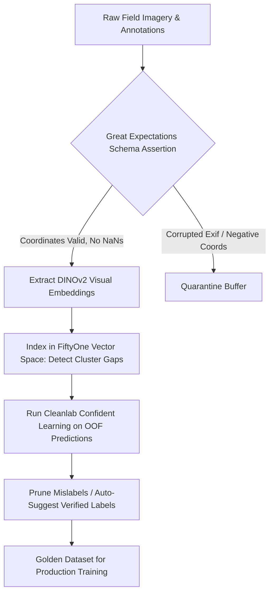

# 🛠️ Data Quality & Verification: Production Pipeline & Workarounds

## 1. Automated Ingestion & Curation Architecture

## 2. Production Engineering Traps & Battle-Tested Workarounds

### Trap 1: Near-Duplicate Data Leakage Between Splits
- **The Issue**: Live camera streams record video at 30 FPS. Frames $t$ and $t+1$ are identical in visual content. Splitting frames uniformly across Train and Validation creates massive data leakage, resulting in an artificial 99% mAP that degrades by 30% in deployment.
- **Battle-Tested Workaround**:
  - Compute cosine distances between consecutive frame embeddings in FiftyOne:
    $$\text{sim}(e_t, e_{t+1}) = \frac{e_t \cdot e_{t+1}}{\|e_t\|_2 \|e_{t+1}\|_2} > 0.96$$
  - Clustered frames must be strictly partitioned into train/val sets at the **scene session level**, never at the individual frame level.

### Trap 2: Asymmetric Annotation Ambiguity in Object Detection
- **The Issue**: Human annotators inconsistently label reflections of vehicles in shop windows or toy cars as real objects.
- **Battle-Tested Workaround**:
  - Run Cleanlab object detection audits to flag bounding boxes where the predicted background confidence exceeds $0.85$ despite human foreground annotations.
