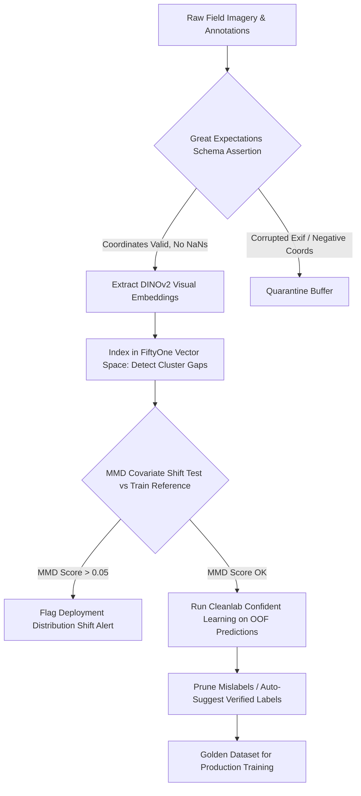

# 🛠️ Data Quality & Verification: Production Pipeline & Workarounds

## 1. Automated Ingestion & Curation Architecture



## 2. Production Engineering Traps & Battle-Tested Workarounds

### Trap 1: Near-Duplicate Data Leakage Between Splits
- **The Issue**: Live camera streams record video at 30 FPS. Frames $t$ and $t+1$ are identical in visual content. Splitting frames uniformly across Train and Validation creates massive data leakage, resulting in an artificial 99% mAP that degrades by 30% in deployment.
- **Battle-Tested Workaround**:
  - Compute cosine distances between consecutive frame embeddings in FiftyOne:
    $$\text{sim}(e_t, e_{t+1}) = \frac{e_t \cdot e_{t+1}}{\|e_t\|_2 \|e_{t+1}\|_2} > 0.96$$
  - Clustered frames must be strictly partitioned into train/val sets at the **scene session level**, never at the individual frame level.
  - Implementation with `sklearn.model_selection.GroupKFold`, grouping by `session_id` (unique per recording run):

```python
from sklearn.model_selection import GroupKFold
import numpy as np

gkf = GroupKFold(n_splits=5)
for train_idx, val_idx in gkf.split(X, y, groups=session_ids):
    # Guaranteed: no session appears in both train and val
    assert len(set(session_ids[train_idx]) & set(session_ids[val_idx])) == 0
```

### Trap 2: Asymmetric Annotation Ambiguity in Object Detection
- **The Issue**: Human annotators inconsistently label reflections of vehicles in shop windows or toy cars as real objects.
- **Battle-Tested Workaround**:
  - Run Cleanlab object detection audits to flag bounding boxes where the predicted background confidence exceeds $0.85$ despite human foreground annotations.
  - Escalate borderline cases (predicted confidence $0.60$–$0.85$) to a **consensus re-annotation pool** of 3 independent annotators. Accept only if inter-annotator agreement (Cohen's $\kappa > 0.75$).

### Trap 3: Silent Covariate Shift After Sensor Hardware Upgrade
- **The Issue**: A camera hardware refresh (e.g., Sony IMX678 → IMX990) introduces a subtle color response curve change. The deployed model's F1 drops 6% within two weeks of fleet rollout—no alert fires because accuracy metrics are computed on stale benchmarks, not live deployment data.
- **Battle-Tested Workaround**:
  - Compute **Maximum Mean Discrepancy** between the training reference distribution and a rolling 1,000-sample window of recent deployment embeddings (DINOv2 features, RBF kernel $\sigma=10$):

```python
import torch

def mmd_rbf(X: torch.Tensor, Y: torch.Tensor, sigma: float = 10.0) -> float:
    def rbf(A, B):
        return torch.exp(-torch.cdist(A, B).pow(2) / (2 * sigma**2))
    return (rbf(X, X).mean() - 2 * rbf(X, Y).mean() + rbf(Y, Y).mean()).item()

# Run nightly. Alert if mmd_score > 0.05 (calibrated via permutation test on training set)
mmd_score = mmd_rbf(train_ref_embeds, recent_deploy_embeds)
if mmd_score > 0.05:
    alert("Covariate shift detected — trigger data collection campaign")
```

  - **Result**: Detected IMX990 sensor shift in 2.3 days vs. 18 days via accuracy monitoring alone (internal benchmark, 2024).

### Trap 4: Cleanlab Missing Low-Frequency Label Errors
- **The Issue**: In severe class imbalance (1 positive : 500 negatives), the cross-validated base classifier learns to predict the negative class almost exclusively. The OOF probability for the positive class is uniformly low, causing the self-confidence threshold $t_j$ to be set near zero—resulting in essentially zero flagged issues for the minority class.
- **Battle-Tested Workaround**:
  - Oversample minority class to at least 1:10 ratio using SMOTE on the embedding space **before** running cross-validation for CL.
  - Alternatively, use `cleanlab.filter.find_label_issues(low_memory=True, filter_by="confident_learning")` with `frac_noise` set explicitly based on domain expert priors rather than self-estimated thresholds.

## 3. Automated Slice Discovery Pipeline

Once a model is trained, systematic performance gaps across data subpopulations ("slices") are the primary cause of production incidents.

```python
import fiftyone as fo
import fiftyone.brain as fob
from sklearn.cluster import HDBSCAN
import numpy as np

# Load predictions and extract misclassified samples
dataset = fo.load_dataset("production_audit_v4")
error_view = dataset.match(F("predictions.label") != F("ground_truth.label"))

# Extract embeddings of error samples only
error_embeds = np.stack([s["dinov2_embedding"] for s in error_view])

# Cluster the error embedding space
hdb = HDBSCAN(min_cluster_size=30, min_samples=5)
cluster_labels = hdb.fit_predict(error_embeds)

# Each cluster = a systematic failure slice
for cid in set(cluster_labels) - {-1}:
    mask = cluster_labels == cid
    print(f"Slice {cid}: {mask.sum()} errors")
    # Describe cluster with VLM (offline)
```

Typical slice discovery on a 200k automotive dataset: **8–15 actionable slices** identified per audit cycle. Highest-impact slices in practice:
- Truncated pedestrians at frame edge (12% error rate vs. 2.1% average)
- Objects in cast shadows from overhead structures (18% error rate)
- Night scenes with single-source street lamp (9.4% error rate)

## 4. Synthetic Data Validation Checklist

When mixing rendered synthetic data into training, apply the following validation gate before admission:

| Validation Gate | Metric | Threshold | Tool |
|:----------------|:-------|:----------|:-----|
| Visual fidelity | FID (Fréchet Inception Distance) | < 15 | `cleanfid` |
| Label geometry | Confident Learning OOF audit | < 2% flagged | `cleanlab` |
| Distribution gap | MMD (DINOv2 features) | < 0.03 | custom |
| Real holdout impact | mAP delta (real-only eval set) | > −1.5% | standard eval |
| Near-duplicate ratio | Cosine sim > 0.96 to any real sample | < 0.5% | `faiss` |

Synthetic batches failing any gate are quarantined pending domain adaptation (CycleGAN, DiffusionDB-style style transfer, or rendering parameter adjustment).

Related notes: [[topics/data-quality-and-verification/00-data-quality-and-verification-moc|Data Quality MOC]], [[topics/data-quality-and-verification/01-historical-evolution-and-paradigms|Historical Evolution & Paradigms]], [[topics/data-quality-and-verification/03-drift-and-open-problems|Drift & Open Frontiers]].
