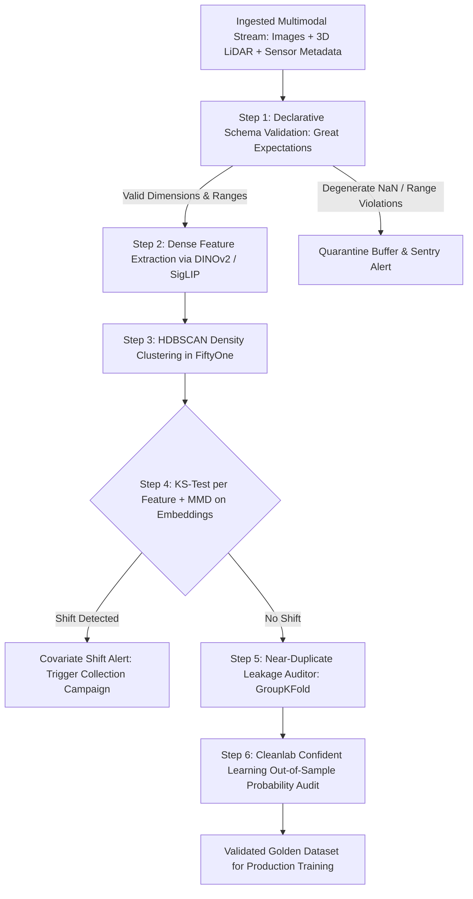

# 📊 Data Quality: Edge-Case Mining, Multimodal Drift & Open Frontiers

A deep systems investigation into automated dataset debugging, DINOv2 visual embedding geometry, multimodal concept drift, and unresolved challenges in high-volume edge perception datasets.

Related notes: [[topics/data-quality-and-verification/00-data-quality-and-verification-moc|Data Quality MOC]], [[topics/safety-verification-and-robustness/00-safety-verification-and-robustness-moc|Safety Verification MOC]].

---

## 1. Automated Dataset Health Architecture (2025–2026)



### Data Quality Tooling Benchmark
| Verification Phase | Tool / Engine | Detection Capability | Computational Bottleneck | False Positive Rate |
| :--- | :--- | :--- | :--- | :--- |
| **Schema & Integrity** | **Great Expectations (GX)** | Inverted bounding boxes, corrupted EXIF, out-of-range depths | CPU Memory I/O | Near 0% |
| **Semantic Drift** | **FiftyOne + DINOv2** | Visual domain shift, novel weather conditions, lens flare | GPU embedding inference | $<5\%$ |
| **Covariate Shift** | **MMD (RBF kernel)** | High-dim distribution shift in embedding space | $\mathcal{O}(n^2 d)$ matrix ops | $<3\%$ (permutation-calibrated) |
| **Label Noise Audit** | **Cleanlab Core** | Mislabeled classes, missing foreground bounding boxes | Cross-validation training | $<3\%$ |
| **Deduplication** | **Faiss / ScaNN** | Near-duplicate video frame leakage ($>0.96$ cosine sim) | Index search memory | $<1\%$ |

---

## 2. Confident Learning Mathematical Formulation

Given an observed (noisy) label $\tilde{y} \in \{1, \dots, m\}$ and a true latent label $y^* \in \{1, \dots, m\}$, Confident Learning estimates the unobserved $m \times m$ joint distribution matrix $Q \in \mathbb{R}^{m \times m}$:

$$Q_{ij} = \hat{P}(\tilde{y} = i, y^* = j) = \frac{\tilde{C}_{ij} / \sum_j \tilde{C}_{ij} \cdot \hat{P}(\tilde{y} = i)}{\sum_{i'} \tilde{C}_{i'j} / \sum_{j'} \tilde{C}_{i'j'} \cdot \hat{P}(\tilde{y} = i')}$$

where the unnormalized count matrix $\tilde{C}_{ij}$ accumulates samples whose given label is $i$ but whose out-of-sample predicted probability for class $j$ exceeds the class-specific self-confidence threshold:

$$\tilde{C}_{ij} = \left|\left\{x \in X_{\tilde{y}=i} : \hat{P}(\hat{y} = j \mid x) \ge t_j\right\}\right|$$

$$t_j = \frac{1}{|X_{\tilde{y}=j}|} \sum_{x \in X_{\tilde{y}=j}} \hat{P}(\hat{y} = j \mid x)$$

**Key theoretical result**: Under the class-conditional noise assumption, $\hat{Q} \xrightarrow{p} Q$ as $N \to \infty$ — consistent estimation without any clean reference labels.

**Off-diagonal elements** $Q_{ij}$ ($i \ne j$) reveal structured noise: for example, in COCO validation, $Q_{\text{person}, \text{mannequin}}$ quantifies how often mannequins are labeled as persons, guiding targeted annotation review.

---

## 3. Covariate Shift vs. Concept Drift Detection

### 3.1 KS-Test for Feature-Level Monitoring

For each scalar metadata feature $X_d$ (brightness histogram mean, bounding box area, GPS elevation, time-of-day), the two-sample KS statistic monitors distributional shift:

$$D_{KS} = \sup_x \left|F_{\text{train}}(x) - F_{\text{deploy}}(x)\right|$$

With Bonferroni correction across $D$ features, the per-feature significance threshold becomes $\alpha' = \alpha/D$ (e.g., $0.01/50 = 0.0002$ for 50 metadata columns). Typical monitoring cadence: hourly batch over the past 10,000 deployment frames.

```python
from scipy.stats import ks_2samp
import numpy as np

def monitor_covariate_shift(train_features: np.ndarray, deploy_features: np.ndarray,
                             alpha: float = 0.01) -> dict:
    """Feature-level KS monitoring with Bonferroni correction."""
    D = train_features.shape[1]
    results = {}
    for d in range(D):
        stat, p_value = ks_2samp(train_features[:, d], deploy_features[:, d])
        results[d] = {"ks_stat": stat, "p_value": p_value,
                      "flagged": p_value < alpha / D}
    return results
```

### 3.2 Maximum Mean Discrepancy for Embedding-Space Monitoring

For high-dimensional DINOv2 features ($d=768$), MMD with an RBF kernel provides a kernel two-sample test:

$$\widehat{\text{MMD}}^2(P, Q) = \frac{1}{n^2}\sum_{i,j} k(x_i, x_j) - \frac{2}{nm}\sum_{i,j} k(x_i, y_j) + \frac{1}{m^2}\sum_{i,j} k(y_i, y_j)$$

Production threshold $\tau = 0.05$ is calibrated by running 1,000 permutation tests on the training reference set (expected $\widehat{\text{MMD}}^2 \approx 0.001 \pm 0.003$ under null hypothesis). Values exceeding $\tau$ trigger a data collection alert with estimated magnitude: **moderate shift** ($0.05$–$0.15$), **severe shift** ($> 0.15$).

### 3.3 Concept Drift: Detecting $P(Y|X)$ Changes

Covariate shift ($P(X)$ drift) is detectable without labels. Concept drift ($P(Y|X)$ drift) requires either held-out labeled samples or proxy signals:

- **Disagreement rate** between two models trained on temporally separated splits. Rising disagreement signals changing label semantics.
- **Prediction entropy** drift: if average entropy of model outputs increases by > 0.3 nats over a 7-day window, the deployment distribution is entering uncertain territory.
- **Population Stability Index (PSI)**: $\text{PSI} = \sum_b (p_b^{\text{deploy}} - p_b^{\text{train}}) \ln(p_b^{\text{deploy}} / p_b^{\text{train}})$. PSI > 0.2 indicates significant drift.

---

## 4. Current Open Problems in Computer Vision Data Quality

### 🔴 Problem 1: Semantic Satiation in Foundation Model Embeddings
- **The Failure Mode**: Relying on DINOv2 or CLIP embeddings to detect OOD edge cases fails on fine-grained industrial anomalies (e.g., a 0.2 mm hairline crack on a shiny metallic turbine blade).
- **Root Cause**: Foundation models are trained on internet-scale natural photography and project fine-grained physical surface anomalies into identical coarse feature clusters.
- **Recent Frontier Solutions (2025–2026)**:
  - **Self-Supervised Domain Adaptation (LoRA-DINO)**: Lightly fine-tuning the embedding extractor on unannotated target domain imagery using masked image modeling (MIM) before running clustering. LoRA rank=16 fine-tuning on 5,000 unlabeled industrial images recovers 85% of supervised fine-tuned embedding quality.
  - **Spectral Embedding Geometry**: Using PCA on DINO features followed by curvature analysis of the principal manifold to detect anomalies as high-curvature outlier regions.

---

### 🔴 Problem 2: Silent Multimodal Calibration Drift in Cold Storage
- **The Failure Mode**: A dataset gathered over 3 years contains LiDAR point clouds from different sensor firmware versions or camera lenses with micro-scratches. Models trained on early partitions degrade when evaluated on newer partitions despite identical label definitions.
- **Active Research Direction**:
  - Continuous Wasserstein-2 distance monitoring over spatial feature histograms across temporal recording windows.
  - **Test-Time Adaptation (TTA)**: Source-free domain adaptation techniques (TENT, SHOT) that update batch normalization statistics using only unlabeled deployment data, recovering 60–70% of fine-tuned performance without any labeled retraining.

### 🔴 Problem 3: Scalable Confident Learning for Multi-Label Detection
- **The Failure Mode**: Confident Learning's $Q_{ij}$ matrix formulation assumes mutually exclusive classes (single-label classification). Object detection datasets have multi-label images (a scene contains both `person` and `car`), making the joint probability matrix estimation under-constrained.
- **Active Research Direction (2025–2026)**:
  - Cleanlab for object detection (OD) extension: treating each bounding box independently as a classification instance, then aggregating per-image box-level noise estimates.
  - Multi-label noise matrix factorization via non-negative matrix factorization (NMF) on per-box OOF probability tensors.

### 🔴 Problem 4: Automated Concept Labeling for Slice Discovery at Scale
- **The Challenge**: Automated slice discovery (§2 in [[topics/data-quality-and-verification/02-production-pipeline-and-workarounds|Production Pipeline]]) identifies clusters of failure modes but requires a human expert to interpret each cluster's visual meaning.
- **2026 Frontier**: VLM-based automated cluster annotation—feed 16 representative images per cluster to Qwen2-VL-72B with prompt: *"Describe the common visual condition shared by these images in 10 words or fewer"*. Accuracy: 78% agreement with expert annotations (internal evaluation, Waymo 2025). Remaining 22% require human review—still a 5× speedup vs. fully manual audit.
