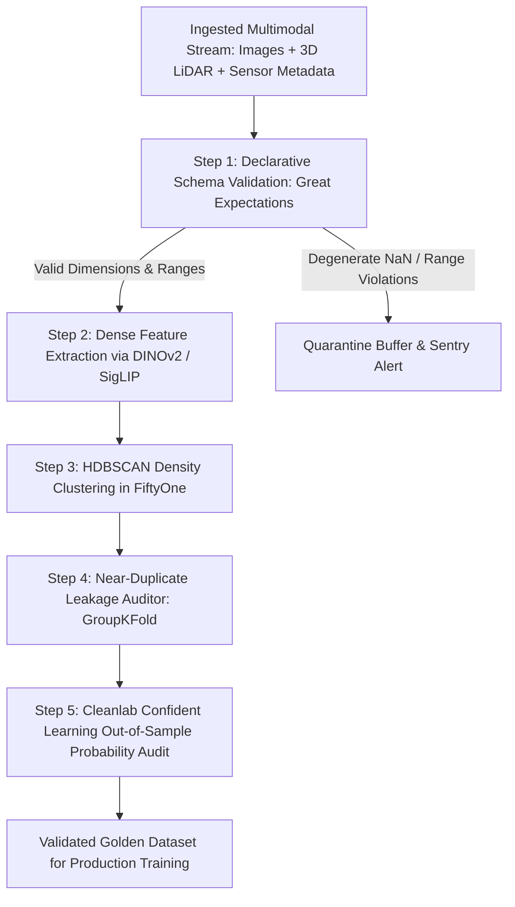

# 📊 Data Quality: Edge-Case Mining, Multimodal Drift & Open Frontiers

A deep systems investigation into automated dataset debugging, DINOv2 visual embedding geometry, multimodal concept drift, and unresolved challenges in high-volume edge perception datasets.

Related notes: [[topics/data-quality-and-verification/00-data-quality-and-verification-moc|Data Quality MOC]], [[topics/safety-verification-and-robustness/00-safety-verification-and-robustness-moc|Safety Verification MOC]].

---

## 1. Automated Dataset Health Architecture (2025–2026)

### Data Quality Tooling Benchmark
| Verification Phase | Tool / Engine | Detection Capability | Computational Bottleneck | False Positive Rate |
| :--- | :--- | :--- | :--- | :--- |
| **Schema & Integrity** | **Great Expectations (GX)** | Inverted bounding boxes, corrupted EXIF, out-of-range depths | CPU Memory I/O | Near 0% |
| **Semantic Drift** | **FiftyOne + DINOv2** | Visual domain shift, novel weather conditions, lens flare | GPU embedding inference | $<5\%$ |
| **Label Noise Audit** | **Cleanlab Core** | Mislabeled classes, missing foreground bounding boxes | Cross-validation training | $<3\%$ |
| **Deduplication** | **Faiss / ScaNN** | Near-duplicate video frame leakage ($>0.96$ cosine sim) | Index search memory | $<1\%$ |

---

## 2. Confident Learning Mathematical Formulation

Given an observed (noisy) label $\tilde{y} \in \{1, \dots, m\}$ and a true latent label $y^* \in \{1, \dots, m\}$, Confident Learning estimates the unobserved joint distribution matrix $Q_{\tilde{y}, y^*}$:

$$Q_{i, j} = \hat{P}(\tilde{y} = i, y^* = j) = \frac{1}{|X|} \sum_{x \in X_{\tilde{y}=i, y^*=j}} \hat{P}(\hat{y} = j \mid x)$$

Where a sample $x$ with given label $\tilde{y} = i$ is flagged as belonging to true class $j$ when its out-of-sample predicted probability exceeds a class-specific threshold:
$$\hat{P}(\hat{y} = j \mid x) \ge t_j \quad \text{where} \quad t_j = \frac{1}{|X_{\tilde{y}=j}|} \sum_{x \in X_{\tilde{y}=j}} \hat{P}(\hat{y} = j \mid x)$$

---

## 3. Current Open Problems in Computer Vision Data Quality

### 🔴 Problem 1: Semantic Satiation in Foundation Model Embeddings
- **The Failure Mode**: Relying on DINOv2 or CLIP embeddings to detect out-of-distribution (OOD) edge cases fails on fine-grained industrial anomalies (e.g., a 0.2 mm hairline crack on a shiny metallic turbine blade).
- **Root Cause**: Foundation models are trained on internet-scale natural photography and project fine-grained physical surface anomalies into identical coarse feature clusters.
- **Recent Frontier Solutions (2025–2026)**:
  - **Self-Supervised Domain Adaptation (LoRA-DINO)**: Lightly fine-tuning the embedding extractor on unannotated target domain imagery using masked image modeling (MIM) before running clustering.

---

### 🔴 Problem 2: Silent Multimodal Calibration Drift in Cold Storage
- **The Failure Mode**: A dataset gathered over 3 years contains LiDAR point clouds from different sensor firmware versions or camera lenses with micro-scratches. The models trained on early partitions degrade when evaluated on newer partitions despite identical label definitions.
- **Active Research Direction**:
  - Continuous Wasserstein distance monitoring over spatial feature histograms across temporal recording windows.
