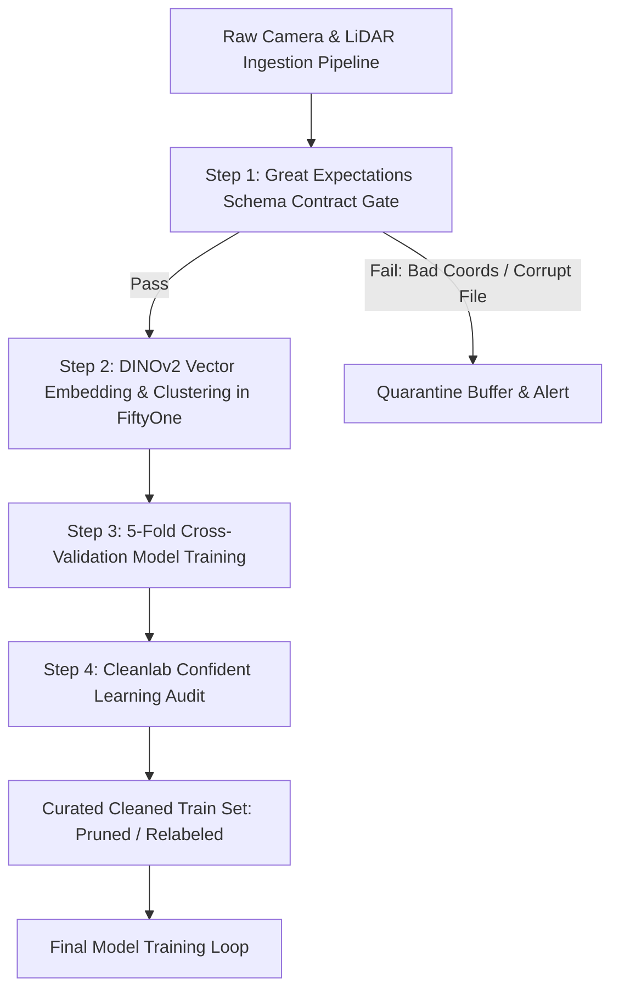

# 📊 Data Quality, Exploration & Validation Playbook

# Overview
In modern computer vision and perception pipelines, over 80% of model performance regressions, silent inference failures, and deployment bottlenecks originate not from architectural flaws, but from **corrupted labels, unrepresentative data splits, distribution shift, and missing edge-case coverage**. Data-Centric AI (DCAI) treats dataset curation, automated anomaly detection, and schema validation as an automated, continuous software engineering discipline.

Related notes: [[resources/ecosystem-tools|Ecosystem Tools]], [[topics/safety-verification-and-robustness/README|Safety & Verification Playbook]].

## SOTA & Research
- **Confident Learning & Noise Identification**:
  - *Northcutt et al.*: *Confident Learning: Estimating Uncertainty in Dataset Labels* (Journal of AI Research). The theoretical foundation for finding exact label error indices in massive datasets using out-of-sample predicted probabilities.
- **Automated Dataset Debugging**:
  - **Cleanlab 2.x/3.x**: Algorithmic discovery of mislabeled images, class-imbalance anomalies, dark/blurry outliers, and near-duplicate leakage between train/val/test splits.
- **Declarative Pipeline Contracts**:
  - **Great Expectations (GX Core)**: Automated pipeline validation suites that verify bounding box coordinate bounds ($x_{\min} \ge 0, x_{\max} \le W$), image aspect ratios, color channel distributions, and missing metadata before training starts.
- **Interactive Visual Exploration & Embedding Geometry**:
  - **FiftyOne (Voxel51)**: Scalable indexing of image embeddings (via DINOv2 / CLIP) to visualize vector clusters, detect semantic concept drift, and slice hard-negative samples interactively.

## Architecture Alternatives & Trade-offs

| Tool / Paradigm | Primary Responsibility | Input Data Modality | Automated Fixes? | Scalability Bottleneck |
| :--- | :--- | :--- | :--- | :--- |
| **Cleanlab** | Mislabeled image detection, out-of-distribution (OOD) scoring | Out-of-fold cross-validated logits | **Yes** (Automated prune or re-label) | Requires full out-of-fold inference cache |
| **Great Expectations**| Pipeline assertion testing, schema validation | Metadata schemas, bounding box tables | No (Assertion fail / alert) | In-memory metadata parsing overhead |
| **FiftyOne** | Visual embedding exploration, dataset clustering | Images, point clouds, video annotations | Interactive | Memory footprint when caching $>1\text{M}$ embeddings |
| **DVC + CML** | Dataset versioning, lineage tracking | Raw binary files, S3 / GCS buckets | No (Version control) | Hash comparison latency on petabyte stores |

## Popular Repos & Integrations
- `cleanlab/cleanlab`: **Cleanlab**: Finding label errors, dataset issues, and outliers in computer vision datasets.
- `great-expectations/great_expectations`: **Great Expectations**: Declarative data quality, assertion testing, and pipeline profiling.
- `voxel51/fiftyone`: **FiftyOne**: Open-source visual data curation, embedding search, and model evaluation.

## End-to-End Pipeline & Workarounds

### Production Workarounds for Common Data Pitfalls:
1. **Data Leakage Across Video Sequences**:
   - *Trap*: Randomly splitting frames from the same 30 FPS video clip across Train and Validation sets yields an artificial 98% mAP that collapses in field deployment.
   - *Fix*: Group-split strictly by physical recording session, vehicle ID, or geographical region using `GroupKFold`.
2. **Bounding Box Boundary Inversions**:
   - Enforce programmatic checks asserting $x_{\max} > x_{\min} + 2\text{ px}$ and $y_{\max} > y_{\min} + 2\text{ px}$ to eliminate zero-area Degenerate Bounding Boxes that crash loss backpropagation.

## Deployment & Real-Time Notes
- **Continuous In-Production Data Curation (Active Learning)**:
  - In deployed edge devices (e.g. Jetson Orin), log frames where model prediction entropy is near maximum ($H(p) \ge 0.8$) or where visual guidance confidence drops below threshold.
  - Compress and stream these "hard cases" over Zenoh/Iceoryx2 back to the central curation loop for automated Cleanlab review.
