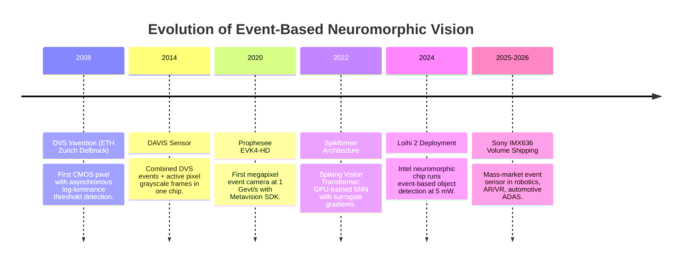
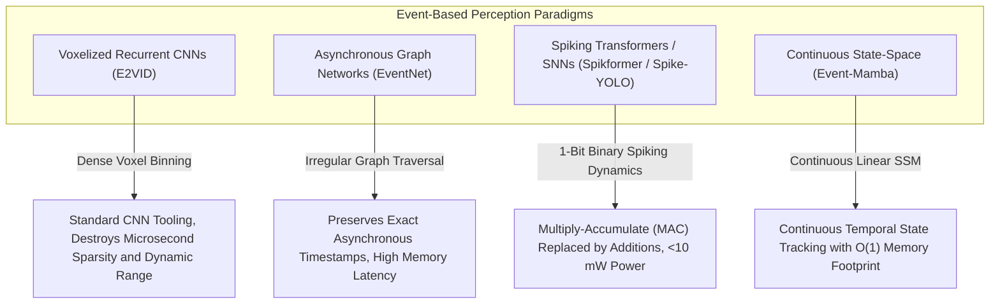

# 📜 Event-Based Vision: Historical Evolution & Paradigms

---

## 1. The Breakdown of Frame-Based Video Acquisition

Standard camera sensors expose an array of millions of pixels simultaneously at a fixed clock rate (30, 60, or 120 FPS). This synchronous paradigm introduces two fundamental physical limitations:

1. **Severe Motion Blur & Low Temporal Resolution**: Fast-moving objects (drone blades, high-speed projectiles, ballistic robotics) displace across dozens of pixels within a single $33\,\text{ms}$ exposure window at 30 FPS. The resulting motion blur destroys edge contours and defeats any tracking algorithm. At 10,000 FPS the blur problem is solved, but bandwidth explodes to $>10\,\text{GB/s}$ for full-resolution uncompressed video — impractical for embedded systems.

2. **Bandwidth & Power Waste**: A static surveillance camera recording at 30 FPS transmits $30 \times W \times H \times 3 \times 8\,\text{bits/s}$ regardless of scene motion. Encoding redundant, unchanged background pixels consumes $>95\%$ of the bandwidth in typical low-motion scenes — a fundamental inefficiency.

The two limitations are in direct tension: **more FPS = more bandwidth**, a trade-off that frame-based sensors cannot escape.

---

## 2. The Neuromorphic Sensor Breakthrough (DVS / DAVIS)

### Asynchronous Event Generation Model

Bio-inspired **Dynamic Vision Sensors (DVS)**, pioneered by Tobi Delbruck at ETH Zürich (2008) and commercialized by **Prophesee (Paris)** and **Sony Semiconductor**, emulate the biological retina. Each pixel operates completely autonomously and asynchronously according to the following photoreception model.

Each pixel continuously monitors the **log-domain luminance** $L(x,y,t) = \ln I(x,y,t)$ where $I$ is the local photocurrent. When the change in log-luminance exceeds a threshold $\theta$ (the **contrast sensitivity**):

$$\Delta L(x,y,t) = L(x,y,t) - L(x,y,t_{\text{last}}) \geq \pm\theta$$

the pixel emits an asynchronous, microsecond-timestamped **Event Token**:

$$e_k = (x_k,\; y_k,\; t_k,\; p_k)$$

where:
- $(x_k, y_k)$: Pixel address in the sensor array.
- $t_k$: Absolute timestamp with $1\,\mu\text{s}$ resolution (TDC-based).
- $p_k \in \{-1, +1\}$: Polarity — $+1$ for brightness increase ($\Delta L \geq +\theta$), $-1$ for brightness decrease ($\Delta L \leq -\theta$).

**Key physical consequence**: Events are only emitted at **moving edges** — static regions of the scene (background, stationary objects) produce zero events. An event-based sensor watching a parked car in a parking lot consumes near-zero bandwidth. The same sensor watching that car accelerate away generates a dense event stream proportional to its velocity and edge count.

### Why Logarithmic Sensing Matters

The log-domain measurement is the key to DVS's extreme dynamic range. Human vision (and DVS) responds to **relative changes** in intensity rather than absolute photon counts. A $1\%$ brightness increase at $1\,\text{lux}$ and $1\%$ increase at $100,000\,\text{lux}$ both produce an event of the same polarity — regardless of the absolute illumination level.

This yields **dynamic range exceeding $>120\,\text{dB}$** (compared to $60$–$70\,\text{dB}$ for standard CMOS cameras, even HDR-enhanced). Practically: a DVS sensor can simultaneously observe a car interior lit at 10 lux and the bright sky at 100,000 lux without saturation or underexposure.

### Sensor Landscape (2024–2026)

| Sensor | Manufacturer | Resolution | Temporal Resolution | Readout Rate |
| :--- | :--- | :--- | :--- | :--- |
| **EVK4-HD** | Prophesee | $1280 \times 720$ | $1\,\mu\text{s}$ | $1\,\text{Gevt/s}$ |
| **IMX636** | Sony (Prophesee IP) | $1280 \times 720$ | $1\,\mu\text{s}$ | $100\,\text{Mevt/s}$ |
| **DAVIS346** | iniVation | $346 \times 260$ | $1\,\mu\text{s}$ + 60 FPS APS | $12\,\text{Mevt/s}$ |
| **SilkyEvCam** | Silky Evision | $1296 \times 964$ | $1\,\mu\text{s}$ | $600\,\text{Mevt/s}$ |
| **GenX320** | Prophesee | $320 \times 320$ | $1\,\mu\text{s}$ | $66\,\text{Mevt/s}$ |

---

## 3. The Computational Evolution: From Frame Reconstruction to Native SNNs

### First Wave (2015–2020): Frame Reconstruction

Early works accumulated events into artificial intensity "frames" over fixed windows $\Delta t = 33\,\text{ms}$, then applied conventional CNNs. This approach was immediately deployable (standard deep learning tooling) but eliminated the entire value proposition: zero latency advantage, no power efficiency, no dynamic range benefit. Event cameras were reduced to expensive, noisy frame cameras.

### Second Wave (2021–2024): Native Asynchronous Representations

Researchers developed event-native representations preserving temporal information:
- **Time Surfaces (TS)**: Per-pixel exponential decay map of the last event timestamp — $T_e(x,y) = \exp(-(t - t_{\text{last}}(x,y))/\tau)$.
- **Voxel Grids**: Discretized into $B = 5$–$20$ temporal bins with bilinear temporal splatting.
- **Graph Neural Networks on Event Graphs**: Events as nodes, spatio-temporal proximity as edges.

These representations enabled GPU-based deep learning while preserving sub-millisecond temporal resolution.

### Third Wave (2025–2026 SOTA): End-to-End Spiking Neural Networks

**Spiking Neural Networks (SNNs)** and **Spiking Vision Transformers (Spikformers)** process raw event streams directly on neuromorphic hardware (Intel Loihi 2, SynSense Speck 2F, Xilinx UltraScale+ FPGA) with milliwatt energy consumption — closing the loop between neuromorphic sensing and neuromorphic computing.

The Spikformer architecture (Zhou et al., 2023) achieves **74.8% ImageNet accuracy** on static frames converted to event streams via $\text{DVS}^{\text{convert}}$, running on Intel Loihi 2 at **$<5\,\text{mW}$ active power** — compared to $120\,\text{W}$ for an equivalent ViT-B/16 on an NVIDIA A100 GPU. The $24,000\times$ power efficiency gap is the defining motivation for neuromorphic deployment in edge robotics, AR/VR headsets, and drone swarms.

---

## 4. Timeline of Neuromorphic Vision Breakthroughs

---

## 5. Intensive Architectural Taxonomy: Convolutional vs Transformer vs Hybrid Sub-Modules

Event-based perception architectures have progressed from dense frame reconstruction using recurrent convolutional networks to graph neural networks on asynchronous event clouds, bio-inspired Spiking Neural Networks (SNNs), Spike-driven Transformers, and continuous state-space models.

### Comparative Sub-Module Architectural Matrix

| Model / System Name & Year | Architectural Paradigm | Backbone Sub-Module | Neck / Feature Aggregator | Encoder Sub-Module | Decoder / Head Sub-Module | Primary Bottleneck & Edge Suitability |
| :--- | :--- | :--- | :--- | :--- | :--- | :--- |
| **E2VID** (2019–2020) | Pure ConvNet / Recurrent CNN | Dense Discretized Event Voxel Grid ($B=5$ bins) | Multi-Scale UNet Skip Connections & Convolutional ResBlocks | Recurrent ConvLSTM / ConvGRU Spatio-Temporal Memory Blocks | Dense Grayscale HDR Intensity Video Reconstruction Head | **Memory Bandwidth Bound**: Discretizing asynchronous events into synchronous dense voxels forfeits microsecond temporal resolution; runs at 30–60 FPS on edge GPUs. |
| **AsyncEvent-GNN (EventNet)** (2021–2022) | Graph Neural Network / Asynchronous Sparse | Spatio-Temporal Event Stream Graph Backbone ($k$-NN graph on $(x,y,t,p)$) | Asynchronous Message Passing & Edge-Conditioned Graph Neck | Dynamic EdgeConv Graph Convolutional Residual Blocks | Sparse 2D Object Bounding Box & Feature Correspondence Head | **Random Memory Access Bound**: High CPU/GPU memory latency during continuous $k$-NN neighbor search on dynamic irregular event clouds. |
| **Spike-YOLO / Spik-ResNet** (2022–2024) | Pure Spiking SNN | Event Surface / Spike Rate Tensor Backbone | Multi-Scale Direct Spike Rate Feature Aggregator | Leaky Integrate-and-Fire (LIF) Spiking Residual Stages ($S \in \{0,1\}$) | Multi-Scale Spiking Detection Head (Anchor-Free Object Detection) | **Surrogate Gradient Training Bound**: Binary spike operations eliminate floating-point multiplications ($4.6\,\text{pJ} \to 0.1\,\text{pJ}$); ideal for edge neuromorphic chips. |
| **Spikformer (Spiking ViT)** (2023–2025) | Pure Spiking Transformer | Spiking Patch Embedding (Conv-LIF Tokenizer, $16\times16$ patches) | Spiking Self-Attention (SSA) Neck (Integer-only additions, zero softmax) | Multi-Stage Spikformer LIF Transformer Encoder Blocks | Neuromorphic Token Classifier / Dense Feature Head | **Spike Rate & Timestep Latency Bound**: Forward pass requires $T=4\text{--}8$ simulation steps; executes at ultra-low dynamic power (<10 mW on neuromorphic silicon). |
| **Event-Mamba (SS-Event)** (2024–2026) | State-Space Mamba Hybrid | Linearized Asynchronous Event Stream Backbone | Bi-directional Cross-Scan Feature Aggregator ($SSM$) | Continuous-Time State-Space Hidden State Transition Blocks ($h_t \in \mathbb{R}^N$) | 1000+ FPS Continuous Optical Flow & Ego-Motion State Regressor | **Compute & Bandwidth Optimal**: $\mathcal{O}(1)$ inference memory overhead and linear $\mathcal{O}(L)$ temporal sequence scaling; runs at $>500\,\text{FPS}$ on Jetson Orin. |
| **Loihi-2 / Speck2F Core** (2024–2026) | Hardware Architecture / Neuromorphic ASIC | Asynchronous Event Routing Mesh ($128\text{--}1024$ Cores) | On-Chip Crossbar Synaptic Matrix Aggregator | Hardware-Hardwired Programmable LIF / Resonate-and-Fire Neurons | Direct Asynchronous Spike Port Output ($<10\,\mu\text{s}$ response) | **Crossbar Routing Congestion**: Eliminates clock oscillators entirely; $<5\,\text{mW}$ active power draw; constrained on-chip SRAM memory per neuromorphic core. |

### Didactic Architectural Trade-Off Analysis

#### 1. Inductive Bias of Dense Frame Grids vs. Asynchronous Spiking Dynamics
Traditional vision models impose a synchronous, dense spatial grid inductive prior. Converting event streams $\mathcal{E} = \{(x_k, y_k, t_k, p_k)\}$ into dense voxel grids $V(x, y, t)$ discards the physical nature of event sensors (temporal resolution $< 1\,\mu\text{s}$, sparsity $> 95\%$).

Native Spiking Neural Networks (SNNs) process events via bio-inspired **Leaky Integrate-and-Fire (LIF)** neuronal membrane potential dynamics:

$$\tau_m \frac{d U_i(t)}{dt} = -(U_i(t) - U_{\text{rest}}) + R \sum_j W_{ij} S_j(t)$$

$$S_i(t) = \Theta(U_i(t) - V_{\text{th}}), \qquad U_i(t) \leftarrow U_i(t)(1 - S_i(t)) + U_{\text{reset}} S_i(t)$$

where $\Theta(\cdot)$ is the Heaviside step function. In Spikformer, **Spiking Self-Attention (SSA)** replaces standard softmax floating-point attention:

$$\text{SSA}(Q_S, K_S, V_S) = \text{LIF}\left(\frac{Q_S K_S^T}{\sqrt{d}} V_S\right)$$

Because $Q_S, K_S, V_S \in \{0, 1\}$ are binary spike tensors, matrix multiplications are replaced entirely by integer accumulations, eliminating high-power floating-point Multiply-Accumulate (MAC) units.

#### 2. Numerical Precision & Energy Consumption in Neuromorphic Silicon
- **MAC vs. AC Silicon Energy**: On a 45nm CMOS process, an FP32 MAC operation consumes $\sim 4.6\,\text{pJ}$, an INT8 MAC consumes $\sim 0.2\,\text{pJ}$, whereas a 1-bit binary Spike Accumulate (AC) operation consumes only **$0.1\,\text{pJ}$** (a $46\times$ energy reduction over FP32).
- **Surrogate Gradient Optimization**: Because the Heaviside spike activation has a derivative $\frac{d\Theta(x)}{dx} = \delta(x)$ that is zero everywhere except at the origin (where it is infinite), training SNNs requires smooth surrogate gradients:

  $$\sigma'(x) = \frac{1}{\pi (1 + (\alpha x)^2)}$$

  Maintaining FP32 gradients during backpropagation through time (BPTT) is mandatory during GPU training, even though deployment on neuromorphic silicon uses purely 1-bit spike tensors.

#### 3. Runtime Deployment Friction: Event Ingestion vs. GPU Memory Latency
- **Event Driver Bottleneck**: At peak optical flow speeds, a megapixel DVS sensor (Sony IMX636) outputs up to $1.06\times 10^9$ events/sec ($>8\,\text{GB/s}$ of raw USB3/MIPI packet data). CPU-based decoding of packet timestamps into GPU tensors introduces up to $20\,\text{ms}$ of serialization latency.
- **Neuromorphic Edge Integration**: Deploying on specialized neuromorphic chips (Intel Loihi 2 / SynSense Speck 2F) enables direct sensor-to-processor asynchronous AER (Address Event Representation) bus coupling, achieving end-to-end perception latencies of **$<500\,\mu\text{s}$** at total system power draws under $15\,\text{mW}$.
