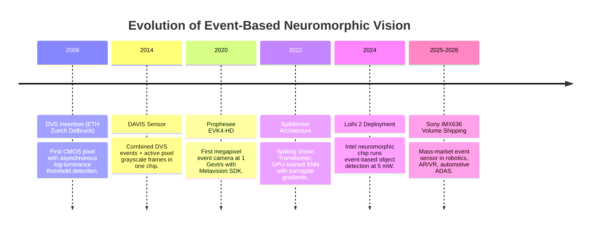

# 📜 Event-Based Vision: Historical Evolution & Paradigms

---

## 1. The Breakdown of Frame-Based Video Acquisition

Standard camera sensors expose an array of millions of pixels simultaneously at a fixed clock rate (30, 60, or 120 FPS). This synchronous paradigm introduces two fundamental physical limitations:

1. **Severe Motion Blur & Low Temporal Resolution**: Fast-moving objects (drone blades, high-speed projectiles, ballistic robotics) displace across dozens of pixels within a single $33\,\text{ms}$ exposure window at 30 FPS. The resulting motion blur destroys edge contours and defeats any tracking algorithm. At 10,000 FPS the blur problem is solved, but bandwidth explodes to $>10\,\text{GB/s}$ for full-resolution uncompressed video — impractical for embedded systems.

2. **Bandwidth & Power Waste**: A static surveillance camera recording at 30 FPS transmits $30 \times W \times H \times 3 \times 8\,\text{bits/s}$ regardless of scene motion. Encoding redundant, unchanged background pixels consumes $>95\%$ of the bandwidth in typical low-motion scenes — a fundamental inefficiency.

The two limitations are in direct tension: **more FPS = more bandwidth**, a trade-off that frame-based sensors cannot escape.

---

## 2. The Neuromorphic Sensor Breakthrough (DVS / DAVIS)

### Asynchronous Event Generation Model

Bio-inspired **Dynamic Vision Sensors (DVS)**, pioneered by Tobi Delbruck at ETH Zürich (2008) and commercialized by **Prophesee (Paris)** and **Sony Semiconductor**, emulate the biological retina. Each pixel operates completely autonomously and asynchronously according to the following photoreception model.

Each pixel continuously monitors the **log-domain luminance** $L(x,y,t) = \ln I(x,y,t)$ where $I$ is the local photocurrent. When the change in log-luminance exceeds a threshold $\theta$ (the **contrast sensitivity**):

$$\Delta L(x,y,t) = L(x,y,t) - L(x,y,t_{\text{last}}) \geq \pm\theta$$

the pixel emits an asynchronous, microsecond-timestamped **Event Token**:

$$e_k = (x_k,\; y_k,\; t_k,\; p_k)$$

where:
- $(x_k, y_k)$: Pixel address in the sensor array.
- $t_k$: Absolute timestamp with $1\,\mu\text{s}$ resolution (TDC-based).
- $p_k \in \{-1, +1\}$: Polarity — $+1$ for brightness increase ($\Delta L \geq +\theta$), $-1$ for brightness decrease ($\Delta L \leq -\theta$).

**Key physical consequence**: Events are only emitted at **moving edges** — static regions of the scene (background, stationary objects) produce zero events. An event-based sensor watching a parked car in a parking lot consumes near-zero bandwidth. The same sensor watching that car accelerate away generates a dense event stream proportional to its velocity and edge count.

### Why Logarithmic Sensing Matters

The log-domain measurement is the key to DVS's extreme dynamic range. Human vision (and DVS) responds to **relative changes** in intensity rather than absolute photon counts. A $1\%$ brightness increase at $1\,\text{lux}$ and $1\%$ increase at $100,000\,\text{lux}$ both produce an event of the same polarity — regardless of the absolute illumination level.

This yields **dynamic range exceeding $>120\,\text{dB}$** (compared to $60$–$70\,\text{dB}$ for standard CMOS cameras, even HDR-enhanced). Practically: a DVS sensor can simultaneously observe a car interior lit at 10 lux and the bright sky at 100,000 lux without saturation or underexposure.

### Sensor Landscape (2024–2026)

| Sensor | Manufacturer | Resolution | Temporal Resolution | Readout Rate |
| :--- | :--- | :--- | :--- | :--- |
| **EVK4-HD** | Prophesee | $1280 \times 720$ | $1\,\mu\text{s}$ | $1\,\text{Gevt/s}$ |
| **IMX636** | Sony (Prophesee IP) | $1280 \times 720$ | $1\,\mu\text{s}$ | $100\,\text{Mevt/s}$ |
| **DAVIS346** | iniVation | $346 \times 260$ | $1\,\mu\text{s}$ + 60 FPS APS | $12\,\text{Mevt/s}$ |
| **SilkyEvCam** | Silky Evision | $1296 \times 964$ | $1\,\mu\text{s}$ | $600\,\text{Mevt/s}$ |
| **GenX320** | Prophesee | $320 \times 320$ | $1\,\mu\text{s}$ | $66\,\text{Mevt/s}$ |

---

## 3. The Computational Evolution: From Frame Reconstruction to Native SNNs

### First Wave (2015–2020): Frame Reconstruction

Early works accumulated events into artificial intensity "frames" over fixed windows $\Delta t = 33\,\text{ms}$, then applied conventional CNNs. This approach was immediately deployable (standard deep learning tooling) but eliminated the entire value proposition: zero latency advantage, no power efficiency, no dynamic range benefit. Event cameras were reduced to expensive, noisy frame cameras.

### Second Wave (2021–2024): Native Asynchronous Representations

Researchers developed event-native representations preserving temporal information:
- **Time Surfaces (TS)**: Per-pixel exponential decay map of the last event timestamp — $T_e(x,y) = \exp(-(t - t_{\text{last}}(x,y))/\tau)$.
- **Voxel Grids**: Discretized into $B = 5$–$20$ temporal bins with bilinear temporal splatting.
- **Graph Neural Networks on Event Graphs**: Events as nodes, spatio-temporal proximity as edges.

These representations enabled GPU-based deep learning while preserving sub-millisecond temporal resolution.

### Third Wave (2025–2026 SOTA): End-to-End Spiking Neural Networks

**Spiking Neural Networks (SNNs)** and **Spiking Vision Transformers (Spikformers)** process raw event streams directly on neuromorphic hardware (Intel Loihi 2, SynSense Speck 2F, Xilinx UltraScale+ FPGA) with milliwatt energy consumption — closing the loop between neuromorphic sensing and neuromorphic computing.

The Spikformer architecture (Zhou et al., 2023) achieves **74.8% ImageNet accuracy** on static frames converted to event streams via $\text{DVS}^{\text{convert}}$, running on Intel Loihi 2 at **$<5\,\text{mW}$ active power** — compared to $120\,\text{W}$ for an equivalent ViT-B/16 on an NVIDIA A100 GPU. The $24,000\times$ power efficiency gap is the defining motivation for neuromorphic deployment in edge robotics, AR/VR headsets, and drone swarms.

---

## 4. Timeline of Neuromorphic Vision Breakthroughs

