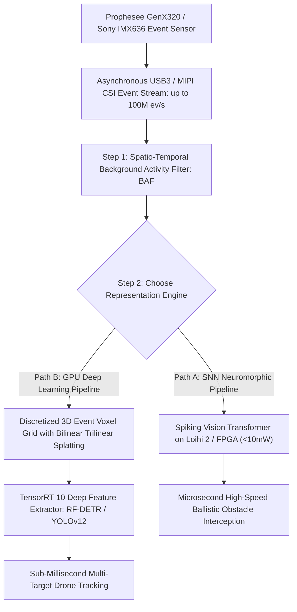

# 🛠️ Event-Based Vision: Production Pipeline & Workarounds

## 1. High-Speed Asynchronous Event Processing Architecture

## 2. Production Engineering Traps & Battle-Tested Workarounds

### Trap 1: Background Thermal Noise Flood in Static Scenes
- **The Issue**: When the camera and scene are stationary, thermal fluctuations cause individual pixels to fire random, uninformative events (Background Activity noise, up to $20\%$ of total bandwidth).
- **Battle-Tested Workaround**:
  - Apply an on-chip or FPGA **Spatio-Temporal Background Activity Filter (BAF)**: An event $e_k = (x_k, y_k, t_k)$ is only forwarded downstream if at least one neighboring pixel in an $8$-connected neighborhood fired an event within time window $\Delta t \le 5\text{ ms}$. This eliminates $>95\%$ of thermal noise events with zero algorithmic latency.

### Trap 2: Event Rate Explosion During Aggressive Camera Pan
- **The Issue**: When an aerial drone or robot violently rotates at $500^\circ/\text{s}$, the entire visual field triggers events simultaneously, generating $>150\text{ Million events/second}$, saturating PCIe buffers and dropping packets.
- **Battle-Tested Workaround**:
  - Implement a dynamic **Hardware Event Rate Controller (ERC)**: Monitor FIFO buffer depth in FPGA/kernel driver; dynamically increase the sensor logarithmic threshold $C$ from $0.15$ to $0.40$ during high angular velocity maneuvers, bounding event bandwidth to a certifiable maximum.
