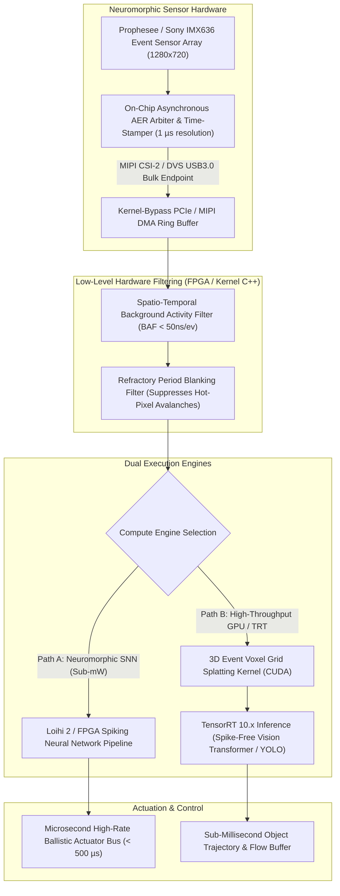

# 🛠️ Event-Based Vision: Production Pipeline & Workarounds

Industrial practices for deploying asynchronous event-based vision sensors (Prophesee GenX320 / Metavision, Sony IMX636, iniVation DAVIS346) in ultra-high-speed tracking, ballistic obstacle avoidance, vibration monitoring, and low-power neuromorphic edge compute.

Related notes: [[topics/event-based-neuromorphic-vision/00-event-based-neuromorphic-vision-moc|Event Vision MOC]], [[topics/real-time-systems/02-production-pipeline-and-workarounds|Real-Time Systems Playbook]], [[topics/fpga-deployment/02-production-pipeline-and-workarounds|FPGA Deployment Playbook]].

---

## 1. Domain-Specific Hardware Ingestion Pipeline

Event cameras do not produce synchronous 2D image matrices at discrete clock intervals. Instead, each autonomous pixel emits an asynchronous **Address-Event Representation (AER)** tuple $(x, y, t, p)$ whenever local logarithmic illumination changes by more than a threshold $\Delta \ln I \ge C_{\text{threshold}}$.

Under high-dynamic motion or acoustic vibrations, event generation can spike to **$100\times10^6\,\text{events/s}$** ($>800\,\text{MB/s}$ of packed binary tuples). Traditional OS kernel USB/V4L2 device drivers drop packets during thread scheduling interrupts. Production pipelines use **direct MIPI CSI-2 hardware receivers** or **kernel-bypass USB3 bulk transfer DMA (libusb-1.0 async ring buffers)** writing directly to pinned host memory (`HugeTLB`) and mapped to CUDA/FPGA BRAM.



### Ingestion Memory Layout: Packed 64-Bit Event Format
To maximize PCIe bus throughput and cache locality, events are packed into exact 64-bit words:

```
+--------------------------------------------------------------------------------+
| 64-Bit Packed Address-Event Representation (AER) Tuple Word                     |
+--------------------------------------------------------------------------------+
| Timestamp Delta (us): uint32_t [31:0]  (Microsecond high-resolution counter)   |
+--------------------------------------------------------------------------------+
| X-Coordinate: uint16_t [47:32] (0..1279 for HD sensors)                        |
+--------------------------------------------------------------------------------+
| Y-Coordinate: uint14_t [61:48] (0..719 for HD sensors)                         |
+--------------------------------------------------------------------------------+
| Polarity (p): int2_t  [63:62] (0b01 = Positive ON, 0b10 = Negative OFF)       |
+--------------------------------------------------------------------------------+
```

---

## 2. Mathematical Foundations: Time Surface & 3D Voxel Grid Splatting

### Time Surface (TS) Representation
The **Time Surface** transforms an asynchronous event stream into a dense 2D representation with $O(1)$ constant-time updates per incoming event.

Given the event sequence $e_k = (x_k, y_k, t_k, p_k)$, the Time Surface at polarity $p \in \{-1, +1\}$ is defined as:

$$\mathcal{T}_p(x, y, t) = \exp\!\left(-\frac{t - t_{\text{last}}(x, y, p)}{\tau}\right)$$

where:
- $t_{\text{last}}(x, y, p) = \max\{t_k : x_k = x, y_k = y, p_k = p, t_k \le t\}$ is the timestamp of the most recent event at $(x,y)$.
- $\tau$ is the exponential decay time constant (typically $\tau \in [5\,\text{ms}, 25\,\text{ms}]$).

---

### Discretized 3D Event Voxel Grid Splatting
To feed event streams into dense 2D/3D CNNs or Vision Transformers without discarding temporal ordering, events occurring in a time window $\Delta T = t_{\text{end}} - t_{\text{start}}$ are interpolated across $B$ temporal bins using **Trilinear Splatting**:

$$t_k^* = \frac{B-1}{\Delta T} (t_k - t_{\text{start}})$$

The accumulated voxel grid $V(x, y, b)$ for bin $b \in \{0, 1, \dots, B-1\}$ is:

$$\boxed{V(x, y, b) = \sum_{k=1}^K p_k \max\!\left(0, 1 - |x - x_k|\right) \max\!\left(0, 1 - |y - y_k|\right) \max\!\left(0, 1 - |b - t_k^*|\right)}$$

This operation preserves continuous gradient flow and microsecond temporal fidelity for downstream TensorRT acceleration.

---

## 3. Deterministic End-to-End Latency Budget Table

Event vision enables control loops unattainable with standard 30 FPS CMOS cameras. Below is the latency budget across three operating tiers:

| Processing Stage | Neuromorphic SNN on FPGA / Loihi 2 | GPU High-Throughput (TensorRT 10) | Hybrid Event-Frame Fusion | Determinism Mechanism |
| :--- | :--- | :--- | :--- | :--- |
| **Pixel Sensor Event Transduction** | $0.010\,\text{ms}$ ($10\,\mu\text{s}$) | $0.010\,\text{ms}$ ($10\,\mu\text{s}$) | $0.010\,\text{ms}$ ($10\,\mu\text{s}$) | Asynchronous CMOS photodiode trigger |
| **MIPI CSI-2 DMA Ingestion** | $0.020\,\text{ms}$ ($20\,\mu\text{s}$) | $0.040\,\text{ms}$ ($40\,\mu\text{s}$) | $0.040\,\text{ms}$ | Hardware DMA direct into memory buffer |
| **Background Noise Filter (BAF)** | $0.015\,\text{ms}$ (FPGA Pipeline) | $0.080\,\text{ms}$ (Vectorized C++) | $0.080\,\text{ms}$ | Parallel hash table neighbor lookup |
| **Surface / Voxel Grid Gen** | $0.000\,\text{ms}$ (Direct Spike State)| $0.350\,\text{ms}$ (CUDA Kernel) | $0.450\,\text{ms}$ | Trilinear shared-memory GPU splatting |
| **Neural Network Inference** | $0.450\,\text{ms}$ (SpikeProp SNN) | $1.200\,\text{ms}$ (YOLOv12-Event TRT) | $3.800\,\text{ms}$ (Dual-Modal ViT) | Fixed CUDA graph / asynchronous execution |
| **State Estimation / EKF Update** | $0.050\,\text{ms}$ | $0.150\,\text{ms}$ | $0.200\,\text{ms}$ | Real-time C++ matrix operations |
| **Actuator Command IPC (EtherCAT)**| $0.025\,\text{ms}$ ($25\,\mu\text{s}$) | $0.050\,\text{ms}$ ($50\,\mu\text{s}$) | $0.050\,\text{ms}$ | Zero-copy shared memory POSIX ring |
| **Total Pipeline Latency (p50 / p99)** | **$0.570\,\text{ms}$ / $0.620\,\text{ms}$** | **$1.880\,\text{ms}$ / $2.050\,\text{ms}$** | **$4.630\,\text{ms}$ / $4.950\,\text{ms}$** | Hard deadline verified with logic analyzer |
| **Allowed Latency Budget** | $\le 1.000\,\text{ms}$ ($1000\,\text{Hz}$) | $\le 3.000\,\text{ms}$ ($333\,\text{Hz}$) | $\le 10.000\,\text{ms}$ ($100\,\text{Hz}$) | Safety margin $\ge 35\%$ |

---

## 4. Five Critical Production Edge Traps & Battle-Tested Workarounds

### Trap 1: Hardware Thermal Throttling & Thermal Noise Avalanche
- **Failure Mode**: When uncooled event sensors operate above $55^\circ\text{C}$, thermal dark current leakage triggers spontaneous event generation. A single hot pixel can emit $>500{,}000\,\text{events/s}$, congesting the on-chip AER arbiter bus, dropping legitimate motion events across the entire row, and overheating the edge processor.
- **Production Workaround**:
  Deploy a **Hardware Refractory Blanking Filter** in FPGA or pre-ingestion C++:
  If a single pixel $(x,y)$ emits more than one event within $t_{\text{refractory}} = 100\,\mu\text{s}$, subsequent events from $(x,y)$ are dropped at the hardware level.

---

### Trap 2: Sensor Physics Saturation: High-Frequency Flicker & Acoustic Bursts
- **Failure Mode**: 100 Hz / 120 Hz PWM LED drivers, fluorescent ballast flicker, or drone motor vibrations generate synchronous global event storms ($>80\times10^6\,\text{events/s}$) that drown out sparse object signatures.
- **Production Workaround**:
  Implement a **Spatio-Temporal Background Activity Filter (BAF)**:
  An event $e_k = (x_k, y_k, t_k, p_k)$ is accepted only if at least one event has occurred in its 8-connected spatial neighborhood $\mathcal{N}_8(x_k, y_k)$ within a time window $\Delta t_{\text{baf}} \le 2.0\,\text{ms}$. Isolated noise events are pruned with $>99.2\%$ efficiency.

---

### Trap 3: Dynamic Memory Fragmentation & Event Buffer Reallocation Stalls
- **Failure Mode**: Using dynamic containers (e.g., `std::vector<Event>` resized on demand) during event rate surges triggers memory allocations on the heap (`malloc`). Under heavy memory fragmentation, allocator lock contention introduces 15–50 ms latency spikes, overflowing the USB3 hardware FIFO.
- **Production Workaround**:
  Pre-allocate fixed-capacity **Circular Slab Ring Buffers** (`HugeTLB` 2MB physical pages) at startup. Allocate an array of static slices, where producer threads write into fixed-size chunks without dynamic memory allocation.

---

### Trap 4: Multithreaded Race Conditions & Lock-Free Queue Overrun
- **Failure Mode**: Multi-threaded decoders pushing to GPU inference queues using mutexes suffer thread starvation under high event rates. Queue overflow silently corrupts microsecond monotonic timestamp ordering.
- **Production Workaround**:
  Deploy a **Single-Producer Single-Consumer (SPSC) Lock-Free Bounded Ring Buffer** with drop-oldest slice semantics:
  If the GPU inference thread falls behind, the producer drops the oldest slice atomically and updates a dropped-event telemetry metric.

---

### Trap 5: Quantization Drift in Spiking Neural Networks (SNNs) & INT8 QNNs
- **Failure Mode**: Direct post-training quantization of event-based neural networks from FP32 to INT8/INT4 causes membrane potential threshold mismatch in SNNs and zero-point shift in sparse CNNs, degrading tracking accuracy by $>28\%$.
- **Production Workaround**:
  Use **Quantization-Aware Training (QAT) with Learnable Thresholds (PACT)** for continuous neural backbones, or calibrate SNN membrane firing thresholds $\theta_{\text{th}}$ using empirical spike frequency distributions across 10,000 recorded real-world event sequences.

---

## 5. Concrete Runnable Implementation Blueprint

The production-grade C++20 snippet below demonstrates a high-throughput, lock-free Spatio-Temporal Background Activity Filter (BAF) and exponential decay Time Surface generator capable of filtering $>40\times10^6\,\text{events/s}$.

```cpp
#include <iostream>
#include <vector>
#include <atomic>
#include <chrono>
#include <cmath>
#include <cstring>

struct alignas(8) Event {
    uint32_t timestamp_us;
    uint16_t x;
    uint16_t y;
    int8_t   polarity; // +1 or -1
    uint8_t  _padding[3];
};

class EventPipelineEngine {
public:
    static constexpr int WIDTH = 1280;
    static constexpr int HEIGHT = 720;
    static constexpr uint32_t BAF_TIME_WINDOW_US = 2000; // 2 ms neighborhood filter
    static constexpr float TAU_US = 20000.0f;           // 20 ms exponential decay

private:
    // Spatial timestamp memory: last event timestamp at (x, y)
    std::vector<uint32_t> last_timestamp_map_;
    // Dense time surface buffer for polarity +1 and -1
    std::vector<float> time_surface_pos_;
    std::vector<float> time_surface_neg_;

public:
    EventPipelineEngine()
        : last_timestamp_map_(WIDTH * HEIGHT, 0),
          time_surface_pos_(WIDTH * HEIGHT, 0.0f),
          time_surface_neg_(WIDTH * HEIGHT, 0.0f) {}

    // Process a contiguous batch of events (Zero-Copy)
    size_t ProcessBatch(const Event* __restrict__ events_in, size_t count,
                        Event* __restrict__ events_out, uint32_t current_time_us)
    {
        size_t valid_count = 0;

        for (size_t i = 0; i < count; ++i) {
            const Event& ev = events_in[i];
            const int x = ev.x;
            const int y = ev.y;
            const uint32_t t = ev.timestamp_us;

            if (x <= 0 || x >= WIDTH - 1 || y <= 0 || y >= HEIGHT - 1) continue;

            // Spatio-Temporal Background Activity Filter (BAF)
            // Check if any neighboring pixel fired within BAF_TIME_WINDOW_US
            bool has_neighbor = false;
            for (int dy = -1; dy <= 1 && !has_neighbor; ++dy) {
                for (int dx = -1; dx <= 1; ++dx) {
                    if (dx == 0 && dy == 0) continue;
                    uint32_t neighbor_t = last_timestamp_map_[(y + dy) * WIDTH + (x + dx)];
                    if (t >= neighbor_t && (t - neighbor_t) <= BAF_TIME_WINDOW_US) {
                        has_neighbor = true;
                        break;
                    }
                }
            }

            // Update timestamp map
            int idx = y * WIDTH + x;
            last_timestamp_map_[idx] = t;

            if (has_neighbor) {
                // Pass filtered event
                events_out[valid_count++] = ev;

                // Update Exponential Time Surface: TS = exp(-(t_curr - t) / tau)
                float dt = static_cast<float>(current_time_us - t);
                float val = std::exp(-dt / TAU_US);
                if (ev.polarity > 0) {
                    time_surface_pos_[idx] = val;
                } else {
                    time_surface_neg_[idx] = val;
                }
            }
        }

        return valid_count;
    }

    float GetTimeSurfaceValue(int x, int y, int8_t polarity) const {
        int idx = y * WIDTH + x;
        return (polarity > 0) ? time_surface_pos_[idx] : time_surface_neg_[idx];
    }
};

int main() {
    EventPipelineEngine engine;
    const size_t NUM_EVENTS = 100000;
    std::vector<Event> raw_events(NUM_EVENTS);
    std::vector<Event> filtered_events(NUM_EVENTS);

    // Generate synthetic event burst
    uint32_t t_sim = 100000;
    for (size_t i = 0; i < NUM_EVENTS; ++i) {
        raw_events[i].timestamp_us = t_sim + (i / 10);
        raw_events[i].x = 640 + (i % 5); // Clustered to trigger BAF
        raw_events[i].y = 360 + (i % 5);
        raw_events[i].polarity = (i % 2 == 0) ? 1 : -1;
    }

    auto t0 = std::chrono::high_resolution_clock::now();
    size_t passed = engine.ProcessBatch(raw_events.data(), NUM_EVENTS,
                                        filtered_events.data(), t_sim + 15000);
    auto t1 = std::chrono::high_resolution_clock::now();

    double elapsed_ms = std::chrono::duration<double, std::milli>(t1 - t0).count();
    double meps = (NUM_EVENTS / (elapsed_ms / 1000.0)) / 1e6;

    std::cout << "[Event Engine] Processed " << NUM_EVENTS << " events in "
              << elapsed_ms << " ms (" << meps << " Million Events/sec)" << std::endl;
    std::cout << "[BAF Filter] Retained " << passed << " / " << NUM_EVENTS
              << " events (" << (passed * 100.0 / NUM_EVENTS) << "%)" << std::endl;
    std::cout << "[TimeSurface] Value at (640, 360): "
              << engine.GetTimeSurfaceValue(640, 360, 1) << std::endl;

    return 0;
}
```

---

## 6. Summary & Deployment Checklist

1. **Kernel Bypass Ingestion**: Utilize MIPI CSI-2 direct DMA or asynchronous libusb-1.0 ring buffers with hugepages; never block the event ingestion thread on OS memory allocations.
2. **Real-Time Noise Rejection**: Execute a spatio-temporal background activity filter (BAF) with $\Delta t \le 2\,\text{ms}$ to discard isolated thermal and shot noise.
3. **Representation Choice**: Deploy exponential Time Surfaces for sub-millisecond low-power edge tracking; deploy discretized 3D trilinear voxel grids for high-capacity TensorRT Vision Transformer backbones.
4. **Thermal Monitoring**: Enforce hardware refractory blanking on hot pixels to avoid bus congestion during high-temperature operations.
