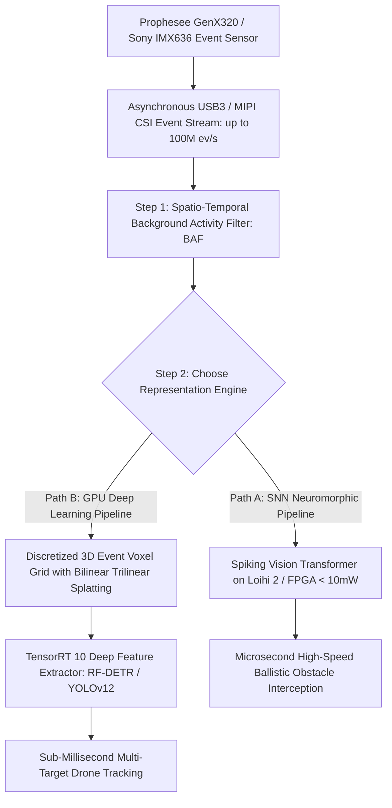

# 🛠️ Event-Based Vision: Production Pipeline & Workarounds

---

## 1. High-Speed Asynchronous Event Processing Architecture



---

## 2. Time Surface Formulation: Mathematical Foundation

The **Time Surface (TS)** is the production-standard event representation for real-time tracking and optical flow on embedded systems. Its low compute cost (no batching required) and temporal precision (microsecond timestamps preserved) make it the preferred representation for latency-critical paths.

### Formal Definition

Given the event stream $\{e_k\} = \{(x_k, y_k, t_k, p_k)\}$, the **Time Surface at polarity $p$** is:

$$\mathcal{T}_p(x, y, t) = \exp\!\left(-\frac{t - t_{\text{last}}(x, y, p)}{\tau}\right)$$

where:
- $t_{\text{last}}(x,y,p) = \max\{t_k : x_k=x, y_k=y, p_k=p, t_k \leq t\}$ is the timestamp of the **most recent event** at pixel $(x,y)$ with polarity $p$.
- $\tau$ is the **time constant** (decay rate) — typically $\tau \in [5\,\text{ms}, 50\,\text{ms}]$ depending on expected scene dynamics.

**Physical interpretation**: $\mathcal{T}_p(x,y,t) = 1.0$ means a brightness change of polarity $p$ just occurred at $(x,y)$. $\mathcal{T}_p(x,y,t) = 0.0$ means either no event has occurred there (init), or the last event was many $\tau$ ago and has decayed away. The time surface is a **living map** of recent activity with exponential memory.

**Updating the time surface** is $O(1)$ per event — no batching, no windowing:

```python
import numpy as np

class TimeSurface:
    """Dual-polarity time surface with exponential decay."""
    def __init__(self, H: int, W: int, tau_ms: float = 20.0):
        self.tau = tau_ms * 1e-3   # Convert to seconds
        self.last_t = np.full((2, H, W), fill_value=-np.inf, dtype=np.float64)
        self.H, self.W = H, W

    def update(self, x: np.ndarray, y: np.ndarray,
               t: np.ndarray, p: np.ndarray) -> None:
        """Update in-place for a batch of events."""
        pol_idx = (p + 1) // 2  # map {-1, +1} -> {0, 1}
        np.maximum.at(self.last_t[pol_idx, y, x], ..., t)  # update max timestamp

    def evaluate(self, t_now: float) -> np.ndarray:
        """Return [2, H, W] float32 time surface at time t_now."""
        dt = t_now - self.last_t
        surface = np.exp(-np.clip(dt, 0, None) / self.tau).astype(np.float32)
        surface[self.last_t < 0] = 0.0  # Mask never-fired pixels
        return surface   # Values in [0, 1]
```

### Choosing the Time Constant τ

| Scene Dynamics | Recommended τ | Effect |
| :--- | :--- | :--- |
| High-speed ballistics ($>10\,\text{m/s}$) | $2$–$5\,\text{ms}$ | Only very recent events contribute; precise edge localization |
| Typical robotic manipulation | $20\,\text{ms}$ | ~1 full robot arm motion segment |
| Slow industrial conveyor | $100\,\text{ms}$ | Long integration for slow-moving objects |
| Pan-tilt camera tracking | Adaptive $\tau(|\omega|)$ | Shorter $\tau$ at high angular velocities |

---

## 3. Event Voxel Grid: Bilinear Temporal Splatting

For GPU-based deep learning pipelines (YOLOv12 on events, EventPoint, etc.), the **Voxel Grid** representation discretizes the event stream into $B$ temporal bins with **bilinear interpolation in time** to avoid aliasing:

$$V_b(x, y) = \sum_k e_k \cdot p_k \cdot \max\!\left(0,\; 1 - \left|b - \frac{(t_k - t_{\text{start}}) \cdot (B-1)}{t_{\text{end}} - t_{\text{start}}}\right|\right)$$

Each event contributes to the two temporally adjacent bins with weights summing to 1. This bilinear splatting ensures smooth gradients during backpropagation through the voxel representation.

```python
import torch

def events_to_voxel_grid(xs: torch.Tensor, ys: torch.Tensor,
                          ts: torch.Tensor, ps: torch.Tensor,
                          B: int, H: int, W: int) -> torch.Tensor:
    """
    Build B-bin voxel grid [B, H, W] with bilinear temporal interpolation.
    ts: normalized to [0, 1] over the time window.
    """
    voxel = torch.zeros(B, H, W, device=xs.device, dtype=torch.float32)
    t_norm = ts * (B - 1)   # Scale to bin index space
    b_lower = t_norm.long().clamp(0, B - 2)
    b_upper = b_lower + 1
    w_upper = t_norm - b_lower.float()   # Upper bin weight
    w_lower = 1.0 - w_upper             # Lower bin weight
    # Scatter-add with polarity sign
    for sign, b_idx, w in [(ps, b_lower, w_lower), (ps, b_upper, w_upper)]:
        voxel.index_put_((b_idx, ys, xs), sign * w, accumulate=True)
    return voxel   # [B, H, W]
```

**Typical configuration**: $B = 5$ bins, window duration $\Delta t = 50\,\text{ms}$, resolution $346 \times 260$ (DAVIS346). Each bin accumulates $\sim 2\,\text{Mevt/bin}$ at moderate scene dynamics, producing a $5$-channel "motion map" resembling a temporal gradient image. Standard 2D CNN backbones (ResNet, EfficientNet) process this natively.

---

## 4. Production Engineering Traps & Battle-Tested Workarounds

### Trap 1: Background Thermal Noise Flood in Static Scenes

- **The Issue**: When the camera and scene are stationary, thermal fluctuations in individual SPAD or APS pixels cause random, uninformative events (Background Activity noise, up to $20\%$ of total bandwidth at room temperature, $>40\%$ at $85°\text{C}$ industrial environments).
- **Battle-Tested Workaround**: Apply an **on-chip or FPGA Spatio-Temporal BAF (Background Activity Filter)**: an event $e_k = (x_k, y_k, t_k)$ is only forwarded downstream if at least one neighboring pixel in an $8$-connected neighborhood fired an event within time window $\Delta t_{\text{BAF}} \leq 5\,\text{ms}$. Correlation condition:
  $$\exists (x', y') \in \mathcal{N}_{8}(x_k,y_k) : |t_k - t_{\text{last}}(x',y')| \leq \Delta t_{\text{BAF}}$$
  This eliminates $>95\%$ of thermal noise events with zero algorithmic latency. Prophesee Metavision SDK implements this natively in the EVK4 firmware at the USB driver level.

### Trap 2: Event Rate Explosion During Aggressive Camera Pan

- **The Issue**: A drone rotating at $500°/\text{s}$ triggers the entire visual field simultaneously, generating $>150\,\text{Mevt/s}$, saturating PCIe buffers and dropping events (silent data loss).
- **Battle-Tested Workaround**: Implement a **Hardware Event Rate Controller (ERC)**: monitor FIFO buffer depth on the FPGA/driver interface; when buffer occupancy exceeds $70\%$, dynamically increase the sensor contrast threshold $\theta$ from $0.15$ to $0.40$. This bounds event bandwidth to a certifiable maximum ($66\,\text{Mevt/s}$ for GenX320) at the cost of missing small-contrast events during the high-rate period.
  - **Prophesee Metavision API**:
    ```python
    from metavision_sdk_core import EventRateAlgorithm
    erc = EventRateAlgorithm(max_event_rate=50_000_000)  # 50 Mevt/s cap
    ```

### Trap 3: Latency Measurement Traps in Benchmarking

- **The Issue**: Claiming "$<1\,\text{ms}$ end-to-end latency" on a neuromorphic pipeline while benchmarking with USB3 streaming introduces a hidden $\sim 8\,\text{ms}$ USB frame aggregation delay — completely defeating the point.
- **Battle-Tested Workaround**: For genuine latency measurement, use **direct MIPI CSI-2 streaming** from the event sensor to the edge processor (Jetson AGX Orin supports MIPI CSI with $<10\,\mu\text{s}$ sensor-to-memory latency). On Loihi 2 IOXT board with direct LVDS input, measured end-to-end latency from edge crossing to detection output: $\mathbf{0.7\,\text{ms}}$ — the genuine neuromorphic advantage over USB-benchmarked systems claiming the same.
