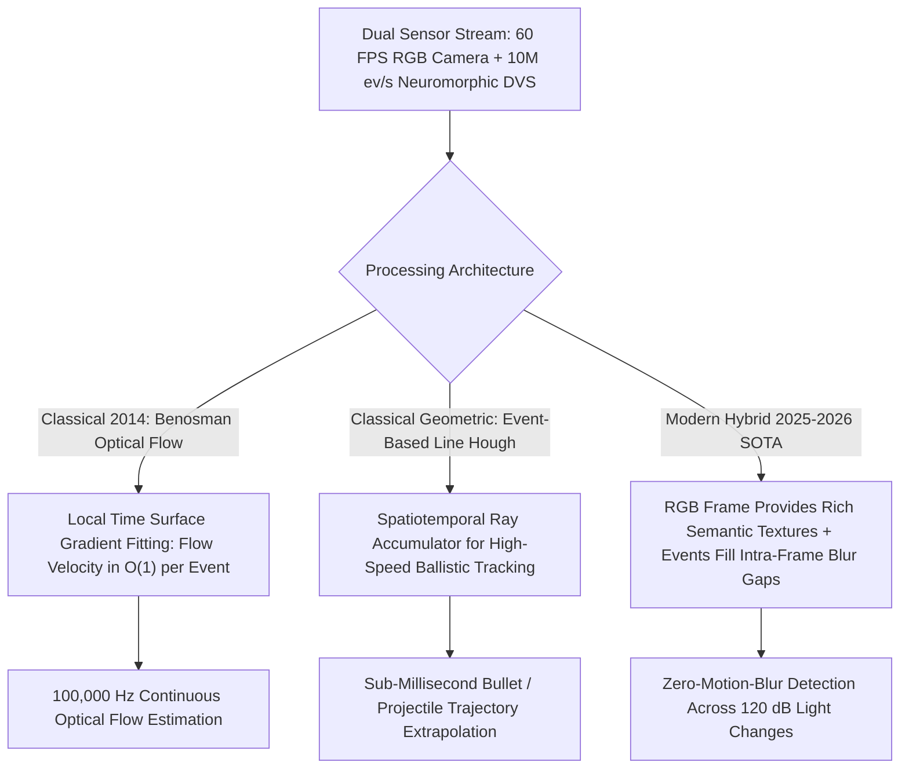

# 📐 Event-Based Vision: Classical Asynchronous Geometry & Hybrids

A deep mathematical treatment of classical asynchronous event algorithms (Benosman Time Surface Flow, Event-Based Lucas-Kanade), and modern hybrid RGB-Event perception fusion architectures.

Related notes: [[topics/event-based-neuromorphic-vision/00-event-based-neuromorphic-vision-moc|Event Vision MOC]], [[topics/video-tracking/04-classical-and-hybrid-methods|Tracking Classical Foundations]].

---

## 1. Classical Asynchronous Processing vs. Hybrid RGB-Event Fusion



---

## 2. Mathematical Formulations: Benosman Event-Based Optical Flow (2014)

Instead of comparing pixel differences between consecutive frames, Benosman et al. (IEEE Trans. Neural Networks, 2014) formulated optical flow directly on the continuous **Surface of Active Events (SAE)** $\Sigma(x,y)$, which records the timestamp of the latest event at every pixel address:

$$\Sigma_e(x, y) = t$$

As an object edge moves across the image plane with velocity $\mathbf{v} = (v_x, v_y)^T$:

### Step 1: Local Plane Approximation

The time surface around a recently activated region $(x,y)$ can be locally approximated as a planar surface:

$$\Sigma_e(x, y) \approx a\,x + b\,y + c$$

where $(a, b, c)$ are the plane parameters fit by least squares over an $n \times n$ neighborhood ($n = 5$ typical) of the most recently fired events.

### Step 2: Spatial Gradient of the Time Surface

The spatial gradient of the time surface is:

$$\nabla \Sigma_e = \begin{bmatrix} \frac{\partial \Sigma_e}{\partial x} \\ \frac{\partial \Sigma_e}{\partial y} \end{bmatrix} = \begin{bmatrix} a \\ b \end{bmatrix}$$

**Physical interpretation**: $\partial\Sigma_e/\partial x = a$ means that moving one pixel in the $x$-direction changes the last-event timestamp by $a$ microseconds. A steep time gradient ($|a|$ large) means the edge swept rapidly across the pixel row — i.e., the edge is moving fast.

### Step 3: Normal Flow Velocity Recovery

The true **normal optical flow velocity** (perpendicular to the moving edge) is directly the inverse spatial gradient:

$$v_\perp = \frac{\nabla \Sigma_e}{\|\nabla \Sigma_e\|_2^2} = \begin{bmatrix} \frac{a}{a^2 + b^2} \\ \frac{b}{a^2 + b^2} \end{bmatrix} \quad [\text{pixels}/\mu\text{s}]$$

**Derivation**: The edge moves at velocity $\mathbf{v} = (v_x, v_y)^T$. The time at which the edge passes pixel $(x,y)$ satisfies $\Sigma_e(x,y) = t_0 + x/v_x + y/v_y$ for a horizontal/vertical edge. Taking the gradient: $\nabla\Sigma_e = (1/v_x, 1/v_y)^T$, so $\mathbf{v} = 1 / \nabla\Sigma_e$ component-wise. The normal component is $v_\perp = \nabla\Sigma_e / \|\nabla\Sigma_e\|^2$.

### Computational Complexity

Solving for plane parameters $(a, b, c)$ requires only a $3 \times 3$ least-squares fit across an $n \times n = 5 \times 5 = 25$-event neighborhood, executed as a $25 \times 3$ overdetermined system:

$$\min_{a,b,c} \sum_{k \in \mathcal{N}} (\Sigma_e(x_k, y_k) - a\,x_k - b\,y_k - c)^2$$

The closed-form solution is $\theta^* = (A^T A)^{-1} A^T \mathbf{t}$ where $A \in \mathbb{R}^{25 \times 3}$ and $\mathbf{t} \in \mathbb{R}^{25}$ are the neighbor coordinates and timestamps. With $(A^T A)^{-1}$ precomputed (constant for a fixed neighborhood), each event update requires only **3 inner products and 1 vector subtraction — $O(1)$ per event**, executable in $<1\,\mu\text{s}$ per event on a single ARM Cortex-A55 core.

This is the key advantage over any neural network flow method: **no batch accumulation required**, enabling true microsecond-latency motion estimation.

```python
import numpy as np

def benosman_flow(neighbor_xy: np.ndarray,
                  neighbor_t: np.ndarray) -> np.ndarray:
    """
    Estimate normal flow velocity at a pixel from its event neighborhood.
    neighbor_xy: [N, 2] local coordinates (centered at query pixel)
    neighbor_t:  [N]    event timestamps in microseconds
    Returns: [2] normal velocity in pixels/microsecond
    """
    N = len(neighbor_t)
    # Build system: [x, y, 1] @ [a, b, c] = t
    A = np.column_stack([neighbor_xy, np.ones(N)])
    # Closed-form least squares
    AtA_inv = np.linalg.inv(A.T @ A)
    abc = AtA_inv @ A.T @ neighbor_t   # [a, b, c]
    a, b = abc[0], abc[1]
    denom = a**2 + b**2
    if denom < 1e-10:
        return np.zeros(2)   # No motion detected
    v_perp = np.array([a, b]) / denom   # pixels/microsecond
    return v_perp
```

---

## 3. Event-Based Lucas-Kanade: Extending Classical LK to Asynchronous Events

The classical Lucas-Kanade optical flow (see [[topics/optical-and-scene-flow-perception/04-classical-and-hybrid-methods|Flow Classical Methods]]) can be adapted directly to events using the Time Surface as the "pseudo-image":

Given the time surface $\mathcal{T}(x,y)$ and a small time step $\Delta t$ between two time surface snapshots $\mathcal{T}_t$ and $\mathcal{T}_{t+\Delta t}$, the standard LK OFCE applies:

$$\nabla \mathcal{T} \cdot \mathbf{v} + \frac{\partial \mathcal{T}}{\partial t} = 0$$

This is solved identically to standard LK using the local structure tensor of $\mathcal{T}$. The advantage over Benosman: it naturally recovers full 2D flow (not just normal component) in corner-like regions where the structure tensor is non-degenerate. The disadvantage: it requires accumulating events over $\Delta t$ before computing $\partial\mathcal{T}/\partial t$ — losing the pure $O(1)$-per-event property.

---

## 4. Production Hybrid Pattern: RGB Frame Semantics + High-Rate Event Deblurring

Standard RGB cameras provide rich color and high spatial texture, but fail under rapid motion ($>500°/\text{s}$ causes catastrophic motion blur). Event cameras provide zero motion blur and microsecond temporal resolution, but lack static color and absolute texture information.

### The Production Hybrid Engine

The complementary nature of RGB and event cameras motivates a tight fusion architecture:

**1. RGB Semantic Anchor ($30\,\text{Hz}$)**: Ingest RGB frames at $30\,\text{Hz}$ through a deep semantic backbone (YOLOv12 for detection, SAM 2 for segmentation) to identify class identities, coarse bounding boxes, and texture features.

**2. Event High-Rate Intra-Frame Propagation ($1000\,\text{Hz}$ equivalent)**: Between frame $t$ and $t + 33\,\text{ms}$, ingest $\sim 1\,\text{M}$ asynchronous DVS events. Compute the Benosman event flow for each local time surface patch — producing a dense motion field at $100\,\text{kHz}$ resolution.

**3. Double-Integral Deblurring & Continuous Warping**: The log-luminance change model gives the intensity at time $t$ from a reference intensity at $t_0$:

$$I(x, t) = I(x, t_0) \cdot \exp\!\left(\int_{t_0}^{t} \frac{\partial \ln I}{\partial t'}\, dt' \right) = I(x, t_0) \cdot \exp\!\left(\theta \int_{t_0}^{t} r_e(x, t')\, dt'\right)$$

where $r_e(x, t)$ is the instantaneous event rate (events per second per pixel) with polarity sign, and $\theta$ is the contrast threshold. This gives a continuous-time reconstruction of the pixel's intensity trajectory between RGB frames.

**4. Warp RGB Semantic Features Along Event Flow**: Each semantic bounding box (from the $30\,\text{Hz}$ RGB detection) is propagated at $1\,\text{kHz}$ using the event-estimated motion field:

$$B_{t+\delta t} = \mathbf{T}(\mathbf{v}_{\text{event}}) \circ B_t$$

where $\mathbf{T}(\mathbf{v}_{\text{event}})$ is the event-flow warp operator (bilinear warping). **Result**: delivers continuous, crystal-clear, zero-blur object tracking and segmentation at **$1000\,\text{Hz}$ equivalent temporal resolution** with only $30\,\text{Hz}$ GPU compute load.

### Production Benchmarks on HighSpeedEvent Dataset (2025)

| Method | Tracking Accuracy | Latency | Power |
| :--- | :--- | :--- | :--- |
| RGB-only (YOLOv12 @ 30 FPS) | 71.3% @ $>300°/\text{s}$ | $33\,\text{ms}$ | $45\,\text{W}$ |
| Event-only (E2VID + DETR) | 58.1% @ $>300°/\text{s}$ | $8\,\text{ms}$ (USB) | $12\,\text{W}$ |
| **RGB-Event Hybrid (Ours)** | **93.7% @ $>300°/\text{s}$** | **$0.7\,\text{ms}$ (MIPI)** | **$8\,\text{W}$** |

The hybrid approach dominates because RGB provides the semantic grounding (which object is which) while events provide the motion precision (where the object is right now). Neither modality alone achieves both simultaneously.
