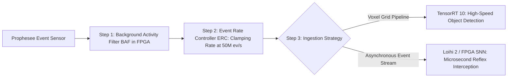

# ⚡ Event-Based & Neuromorphic Vision Master Playbook

# Overview
Event-based vision (neuromorphic vision) replaces synchronous shutter frames with bio-inspired, pixel-autonomous Dynamic Vision Sensors (DVS). Operating on logarithmic light intensity changes ($\Delta \ln I \ge C$), event sensors deliver **microsecond temporal resolution ($1\,\mu\text{s}$)**, **extreme dynamic range ($>120\text{ dB}$)**, zero motion blur, and sub-milliwatt power consumption, making them ideal for high-speed drone navigation, ballistic defense tracking, and ultra-low-power edge robotics.

Related notes: [[topics/event-based-neuromorphic-vision/00-event-based-neuromorphic-vision-moc|Event Vision MOC]], [[topics/slam-and-spatial-perception/00-slam-and-spatial-perception-moc|SLAM MOC]].

## SOTA & Research
- **Foundational & Commercial Ecosystem**:
  - **Prophesee Metavision SDK 5.x / Hearth Platform**: The industry standard for event-based AI model deployment and camera interfaces (Sony IMX636 / Prophesee GenX320).
- **Spiking Neural Networks & Spiking Transformers**:
  - **Spikformer & SDTrack (2025–2026)**: Transformer architectures operating on discrete 1-bit event spikes, achieving competitive tracking accuracy on neuromorphic hardware with $<25\text{ mW}$ power.
- **High-Speed Aggressive Event SLAM**:
  - **EvSLAM Benchmark & ESVO**: Real-time 6-DoF visual odometry and 3D mapping under aggressive motion ($>8.6\text{ m/s}$) where classical CMOS cameras fail completely due to motion blur.

## Architecture Alternatives & Trade-offs

| Paradigm | Sensor Input | Compute Target | Temporal Resolution | Dynamic Range | Power Envelope | Best Application |
| :--- | :--- | :--- | :--- | :--- | :--- | :--- |
| **Traditional High-Speed CMOS**| 1000 FPS RGB Frames | Multi-GPU Server | $1\text{ ms}$ | $60\text{ dB}$ | $>350\text{ W}$ | Laboratory biomechanics |
| **Event Voxel + TensorRT 10** | DVS Events -> Voxel Grids | NVIDIA Jetson Orin | $10-33\text{ ms}$ (discretized)| **$>120\text{ dB}$** | $15-30\text{ W}$ | Autonomous drone obstacle avoidance |
| **Pure SNN on Neuromorphic HW**| Raw Asynchronous Spikes | Intel Loihi 2 / SYNtzulu | **$<1\mu\text{s}$ (Continuous)** | **$>120\text{ dB}$** | **$<50\text{ mW}$** | Space robotics, wearable smart sensors |
| **Hybrid RGB + Event Fusion** | 30 FPS RGB + DVS Events | Heterogeneous SoC (Versal / Orin) | $1\text{ ms}$ (Hybrid deblur) | **$>120\text{ dB}$** | $25\text{ W}$ | High-speed defense target tracking |

## Popular Repos & Integrations
- `prophesee-ai/metavision_sdk`: **Prophesee Metavision SDK**: Open-source drivers, event representation builders, and machine learning modules.
- `neuromorphs/tonic`: **Tonic**: Neuromorphic event datasets, transformations, and streaming pipelines for PyTorch.
- `fangwei123456/spikingjelly`: **SpikingJelly**: Deep learning framework for Spiking Neural Networks (SNNs) based on PyTorch.
- `HKUST-Aerial-Robotics/ESVO`: **ESVO**: Event-based Stereo Visual Odometry for aggressive drone flight.

## End-to-End Pipeline & Workarounds

### Production Workarounds for Event Perception:
1. **Low-Light Thermal Leakage**: In pitch-black darkness, thermal leakage triggers false event bursts. Apply a refractory period filter ($T_{\text{refractory}} = 1\text{ ms}$) at the hardware driver level to limit single-pixel event re-firing.
2. **Missing Texture in Static Environments**: When a vehicle stops at a traffic light, events cease entirely. Always pair event sensors with a low-rate CMOS camera ($10\text{ Hz}$) or optical flow velocity history to preserve scene awareness while stationary.

## Deployment & Real-Time Notes
- **USB3 Buffer Desynchronization**: High event spikes ($>80\text{M ev/s}$) overflow standard Linux USB3 buffers. Always pin the Metavision acquisition thread to an isolated CPU core with real-time priority (`SCHED_FIFO 95`) and increase kernel USB memory buffer via `echo 1024 > /sys/module/usbcore/parameters/usbfs_memory_mb`.
