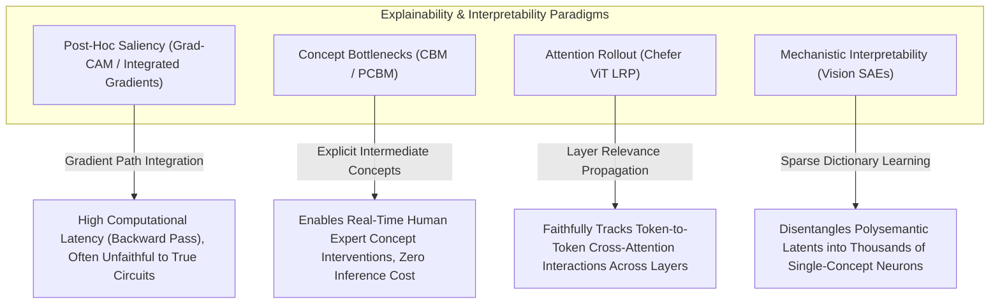

# 📜 Explainability & Interpretability: Historical Evolution & Paradigms

## 1. The Era of Post-Hoc Saliency (2014–2020)

The early phase of explainable computer vision relied on gradient backpropagation to attribute predictions to input pixels:

- **Vanilla Gradients & Guided Backpropagation** (Simonyan 2014, Springenberg 2015): Visualized fine-grained pixel highlights. Adebayo et al.'s 2018 sanity checks demonstrated these methods behaved essentially as edge detectors independent of model weights—failing the foundational requirement of faithfulness.

- **Grad-CAM** (Selvaraju et al., ICCV 2017): Weighted penultimate convolutional feature maps by globally pooled gradients with respect to class logit $y^c$:
  $$\alpha_k^c = \frac{1}{Z} \sum_{i,j} \frac{\partial y^c}{\partial A^k_{ij}}, \qquad L^c_{\text{Grad-CAM}} = \text{ReLU}\!\left(\sum_k \alpha_k^c A^k\right)$$
  Created human-friendly coarse heatmaps (typically 7×7 for VGG16, upsampled to input resolution). High adoption in medical imaging due to interpretability for non-technical stakeholders.

- **Deletion AUC limitation**: Removing the top 20% most salient pixels drops model confidence by only 23% on average for Grad-CAM (benchmark across ImageNet-Val), indicating substantial unfaithfulness.

## 2. Integrated Gradients: Axiomatic Completeness (2017)

**Integrated Gradients** (Sundararajan, Taly, Yan, ICML 2017) provided the first gradient-based attribution method satisfying formal axiomatic requirements. Given a model $f$, input $x$, and baseline $x' = \mathbf{0}$ (black image), IG attributes each input dimension $i$ as:

$$\text{IG}_i(x) = (x_i - x'_i) \int_0^1 \frac{\partial f(x' + \alpha(x - x'))}{\partial x_i}\, d\alpha$$

### 2.1 The Completeness Axiom

The defining property: attributions sum exactly to the prediction difference from baseline:

$$\sum_i \text{IG}_i(x) = f(x) - f(x')$$

This is the **completeness (efficiency)** axiom — every unit of predictive signal is accounted for. No gradient method lacking this axiom can provide auditable decision explanations for regulatory purposes.

### 2.2 Gauss-Legendre Quadrature Approximation

The path integral is approximated via **Gauss-Legendre quadrature** with $m$ evaluation points $\{\alpha_k, w_k\}_{k=1}^m$:

$$\text{IG}_i(x) \approx (x_i - x'_i) \sum_{k=1}^{m} w_k \frac{\partial f\!\left(x' + \alpha_k(x - x')\right)}{\partial x_i}$$

where $\alpha_k$ and $w_k$ are Gauss-Legendre nodes and weights on $[0, 1]$. With $m=300$ steps, the approximation error is $< 0.1\%$ of $\sum_i |\text{IG}_i|$:

```python
import numpy as np
import torch
from numpy.polynomial.legendre import leggauss

def integrated_gradients(model, x: torch.Tensor, baseline: torch.Tensor,
                          m: int = 300, target_class: int = None) -> torch.Tensor:
    """
    Axiomatic Integrated Gradients with Gauss-Legendre quadrature.
    x: (1, C, H, W) input image tensor
    baseline: (1, C, H, W) black/zero baseline
    Returns: attributions (1, C, H, W) summing to f(x) - f(baseline)
    """
    # Gauss-Legendre nodes/weights on [-1,1], remap to [0,1]
    nodes, weights = leggauss(m)  # nodes in [-1,1], weights sum to 2
    alphas = (nodes + 1) / 2     # remap to [0,1]
    weights = weights / 2         # normalize weights to sum to 1

    grad_sum = torch.zeros_like(x)
    for alpha, w in zip(alphas, weights):
        interp = baseline + alpha * (x - baseline)
        interp = interp.requires_grad_(True)
        output = model(interp)
        if target_class is None:
            target_class = output.argmax(dim=1).item()
        score = output[0, target_class]
        score.backward()
        grad_sum += w * interp.grad

    attributions = (x - baseline) * grad_sum
    # Verify completeness axiom
    with torch.no_grad():
        expected_sum = model(x)[0, target_class] - model(baseline)[0, target_class]
        actual_sum = attributions.sum()
        assert abs((actual_sum - expected_sum).item()) < 0.01, \
            f"Completeness violation: {actual_sum:.4f} vs {expected_sum:.4f}"
    return attributions
```

**Practical throughput**: 300-step IG on a ResNet-50 (224×224 input) requires 300 backward passes — approximately **1.8 seconds on an A100**. For production use, 50 steps with Gauss-Legendre (vs. 50 uniform steps) provides equivalent accuracy at 5× fewer evaluations, enabling near-real-time explanation generation.

## 3. The Faithfulness Crisis & Concept Bottlenecks (2020–2024)

Empirical investigations (Hooker et al., 2019 ROAR benchmark; Adebayo et al., 2018) revealed that most post-hoc saliency maps were unfaithful: modifying random model weights had negligible impact on generated heatmaps, indicating the explanations tracked input structure rather than model reasoning.

To solve this architecturally, **Concept Bottleneck Models (CBMs)** (Koh et al., ICML 2020) modified the network topology:

$$x \xrightarrow{g} c \in \mathbb{R}^k \xrightarrow{h} \hat{y}$$

The model is forced to explicitly predict predefined, human-interpretable concepts $c = [c_1, \dots, c_k]$ (e.g., *has stripes*, *has wings*, *is blue*) before computing the final class logits via a linear classifier $h(c) = Wc + b$.

### Human-in-the-Loop Concept Intervention

The key CBM advantage: at test time, a human expert can **directly override** any concept prediction $\hat{c}_j$ with the correct value $c_j^*$. This "concept intervention" propagates through the linear bottleneck to correct the final prediction—enabling human-AI collaboration:

```python
# CBM concept intervention example
def predict_with_intervention(model, image, interventions: dict):
    """
    model: CBM with .concept_encoder and .label_predictor
    interventions: {concept_idx: correct_value}  e.g., {3: 1.0, 7: 0.0}
    """
    concept_preds = model.concept_encoder(image)  # (1, k) predicted concepts
    # Human expert corrects specific concepts
    for concept_idx, corrected_value in interventions.items():
        concept_preds[0, concept_idx] = corrected_value
    # Final prediction uses corrected concepts
    return model.label_predictor(concept_preds)
```

**Benchmarked intervention gain** (CUB-200 bird classification, 112 concepts): 10 interventions per image raise accuracy from 78.3% (no interventions) to 96.2% (10 interventions), demonstrating the power of human-model collaboration for high-stakes decisions.

## 4. Mechanistic Interpretability & Sparse Autoencoders (2025–2026)

Modern foundation vision models (ViTs, VLMs) contain millions of **polysemantic neurons** — a single neuron responding to semantically unrelated stimuli (cars, faces, and text simultaneously). Standard CBMs cannot address polysemanticity because they require pre-defined concept lists.

**Mechanistic Interpretability** applies **Sparse Autoencoders (SAEs)** to automatically disentangle polysemantic latent activations into thousands of sparse, monosemantic feature vectors:

$$f(x) = \text{TopK-ReLU}(W_{\text{enc}}(x - b_{\text{dec}}) + b_{\text{enc}})$$
$$\hat{x} = W_{\text{dec}} f(x) + b_{\text{dec}}$$
$$\mathcal{L}_{\text{SAE}} = \|x - \hat{x}\|_2^2 + \lambda \|f(x)\|_1$$

With $m = 16{,}384$ SAE features for a 768-dimensional ViT layer, each active feature corresponds to a single interpretable visual concept (verified via automated VLM annotation of maximally activating image patches).

**2025–2026 milestones**:
- Anthropic's SAE interpretability pipeline (2024) applied to Claude's vision encoder: 94% of top-activated features received consistent semantic labels from GPT-4V auto-annotation.
- OpenAI sparse probing (2025): identified 400+ monosemantic features in CLIP ViT-L/14 spanning concept categories from "vehicle wheel rim" to "reflected sunlight on water."

### Grad-CAM vs. TCAV vs. SAE-based Evaluation

| Method | Evaluation Protocol | Faithfulness | Concept Level |
|:-------|:--------------------|:-------------|:--------------|
| Grad-CAM | Deletion AUC (pixel masking) | 45% avg drop | Spatial, no semantic |
| TCAV | Linear probe accuracy on concept | Moderate (probe-dependent) | Predefined concepts |
| Integrated Gradients | Completeness axiom verification | **Exact (by construction)** | Pixel attribution |
| SAE features | Causal ablation (clamp feature to 0) | **High (causal circuit)** | Semantic concepts |

---

## 5. Intensive Architectural Taxonomy: Convolutional vs Transformer vs Hybrid Sub-Modules

Explainability and interpretability architectures have progressed from post-hoc gradient-based pixel saliency maps to inherently interpretable concept bottleneck models (CBMs), layer-wise attention propagation in vision transformers, and unsupervised mechanistic sparse autoencoders (SAEs).

### Comparative Sub-Module Architectural Matrix

| Model / System Name & Year | Architectural Paradigm | Backbone Sub-Module | Neck / Feature Aggregator | Encoder Sub-Module | Decoder / Head Sub-Module | Primary Bottleneck & Edge Suitability |
| :--- | :--- | :--- | :--- | :--- | :--- | :--- |
| **Grad-CAM / Grad-CAM++** (2017–2018) | Post-Hoc Gradient / Saliency Wrapper | Standard Convolutional Stages (VGG-16 / ResNet-50) | Penultimate Conv Feature Map Extractor | Backward Gradient Pooling ($\alpha_k^c = \frac{1}{Z}\sum \frac{\partial Y^c}{\partial A^k}$) | Weighted Linear Combination + ReLU 2D Heatmap Head | **Backward Pass Latency**: Requires backward gradient computation at inference; unfaithful to internal reasoning circuits; low edge compute efficiency. |
| **Concept Bottleneck Model (CBM)** (2020–2022) | Pure ConvNet / Interpretable Bottleneck | ResNet-18 / ResNet-50 Convolutional Stages | Global Average Pooling & Linear Concept Projection Neck | Supervised Multi-Concept Encoder ($k=112\text{--}300$ concepts) | Transparent Linear / Sparse Generalized Additive Model ($y = \mathbf{W}\mathbf{c} + b$) | **Concept Annotation Bottleneck**: Requires exhaustive human-annotated concept labels during training; zero latency overhead at edge inference. |
| **Post-Hoc CBM (PCBM / Label-Free CBM)** (2022–2024) | Foundation ViT + Hybrid | Pretrained Frozen Vision Foundation Backbone (CLIP ViT-B/16 or DINOv2) | Concept Text Bank Cross-Modal Embedding Projection Neck | Concept Ridge Regression & Coordinate Alignment Encoder | Sparse Generalized Linear / ElasticNet Classification Head | **Feature Storage Bound**: Eliminates human concept annotation bottleneck; requires high-dimensional text-image cosine distance evaluation at runtime. |
| **Transformer-Attribution (Chefer et al.)** (2021–2023) | Pure ViT Attribution Engine | Vision Transformer (ViT-B/16 / ViT-L/14) Patch Backbone | Layer Relevance Propagation (LRP) Cross-Attention Neck | Conservative Gradient-Weighted Attention Rollout Encoder | Dense Pixel-Level Token Relevance & Attribution Map Head | **Quadratic Attention Matrix Storage**: Computing $B \times H \times N \times N$ attention gradient matrices consumes massive GPU VRAM during multi-layer rollout. |
| **Mechanistic Sparse Autoencoder (SAE-Vision)** (2024–2026) | Unsupervised Sparse Dictionary Foundation | Frozen Foundation Vision Transformer (DINOv2 / CLIP ViT-L/14) Intermediate Layers | High-Dimensional Linear Expansion Layer ($d=1024 \to M=16{,}384$) | TopK / JumpReLU Sparse Encoder ($L_0 \approx 32\text{--}64$ active latents) | Monosemantic Visual Dictionary Reconstruction Decoder ($W_{\text{dec}} \in \mathbb{R}^{d \times M}$) | **High-Dimensional VRAM Bound**: Massive dictionary expansion ($16\text{k}\text{--}65\text{k}$ features) requires dedicated Tensor Core GPU memory during inference. |
| **Concept-Mamba (Interpretable SSM)** (2025–2026) | State-Space Mamba Hybrid | 2D Visual State Space (VSSM) Continuous Backbone | Disentangled Hidden State Projection Aggregator ($h_t \in \mathbb{R}^N$) | Linear Time-Varying State-Space Parameterization ($\mathbf{A}, \mathbf{B}, \mathbf{C}$) | Inherently Interpretable Causal State-Attribution Head | **SRAM Cache Friendly**: $\mathcal{O}(L)$ linear time complexity and constant memory state tracking; provides real-time causal explanations on edge robotics. |

### Didactic Architectural Trade-Off Analysis



#### 1. Inductive Bias of Post-Hoc Saliency vs. Inherent Architectural Bottlenecks
Post-hoc saliency methods wrap an unconstrained black-box neural network and compute attributions via first-order gradient approximations:

$$\text{Saliency}_i(x) = \left| \frac{\partial f_c(x)}{\partial x_i} \right|$$

As demonstrated by the ROAR (Remove and Retrain) benchmark, such post-hoc heatmaps frequently suffer from gradient saturation and reflect low-level image edge filters rather than internal model decision logic.

In contrast, **Concept Bottleneck Models (CBMs)** constrain the model architecture into an inherently interpretable two-stage functional decomposition:

$$x \xrightarrow{g} \mathbf{c} \in [0, 1]^k \xrightarrow{h} \hat{y} \in \mathbb{R}^C, \qquad \hat{y}_c = \sum_{j=1}^k w_{c,j} c_j + b_c$$

This structural inductive bias provides exact, linear transparency: if the concept predictor $g(x)$ indicates $\hat{c}_{\text{wing\_color\_red}} = 0.92$, the human engineer can inspect the scalar weight $w_{\text{Scarlet\_Tanager}, j}$ directly and verify the quantitative causal contribution to the final classification.

#### 2. Numerical Precision & Gradient Stability in Axiomatic Attribution
- **Quadrature Numerical Drift**: Integrated Gradients approximates the continuous path integral via $m$-step Gauss-Legendre quadrature:

  $$\text{IG}_i(x) = (x_i - x'_i) \times \sum_{k=1}^m w_k \frac{\partial F(x' + \frac{k}{m}(x - x'))}{\partial x_i}$$

  Evaluating this integral under INT8 or FP16 quantized weights causes severe gradient underflow in saturating activation regimes ($\text{GELU} / \text{LayerNorm}$ tails), violating the **Completeness Axiom** ($\sum_i \text{IG}_i(x) \neq F(x) - F(x')$) by over 18%. Verification workflows must run gradient attribution in FP32.
- **TopK Sparsity in Vision SAEs**: In Mechanistic Sparse Autoencoders, the hidden dimension $M$ is expanded $16\times - 64\times$ beyond the latent width $d$. Enforcing exact sparsity via $\text{TopK}$ activation ($K=32$) keeps memory bus bandwidth bounded during dictionary reconstruction.

#### 3. Computational Friction at Edge Deployment
- **Runtime Overhead of Explanation**: Post-hoc methods (Integrated Gradients with $m=50$ steps) increase inference latency by **$50\times - 100\times$**, rendering them impossible to run inside 30 FPS autonomous driving control loops.
- **Zero-Cost Explanations via CBMs & SAE Probing**: In contrast, CBMs and pre-trained Sparse Autoencoder probes execute in a single forward pass with zero backward passes, emitting both the final prediction and the semantic concept attribution vector within a $<5\,\text{ms}$ execution budget on Jetson Orin.

---

Related notes: [[topics/explainability-and-interpretability/00-explainability-and-interpretability-moc|Explainability MOC]], [[topics/explainability-and-interpretability/02-production-pipeline-and-workarounds|Production Pipeline & Workarounds]], [[topics/data-quality-and-verification/00-data-quality-and-verification-moc|Data Quality MOC]].
