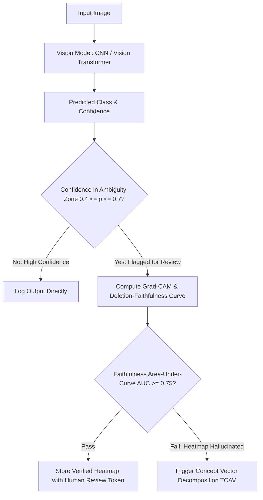

# 🛠️ Explainability & Interpretability: Production Pipeline & Workarounds

## 1. Faithfulness-Verified Explanation Architecture

## 2. Production Engineering Traps & Battle-Tested Workarounds

### Trap 1: Visual Confirmation Bias in Clinical & Industrial Audits
- **The Issue**: Operators rely on visual heatmaps that look aesthetically convincing, missing the fact that the underlying prediction was actually triggered by background illumination or sensor artifacts.
- **Battle-Tested Workaround**:
  - Automatically evaluate the **Deletion Metric**: sequentially mask out the top 20% most salient pixels identified by the explanation. If the class probability does not drop by at least 50%, flag the explanation as *unfaithful* and reject automated decisioning.

### Trap 2: Manual Concept Annotation Bottleneck in CBMs
- **The Issue**: Building Concept Bottleneck Models traditionally required human annotators to label dozens of attributes (e.g. *color*, *texture*, *geometry*) for every training image, multiplying dataset costs by $10\times$.
- **Battle-Tested Workaround**:
  - Use **Mechanistic Concept Bottleneck Models (M-CBMs)** or automated zero-shot VLM prompting (using Qwen2-VL or Florence-2) to generate pseudo-concept labels, followed by Cleanlab confident learning filtering.
