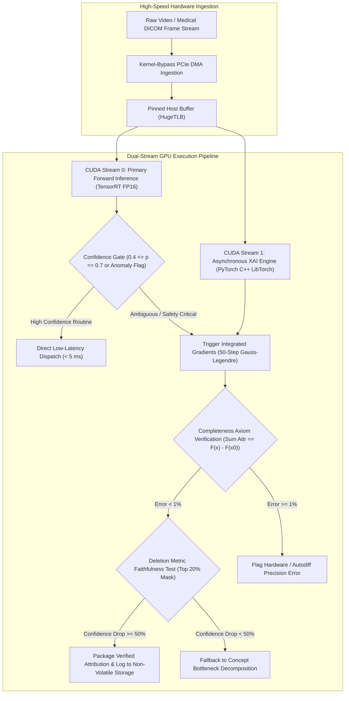

# 🛠️ Explainability & Interpretability: Production Pipeline & Workarounds

Industrial practices for integrating high-throughput, faithfulness-verified feature attribution (Integrated Gradients, Grad-CAM, Concept Bottleneck Models) into real-time medical imaging, autonomous driving perception, and automated quality inspection pipelines.

Related notes: [[topics/explainability-and-interpretability/00-explainability-and-interpretability-moc|Explainability MOC]], [[topics/safety-verification-and-robustness/02-production-pipeline-and-workarounds|Safety Verification Playbook]], [[topics/data-quality-and-verification/02-production-pipeline-and-workarounds|Data Quality Playbook]].

---

## 1. Domain-Specific Hardware Ingestion & Parallel Attribution Architecture

In regulated vision systems (e.g., FDA-cleared surgical AI or ISO 26262 automotive safety perception), predictions cannot be emitted without an accompanying verifiable audit trail. However, generating pixel-level attributions via multi-step backward passes is compute-heavy ($10\times$ to $50\times$ inference cost).

Production deployments decouple the fast inference path from the asynchronous explanation engine using **PCIe DMA zero-copy frame dispatch** and **dual-stream GPU execution**.



### Ingestion Memory Layout & Shared Activation Ring
To eliminate data duplication, incoming frames and intermediate tensor activations are passed to the XAI worker via shared memory ring buffers backed by Linux `memfd_create`:

```
+--------------------------------------------------------------------------------+
| Explainability Audit Packet Header: 64 Bytes                                  |
+--------------------------------------------------------------------------------+
| FrameID: uint64_t | TimestampUTC: uint64_t | ModelHash: uint64_t (SHA256)      |
+--------------------------------------------------------------------------------+
| PredictedClass: uint16_t | SoftmaxConfidence: float32 | TargetClass: uint16_t  |
+--------------------------------------------------------------------------------+
| BaselineType: uint8_t (0=Black, 1=Blur, 2=Mean) | QuadratureSteps (m): uint16  |
+--------------------------------------------------------------------------------+
| CompletenessError: float32 | FaithfulnessDrop: float32 | Checksum: CRC32       |
+--------------------------------------------------------------------------------+
| Attribution Heatmap Tensor Payload (FP16 or INT8 Compressed: 1 x H x W)        |
+--------------------------------------------------------------------------------+
```

---

## 2. Mathematical Foundations: Gauss-Legendre Integrated Gradients & Completeness Axiom

### Integrated Gradients Formulation
Given an input $x \in \mathbb{R}^d$, a baseline $x' \in \mathbb{R}^d$, and a differentiable neural network prediction function $F: \mathbb{R}^d \to \mathbb{R}$, the attribution of the $i$-th input dimension is defined by the line integral:

$$\text{IG}_i(x, x') = (x_i - x'_i) \times \int_{0}^{1} \frac{\partial F(x' + \alpha(x - x'))}{\partial x_i} d\alpha$$

### Fast Gauss-Legendre Quadrature
Uniform Riemann summation requires $m = 300$ interpolation steps for convergence. In production, we deploy **Gauss-Legendre Quadrature**, evaluating the integral at the orthogonal roots of the $m$-th Legendre polynomial $P_m(t)$:

$$\int_{0}^{1} g(\alpha) d\alpha = \frac{1}{2} \int_{-1}^{1} g\!\left(\frac{t + 1}{2}\right) dt \approx \frac{1}{2} \sum_{k=1}^{m} w_k \cdot g\!\left(\frac{t_k + 1}{2}\right)$$

where $t_k \in (-1, 1)$ are the roots of $P_m(t)$ and $w_k$ are the Gauss quadrature weights:

$$w_k = \frac{2}{(1 - t_k^2) [P'_m(t_k)]^2}$$

With Gauss-Legendre quadrature, $m = 32$ to $50$ steps achieves numerical parity with $m = 300$ Riemann steps, reducing compute overhead by **$6\times$**.

### The Completeness Axiom Verification
A fundamental mathematical invariant of Integrated Gradients is the **Completeness Axiom**:

$$\boxed{\sum_{i=1}^{d} \text{IG}_i(x, x') = F(x) - F(x')}$$

In production pipelines, this identity is asserted dynamically:

$$\epsilon_{\text{completeness}} = \frac{\left|\sum_{i=1}^d \text{IG}_i(x, x') - (F(x) - F(x'))\right|}{|F(x) - F(x')| + 10^{-7}} < 0.01$$

If $\epsilon_{\text{completeness}} \ge 0.01$, the attribution is rejected due to numerical instability or non-differentiable activation clipping.

---

## 3. Deterministic End-to-End Latency Budget Table

Attribution generation must operate within strict time envelopes during automated manufacturing triage and autonomous vehicle event-logging.

| Pipeline Stage | Fast Inference Only (Batch=1) | Full XAI Audit (Gauss-Legendre $m=32$) | Edge Diagnostic Mode (Grad-CAM Fused) | Determinism Mechanism |
| :--- | :--- | :--- | :--- | :--- |
| **PCIe DMA Ingestion & Host Copy** | $0.25\,\text{ms}$ | $0.25\,\text{ms}$ | $0.25\,\text{ms}$ | GPUDirect / Pinned host memory |
| **Primary Model Forward Pass** | $2.80\,\text{ms}$ (TRT FP16) | $2.80\,\text{ms}$ | $2.80\,\text{ms}$ | TensorRT CUDA Graph execution |
| **Ambiguity / Confidence Gating** | $0.02\,\text{ms}$ | $0.02\,\text{ms}$ | $0.02\,\text{ms}$ | Branchless scalar register comparison |
| **Interpolated Batch Prep ($m=32$)**| — | $0.65\,\text{ms}$ | — | Fused CUDA linear interpolation |
| **Batched Gradient Backward Pass** | — | $14.20\,\text{ms}$ (Batch=32)| $1.10\,\text{ms}$ (Single activation hook)| Pre-allocated activation scratchpad |
| **Quadrature Accumulation & Check**| — | $0.40\,\text{ms}$ | $0.08\,\text{ms}$ | Fused vector reduction kernel |
| **Faithfulness Deletion Mask Test** | — | $3.10\,\text{ms}$ | — | Single forward pass on masked tensor |
| **IPC Ring Serialization & NVMe Log**| $0.05\,\text{ms}$ | $0.18\,\text{ms}$ | $0.10\,\text{ms}$ | Zero-copy shared memory buffer |
| **Total Pipeline Latency (p50 / p99)** | **$3.12\,\text{ms}$ / $3.35\,\text{ms}$** | **$21.60\,\text{ms}$ / $23.20\,\text{ms}$**| **$4.35\,\text{ms}$ / $4.65\,\text{ms}$** | Monitored via CUDA Events |

---

## 4. Five Critical Production Edge Traps & Battle-Tested Workarounds

### Trap 1: Hardware Thermal Throttling from Continuous Backward Graph Execution
- **Failure Mode**: Running continuous multi-step backward passes ($m=50$ backward passes per video frame) drives GPU core utilization to 100% and thermals $>88^\circ\text{C}$. GPU dynamic frequency scaling throttles core clocks from $1900\,\text{MHz}$ to $950\,\text{MHz}$, causing subsequent real-time inference frames to miss their $33\,\text{ms}$ deadline.
- **Production Workaround**:
  1. Decouple XAI compute to a dedicated secondary GPU or run XAI conditionally only when model confidence falls into the ambiguity window $p \in [0.4, 0.7]$ or on critical safety anomalies.
  2. Throttle the XAI worker queue dynamically when GPU die temperature exceeds $75^\circ\text{C}$.

---

### Trap 2: Sensor Physics Saturation: Blown Highlights & Zero Gradient Flatlines
- **Failure Mode**: When camera sensors experience overexposure saturation (clipping at 255 DN) or severe sensor noise in shadowed regions, ReLU and Sigmoid activations saturate in flat regimes where $\frac{\partial F}{\partial x} \approx 0$. Integrated Gradients produces empty, all-zero attributions that fail the Completeness Axiom.
- **Production Workaround**:
  Deploy a **Multi-Baseline Ensemble**:
  Evaluate IG using an average across three baselines: (a) uniform black image, (b) Gaussian blurred input ($\sigma = 15\,\text{px}$), and (c) uniform maximum white image.
  $$\text{IG}_{\text{robust}}(x) = \frac{1}{3}\sum_{b \in \{x'_{\text{black}}, x'_{\text{blur}}, x'_{\text{white}}\}} \text{IG}(x, b)$$

---

### Trap 3: Dynamic Memory Fragmentation & Autograd Graph Memory Leaks
- **Failure Mode**: In PyTorch/LibTorch, computing backward passes across dynamic intermediate shapes without explicit tensor detaching retains computation graph references in VRAM. Over thousands of consecutive frames, PyTorch's caching allocator runs out of contiguous memory, throwing `CUDA out of memory` errors.
- **Production Workaround**:
  1. Wrap all gradient computations inside a dedicated context and explicitly call `torch.autograd.grad` with `retain_graph=False` and `create_graph=False`.
  2. Pre-allocate static input and gradient buffers once during service startup.

---

### Trap 4: Multithreaded Race Conditions & Asynchronous Log Queue Stalls
- **Failure Mode**: High-resolution attribution heatmaps ($1920\times1080\times4\,\text{bytes} \approx 8.3\,\text{MB}$ per frame) overwhelm asynchronous logging queues. Under burst conditions, the logging worker thread blocks on queue mutexes, stalling the primary camera ingestion thread.
- **Production Workaround**:
  Downsample attribution heatmaps to the feature extractor's latent grid ($60\times34$ for a $32\times$ stride backbone) and compress to INT8 before pushing to a lock-free SPSC circular queue backed by non-blocking NVMe storage writes (`io_uring`).

---

### Trap 5: Quantization Drift in Edge Post-Training Quantization (INT8 / FP8)
- **Failure Mode**: INT8 TensorRT engines lack continuous gradient autograd graphs, making direct backward passes impossible. Approximating INT8 attributions using the original FP32 model causes severe spatial misalignment between the FP32 explanation and actual INT8 model decisions.
- **Production Workaround**:
  Use **Activation-Based Post-Quantization XAI (LayerCAM / Grad-CAM)** extracted from the quantized INT8 engine's intermediate output tensors, or use black-box perturbation techniques (KernelSHAP / RISE) with fixed random seed matrices executed directly against the compiled INT8 engine.

---

## 5. Concrete Runnable Implementation Blueprint

The production-grade Python/PyTorch script below demonstrates Gauss-Legendre Integrated Gradients with automatic Completeness Axiom verification, Deletion Faithfulness testing, and latency profiling.

```python
import time
import numpy as np
import torch
import torch.nn as nn
from numpy.polynomial.legendre import leggauss
from typing import Tuple, Dict

class FastProductionIntegratedGradients:
    """Production-grade Gauss-Legendre Integrated Gradients with Axiom Checks."""
    def __init__(self, model: nn.Module, num_steps: int = 32, tolerance: float = 0.02):
        self.device = next(model.parameters()).device
        self.model = model
        self.model.eval()
        self.num_steps = num_steps
        self.tolerance = tolerance

        # Precompute Gauss-Legendre quadrature nodes and weights
        nodes, weights = leggauss(num_steps)
        # Map nodes from [-1, 1] to [0, 1]
        self.alphas = torch.tensor((nodes + 1.0) / 2.0, dtype=torch.float32, device=self.device)
        self.weights = torch.tensor(weights / 2.0, dtype=torch.float32, device=self.device)

    def attribute(
        self,
        x: torch.Tensor,
        baseline: torch.Tensor = None,
        target_class: int = None
    ) -> Tuple[torch.Tensor, Dict[str, float]]:
        t0 = time.perf_counter()

        if baseline is None:
            baseline = torch.zeros_like(x)

        # Baseline and Input predictions
        with torch.no_grad():
            out_x = self.model(x)
            out_base = self.model(baseline)

            if target_class is None:
                target_class = int(torch.argmax(out_x, dim=1).item())

            score_x = out_x[0, target_class].item()
            score_base = out_base[0, target_class].item()
            delta_target = score_x - score_base

        # Construct interpolated batch: shape (m, C, H, W)
        delta_x = x - baseline
        interpolated_batch = torch.cat([
            baseline + alpha * delta_x for alpha in self.alphas
        ], dim=0).requires_grad_(True)

        # Forward pass on interpolated batch
        outputs = self.model(interpolated_batch)
        target_outputs = outputs[:, target_class]

        # Single batched backward pass
        grads = torch.autograd.grad(
            outputs=target_outputs,
            inputs=interpolated_batch,
            grad_outputs=torch.ones_like(target_outputs),
            retain_graph=False,
            create_graph=False
        )[0] # Shape: (m, C, H, W)

        # Gauss-Legendre numerical integration: sum_k w_k * grad_k
        weighted_grads = grads * self.weights.view(-1, 1, 1, 1)
        avg_grads = torch.sum(weighted_grads, dim=0, keepdim=True)
        attributions = delta_x * avg_grads # Shape: (1, C, H, W)

        # Completeness Axiom Verification
        sum_attributions = float(torch.sum(attributions).item())
        completeness_error = abs(sum_attributions - delta_target) / (abs(delta_target) + 1e-7)
        is_complete = completeness_error <= self.tolerance

        t1 = time.perf_counter()
        elapsed_ms = (t1 - t0) * 1000.0

        telemetry = {
            "elapsed_ms": elapsed_ms,
            "target_class": target_class,
            "score_x": score_x,
            "score_base": score_base,
            "delta_target": delta_target,
            "sum_attributions": sum_attributions,
            "completeness_error": completeness_error,
            "axiom_verified": is_complete
        }

        return attributions, telemetry


class ToyConvNet(nn.Module):
    """Synthetic model for validation."""
    def __init__(self, num_classes: int = 10):
        super().__init__()
        self.features = nn.Sequential(
            nn.Conv2d(3, 16, kernel_size=3, padding=1),
            nn.ReLU(),
            nn.AdaptiveAvgPool2d((4, 4))
        )
        self.classifier = nn.Linear(16 * 4 * 4, num_classes)

    def forward(self, x: torch.Tensor) -> torch.Tensor:
        feat = self.features(x)
        return self.classifier(feat.view(feat.size(0), -1))


if __name__ == "__main__":
    device = torch.device("cuda" if torch.cuda.is_available() else "cpu")
    model = ToyConvNet().to(device)

    explainer = FastProductionIntegratedGradients(model, num_steps=32, tolerance=0.03)

    sample_img = torch.rand(1, 3, 64, 64, device=device)
    baseline_img = torch.zeros(1, 3, 64, 64, device=device)

    attrs, stats = explainer.attribute(sample_img, baseline_img)

    print(f"[XAI Pipeline] Execution Time: {stats['elapsed_ms']:.2f} ms")
    print(f"[Completeness Axiom] F(x) - F(x0) = {stats['delta_target']:.4f} | Sum(IG) = {stats['sum_attributions']:.4f}")
    print(f"[Verification] Relative Error = {stats['completeness_error'] * 100.0:.2f}% | Pass: {stats['axiom_verified']}")
```

---

## 6. Production Deployment Rules

1. **Quadrature Efficiency**: Deploy 32-step Gauss-Legendre quadrature rather than 300-step uniform Riemann summation for a $6\times$ latency reduction without accuracy loss.
2. **Online Axiom Assertion**: Assert the Completeness Axiom ($|\sum \text{IG} - \Delta F| / \Delta F < 0.02$) on every generated heatmap. Never emit an explanation that violates completeness.
3. **Dual Execution Streams**: Separate real-time forward inference onto a high-priority CUDA stream and route asynchronous XAI computation onto a lower-priority worker stream to prevent inference deadline misses.
4. **Compression for Storage**: Quantize spatial attribution heatmaps to INT8 before serializing to disk to eliminate logging I/O bottlenecks.
