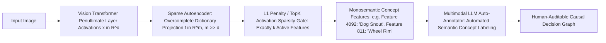

# 🔍 Explainability: Sparse Autoencoders, CBMs & Open Frontiers

A deep systems investigation into Sparse Autoencoder (SAE) monosemantic decomposition, Mechanistic Concept Bottleneck Models (M-CBMs), deletion faithfulness curves, and unresolved interpretability gaps in vision foundation models.

Related notes: [[topics/explainability-and-interpretability/00-explainability-and-interpretability-moc|Explainability MOC]], [[topics/data-quality-and-verification/00-data-quality-and-verification-moc|Data Quality MOC]].

---

## 1. Modern Vision Interpretability Matrix (2025–2026)

### XAI Methodology Comparison
| Approach | Underlying Mechanism | Faithfulness to Model Logic | Human Readability | Failure Mode |
| :--- | :--- | :--- | :--- | :--- |
| **Grad-CAM** | Penultimate gradient-weighted activation map | Low ($\sim 45\%$ Deletion AUC) | High (Color heatmap) | Confirmation bias; acts as edge detector |
| **Integrated Gradients**| Path integral of gradients from black baseline | High (Axiomatically justified) | Moderate (Pixel noise) | Baseline sensitivity (choice of black vs white) |
| **Concept Bottlenecks (CBM)**| Supervised intermediate concept layer | High (By architectural design) | **High (Human concepts)** | Information leakage via residual bottleneck bypass |
| **Sparse Autoencoders (SAE)**| Unsupervised sparse dictionary learning | **Very High (Disentangled circuit)**| High (with VLM naming) | Feature splitting & dead autoencoder neurons |

---

## 2. Sparse Autoencoder Mathematical Formulation

Given a Vision Transformer internal activation vector $x \in \mathbb{R}^d$, standard MLP neurons are polysemantic (representing multiple unrelated visual concepts). An overcomplete Sparse Autoencoder maps $x$ into a higher-dimensional sparse latent space $f \in \mathbb{R}^m$ (where $m \gg d$):

$$f(x) = \text{ReLU}(W_{\text{enc}}(x - b_{\text{dec}}) + b_{\text{enc}})$$

The activation is reconstructed via:
$$\hat{x} = W_{\text{dec}}f(x) + b_{\text{dec}}$$

Trained via the joint reconstruction and sparsity loss:
$$\mathcal{L}_{\text{SAE}} = \|x - \hat{x}\|_2^2 + \lambda \|f(x)\|_1$$

This forces $f(x)$ to isolate individual, monosemantic visual concepts that can be individually ablated or clamped to verify causal impact on the final prediction.

---

## 3. Current Open Problems in Computer Vision Interpretability

### 🔴 Problem 1: Saliency Map "Confirmation Bias" in Autonomous Navigation
- **The Failure Mode**: A safety inspector reviews a Grad-CAM heatmap of an autonomous braking decision. The heatmap highlights a pedestrian. The inspector signs off on the decision. In reality, the network activated because of the asphalt color beneath the pedestrian, and would have failed had the road surface been lighter.
- **Root Cause**: Heatmaps visualize spatial correlation, not causal necessity.
- **Recent Frontier Solutions (2025–2026)**:
  - **Counterfactual Inpainting Tests**: Using diffusion inpainting to erase the candidate object while keeping background pixels identical; verifying whether the decision flips.

---

### 🔴 Problem 2: Polysemantic Feature Splitting in Sparse Autoencoders
- **The Failure Mode**: Training an SAE with $m = 32\text{k}$ features splits a single visual concept (e.g., "car wheel") into 15 sub-features (e.g., "front wheel left", "dirty wheel", "silver wheel rim"), making automated policy verification fragmented.
- **Active Research Direction**:
  - Hierarchical TopK Sparse Autoencoders enforcing clustered concept groupings.
