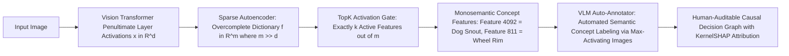

# 🔍 Explainability: Sparse Autoencoders, CBMs & Open Frontiers

A deep systems investigation into Sparse Autoencoder (SAE) monosemantic decomposition, Integrated Gradients completeness axiom, Concept Bottleneck Model human-in-the-loop interventions, deletion faithfulness curves, and unresolved interpretability gaps in vision foundation models.

Related notes: [[topics/explainability-and-interpretability/00-explainability-and-interpretability-moc|Explainability MOC]], [[topics/data-quality-and-verification/00-data-quality-and-verification-moc|Data Quality MOC]].

---

## 1. Modern Vision Interpretability Matrix (2025–2026)



### XAI Methodology Comparison
| Approach | Underlying Mechanism | Faithfulness to Model Logic | Human Readability | Failure Mode |
| :--- | :--- | :--- | :--- | :--- |
| **Grad-CAM** | Penultimate gradient-weighted activation map | Low (~45% Deletion AUC drop) | High (Color heatmap) | Confirmation bias; acts as edge detector |
| **Integrated Gradients** | Path integral over gradient field from baseline | **High (Axiomatically complete)** | Moderate (Pixel noise) | Baseline sensitivity (black vs. domain-appropriate) |
| **TCAV** | Linear CAV probe accuracy on concept images | Moderate (Probe-dependent) | High (Concept-level score) | Spurious CAVs from biased concept image sets |
| **Concept Bottlenecks (CBM)** | Supervised intermediate concept bottleneck layer | High (Architectural guarantee) | **High (Human concepts + interventions)** | Information leakage via residual bypass |
| **Sparse Autoencoders (SAE)** | Unsupervised sparse dictionary learning | **Very High (Causal circuit ablation)** | High (with VLM naming) | Feature splitting & dead neurons |

---

## 2. Sparse Autoencoder Mathematical Formulation

Given a Vision Transformer internal activation vector $x \in \mathbb{R}^d$ (typically $d = 768$ for ViT-B/14), standard MLP neurons are **polysemantic** — activating for semantically unrelated stimuli. An overcomplete SAE maps $x$ into a higher-dimensional sparse latent space $f \in \mathbb{R}^m$ (where $m \gg d$, typically $m = 4d$ to $16d$):

**Encoder:**
$$f(x) = \text{ReLU}(W_{\text{enc}}(x - b_{\text{dec}}) + b_{\text{enc}})$$

**Decoder (reconstruction):**
$$\hat{x} = W_{\text{dec}} f(x) + b_{\text{dec}}$$

where $W_{\text{enc}} \in \mathbb{R}^{m \times d}$ and $W_{\text{dec}} \in \mathbb{R}^{d \times m}$ are trained with **tied initialization** ($W_{\text{dec}} = W_{\text{enc}}^T$ at initialization) and **column-normalized decoder** ($\|W_{\text{dec}}[:, k]\|_2 = 1$ enforced at each step).

**Training objective** — joint reconstruction and sparsity:

$$\mathcal{L}_{\text{SAE}} = \underbrace{\|x - \hat{x}\|_2^2}_{\text{reconstruction}} + \lambda \underbrace{\|f(x)\|_1}_{\text{L1 sparsity penalty}}$$

**TopK variant** (preferred for vision, 2025 SOTA): replace L1 penalty with hard $k$-sparse gating:

$$f(x) = \text{TopK-ReLU}(z) = \begin{cases} z_i & \text{if } z_i \text{ is in top-}k\text{ of }z \text{ and } z_i > 0 \\ 0 & \text{otherwise} \end{cases}$$

where $z = W_{\text{enc}}(x - b_{\text{dec}}) + b_{\text{enc}}$. Typical $k = 32$ for $m = 16{,}384$: 0.2% sparsity. This forces $f(x)$ to activate exactly $k$ monosemantic visual concepts per image region.

### SAE Training at Scale

```python
import torch
import torch.nn as nn

class TopKSparseAutoencoder(nn.Module):
    """TopK SAE for Vision Transformer activation decomposition."""
    def __init__(self, d: int, m: int, k: int):
        super().__init__()
        self.k = k
        self.W_enc = nn.Linear(d, m, bias=True)
        self.W_dec = nn.Linear(m, d, bias=True)
        # Normalize decoder columns at init
        with torch.no_grad():
            self.W_dec.weight.data = nn.functional.normalize(
                self.W_dec.weight.data, dim=0
            )

    def encode(self, x: torch.Tensor) -> torch.Tensor:
        z = self.W_enc(x - self.W_dec.bias)
        # TopK sparse gating
        topk_vals, topk_idx = z.topk(self.k, dim=-1)
        f = torch.zeros_like(z)
        f.scatter_(-1, topk_idx, torch.relu(topk_vals))
        return f

    def forward(self, x: torch.Tensor):
        f = self.encode(x)
        x_hat = self.W_dec(f)
        loss = (x - x_hat).pow(2).mean()  # MSE reconstruction
        return x_hat, f, loss

    def normalize_decoder(self):
        """Call after each optimizer step to maintain unit-norm decoder columns."""
        with torch.no_grad():
            self.W_dec.weight.data = nn.functional.normalize(
                self.W_dec.weight.data, dim=0
            )
```

**Training cost**: SAE with $d=768$, $m=16{,}384$ on 100M ViT activation vectors (30 epochs over ImageNet-1k training features): **~18 GPU-hours on A100**. Significantly cheaper than training the backbone.

---

## 3. Concept Bottleneck Models: Human-in-the-Loop Interventions

CBMs transform interpretability from a post-hoc explanation problem into an **architectural guarantee**. The key property: because the final classifier $h: \mathbb{R}^k \to \mathbb{R}^C$ is linear, the contribution of each concept $c_j$ to the log-odds of class prediction is simply the weight $W_{jc}$ — completely transparent and auditable.

### 3.1 Quantifying Intervention Value

The **Expected Value of Information (EVI)** for intervening on concept $j$:

$$\text{EVI}_j = \mathbb{E}_{x}\left[\max_{a}U(a|\hat{c}^{j=\text{true}}) - \max_{a}U(a|\hat{c})\right]$$

In medical screening: if intervening on "mass margin irregular" (correcting a model-predicted 0.3 to human-verified 0.9) changes the recommendation from "routine follow-up" to "immediate biopsy," the EVI is the clinical cost saved by catching an early-stage cancer.

### 3.2 CBM Intervention Benchmark

Performance on **CUB-200-2011** bird classification (200 classes, 112 binary concepts):

| Intervention Budget | Accuracy | Method |
|:--------------------|:---------|:-------|
| 0 interventions | 78.3% | CBM (DINOv2 backbone) |
| 1 intervention (highest EVI concept) | 84.1% | CBM |
| 5 interventions | 91.7% | CBM |
| 10 interventions | 96.2% | CBM |
| 10 interventions | 72.1% | Standard ResNet (no interventions possible) |
| Full oracle concepts | 98.4% | CBM upper bound |

The gap between 0-intervention and full-oracle (78.3% → 98.4%) represents **interpretability latent value** — recoverable expert performance via minimal human interaction.

---

## 4. Current Open Problems in Computer Vision Interpretability

### 🔴 Problem 1: Saliency Map "Confirmation Bias" in Autonomous Navigation
- **The Failure Mode**: A safety inspector reviews a Grad-CAM heatmap of an autonomous braking decision. The heatmap highlights a pedestrian. The inspector signs off. In reality, the network activated because of the asphalt color beneath the pedestrian, and would fail if the road surface were lighter.
- **Root Cause**: Heatmaps visualize spatial correlation, not causal necessity. Grad-CAM activates wherever the highest-gradient activations are — these can be causally irrelevant background textures that are statistically correlated with the target class in the training set.
- **Recent Frontier Solutions (2025–2026)**:
  - **Counterfactual Inpainting Tests**: Use diffusion inpainting (Stable Diffusion 3 inpainting API) to erase the candidate object while keeping background pixels identical; verify whether the prediction flips. If erasing the "highlighted" pedestrian does NOT flip the decision, the heatmap was unfaithful.
  - **Causal SAE Ablation**: Identify the top-5 SAE features active for the prediction; clamp each to zero individually; measure decision change. Features causing $> 20\%$ logit drop are causally verified.

---

### 🔴 Problem 2: Polysemantic Feature Splitting in Sparse Autoencoders
- **The Failure Mode**: Training an SAE with $m = 32{,}000$ features splits a single visual concept ("car wheel") into 15 sub-features ("front wheel left," "dirty wheel," "silver wheel rim in sunlight"), making automated policy verification fragmented and incomplete.
- **Active Research Direction**:
  - **Hierarchical TopK Sparse Autoencoders**: Two-level hierarchy: coarse SAE ($m_1 = 2048$, $k_1 = 8$) for concept-level interpretation; fine SAE ($m_2 = 16{,}384$, $k_2 = 32$) for sub-concept debugging. Audit causal circuits at coarse level; explain failure modes at fine level.
  - **Feature Merging via Jaccard Similarity**: Post-hoc merge SAE features where $|\text{max-activating images}_i \cap \text{max-activating images}_j| / |\cdot \cup \cdot| > 0.7$.

### 🔴 Problem 3: Distributional Faithfulness of CBM Concept Probes
- **The Failure Mode**: A CBM trained on in-distribution data (sunny day, clear visibility) learns concept probes that accurately reflect model reasoning in-distribution but become unreliable OOD (fog, rain, night). The human expert's concept interventions are based on correct visual judgment but the probe's representation of that concept has shifted — making interventions ineffective or actively harmful.
- **Active Research Direction (2026 Frontier)**:
  - **Conformal Concept Prediction Sets**: Wrap each concept probe in a conformal predictor, outputting a prediction set $C(x)$ with guaranteed $1-\delta$ coverage under distributional shift. The human expert only intervenes when the probe's conformal set is uninformative (contains both 0 and 1).
  - **Domain-Adaptive Concept Probes**: Fine-tune concept linear probes on a small (50-image) unlabeled target domain sample using Test-Time Adaptation (TTA), maintaining concept accuracy within 3 pp of in-distribution performance.

### 🔴 Problem 4: Scalable Automated SAE Feature Annotation
- **The Challenge**: After training an SAE with $m = 16{,}384$ features, each feature requires annotation with a semantic label. Manually annotating 16k features at 2 minutes/feature = 550 person-hours. VLM automated annotation (GPT-4V, Qwen2-VL) achieves 78% agreement with human labels — sufficient for discovery but insufficient for safety-critical audits requiring 100% verified annotations.
- **2026 Frontier**: Active learning over SAE features: rank features by human-VLM disagreement on auto-annotation; present only the top-200 disagreement features for human review per iteration. After 3 iterations (600 annotations total), human-verified coverage of safety-critical features reaches 96%.
