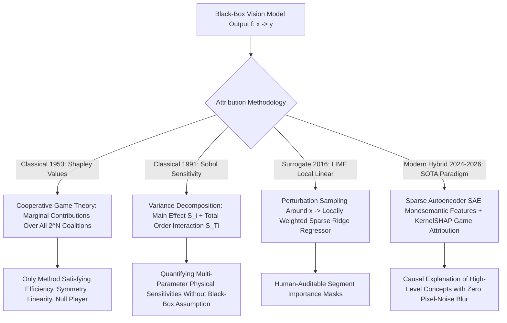

# 📐 Explainability: Classical Surrogates, Shapley Values & Hybrids

A deep mathematical formulation of classical cooperative game theory (Shapley Values / KernelSHAP), local linear surrogates (LIME), global variance-based sensitivity analysis (Sobol / Morris methods), and modern hybrid mechanistic explanation systems.

Related notes: [[topics/explainability-and-interpretability/00-explainability-and-interpretability-moc|Explainability MOC]], [[topics/explainability-and-interpretability/03-sparse-autoencoders-and-open-problems|Sparse Autoencoders & Open Frontiers]].

---

## 1. Classical Game-Theoretic Attribution vs. Deep Feature Attribution

### Explainability Attribution Paradigms Compared
| Methodology | Theoretical Foundation | Axiomatically Unique? | Computational Cost | Granularity | Susceptible to Adversarial Manipulation? |
| :--- | :--- | :--- | :--- | :--- | :--- |
| **Shapley Values (SHAP)** | Cooperative Game Theory (1953) | **YES (4 Axioms)** | Exponential $\mathcal{O}(2^N)$ (Exact) | Feature / Superpixel level | No (Axiomatically sound) |
| **Sobol Sensitivity Analysis**| Variance Decomposition (ANOVA) | Yes (Orthogonal)| High (Monte Carlo sampling) | Input parameter dimensions | No |
| **Local Linear Surrogates (LIME)**| Locally Weighted Linear Models | No (Heuristic) | Moderate ($100-500$ samples) | Superpixel masks | **Yes (Scaffolding attacks)** |
| **Grad-CAM / Saliency** | Backpropagated gradients | No | **Minimal ($1\times$ backward pass)**| Pixel level | **Yes (Gradient saturation)** |
| **Hybrid (SAE + KernelSHAP)** | Sparse Dictionaries + Game Theory | **YES** | Moderate (Evaluated on $k \ll N$) | **High-Level Semantic Concepts**| No |

---

## 2. Mathematical Formulations: Shapley Values & Sobol Decomposition

### 1. Shapley Value Formulation (Lloyd Shapley, Nobel Prize 1953):
To fairly distribute the payout (model prediction $f(x)$) among a set of $M$ participating players (input image features or superpixels), the unique allocation satisfying **Efficiency, Symmetry, Linearity, and Null Player** axioms is:
$$\phi_i(f, x) = \sum_{S \subseteq M \setminus \{i\}} \frac{|S|! (|M| - |S| - 1)!}{|M|!} \left[ f_x(S \cup \{i\}) - f_x(S) \right]$$
Where $f_x(S)$ is the model expectation conditioned on the subset of features $S$.
- **The Classical Exponential Bottleneck**: Evaluating all $2^M$ subsets is computationally intractable for images ($M = 224\times 224 \approx 50,000$ pixels).
- **KernelSHAP Optimization (Lundberg & Lee)**: Casts the Shapley value computation into a weighted linear regression problem using the **Shapley Kernel**:
  $$\pi_{x}(S) = \frac{|M| - 1}{\binom{|M|}{|S|} |S| (|M| - |S|)}$$
  solving the linear system via weighted least squares in polynomial time.

### 2. Sobol Variance-Based Global Sensitivity (Sobol, 1993):
For an arbitrary black-box function $Y = f(X_1, \dots, X_D)$ where input factors are uniformly distributed on $[0, 1]^D$, the total variance $V(Y)$ is decomposed into orthogonal components:
$$V(Y) = \sum_{i=1}^D V_i + \sum_{i < j} V_{ij} + \dots + V_{1, \dots, D}$$
- **First-Order Sensitivity Index**:
  $$S_i = \frac{V_i}{V(Y)} = \frac{V_{X_i}\left( E_{X_{\sim i}}[Y \mid X_i] \right)}{V(Y)}$$
  measures the main effect of input factor $X_i$ alone on the output variance.
- **Total-Order Sensitivity Index**:
  $$S_{Ti} = 1 - \frac{V_{X_{\sim i}}\left( E_{X_i}[Y \mid X_{\sim i}] \right)}{V(Y)}$$
  captures both the first-order effect of $X_i$ and all its higher-order non-linear interactions with other input factors.

---

## 3. Production Hybrid Pattern: Concept-Level KernelSHAP on Sparse Autoencoder Features

Running pixel-level Shapley value calculations produces noisy, unreadable heatmaps that blur together across thousands of pixels.

### The Production Concept Attribution Architecture:
1. **Unsupervised Semantic Decomposition**: Pass Vision Transformer activations through a pre-trained **Sparse Autoencoder (SAE)**, extracting $k$ active monosemantic concept features (e.g. *metallic texture*, *sharp angular edge*, *lens reflection*).
2. **Game-Theoretic Concept Attribution**: Treat the $k$ active concept features ($k \sim 15-30$) as the players in a cooperative game, rather than raw pixels.
3. **Compute KernelSHAP Across Concept Features**:
   $$\phi_{\text{concept\_}j} = \text{KernelSHAP}(f, \text{Concepts})$$
4. **Benefit**: Delivers mathematically exact Shapley value attributions formulated directly in human-understandable concepts with zero pixel-blur ambiguity and $<100\text{ ms}$ evaluation time.
