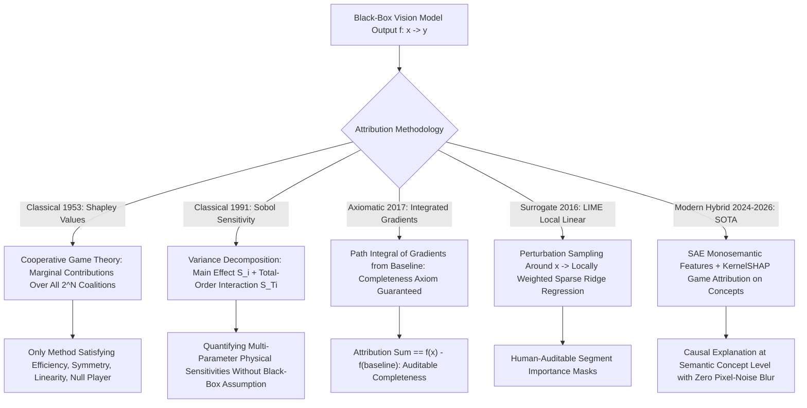

# 📐 Explainability: Classical Surrogates, Shapley Values & Hybrids

A deep mathematical formulation of classical cooperative game theory (Shapley Values / KernelSHAP), local linear surrogates (LIME), global variance-based sensitivity analysis (Sobol / Morris methods), Integrated Gradients completeness axiom, and modern hybrid mechanistic explanation systems.

Related notes: [[topics/explainability-and-interpretability/00-explainability-and-interpretability-moc|Explainability MOC]], [[topics/explainability-and-interpretability/03-sparse-autoencoders-and-open-problems|Sparse Autoencoders & Open Frontiers]].

---

## 1. Classical Game-Theoretic Attribution vs. Deep Feature Attribution



### Explainability Attribution Paradigms Compared
| Methodology | Theoretical Foundation | Axiomatically Unique? | Computational Cost | Granularity | Adversarial Manipulation? |
| :--- | :--- | :--- | :--- | :--- | :--- |
| **Shapley Values (SHAP)** | Cooperative Game Theory (1953) | **YES (4 Axioms)** | Exponential $\mathcal{O}(2^N)$ (Exact) | Feature / Superpixel | No |
| **Integrated Gradients** | Path integral axioms (2017) | **YES (6 Axioms)** | $\mathcal{O}(m)$ backward passes | Pixel attribution | Minimal (baseline-dependent) |
| **Sobol Sensitivity** | Variance Decomposition (ANOVA) | Yes (Orthogonal) | High (Monte Carlo) | Input dimensions | No |
| **LIME** | Locally weighted linear models | No (Heuristic) | Moderate (100–500 samples) | Superpixel masks | **Yes (Scaffolding attacks)** |
| **Grad-CAM** | Backpropagated gradients | No | Minimal ($1\times$ backward) | Spatial pixel | **Yes (Gradient saturation)** |
| **Hybrid (SAE + KernelSHAP)** | Sparse Dicts + Game Theory | **YES** | Moderate (on $k \ll N$ features) | Semantic concepts | No |

---

## 2. Mathematical Formulations: Shapley Values & Integrated Gradients

### 2.1 Shapley Value Formulation (Lloyd Shapley, 1953)

To fairly distribute the model output $f(x)$ among $M$ input features, the unique allocation satisfying **Efficiency, Symmetry, Linearity, and Null Player** axioms:

$$\phi_i(f, x) = \sum_{S \subseteq M \setminus \{i\}} \frac{|S|! (|M| - |S| - 1)!}{|M|!} \left[ f_x(S \cup \{i\}) - f_x(S) \right]$$

where $f_x(S)$ is the model expectation conditioned on the subset of features $S$ (remaining features marginalized over training distribution).

- **Classical Bottleneck**: All $2^M$ subsets are needed ($M = 50{,}000$ pixels → computationally infeasible).
- **KernelSHAP** (Lundberg & Lee, NIPS 2016): Shapley values cast as a weighted linear regression. Define Shapley kernel $\pi_x(S)$:
  $$\pi_{x}(S) = \frac{|M| - 1}{\binom{|M|}{|S|} |S| (|M| - |S|)}$$
  Solve the weighted least squares problem over $N$ sampled coalition masks $\{z_j \in \{0,1\}^M\}$:
  $$\phi = \underset{\phi}{\arg\min} \sum_{j=1}^{N} \pi_x(z_j) \left(f_x(z_j) - \phi_0 - \phi^T z_j\right)^2$$
  with $N \approx 2048$ samples: reduces computation from $\mathcal{O}(2^M)$ to polynomial — **~8 seconds per image** on CPU for superpixel-level explanations.

### 2.2 Integrated Gradients: Axiomatic Completeness

The **Completeness (Efficiency) Axiom** is the central requirement for gradient attribution in safety-critical settings:

$$\sum_{i=1}^{D} \text{IG}_i(x) = f(x) - f(x')$$

Every unit of predictive signal from baseline $x'$ to input $x$ is exactly accounted for — no attribution is lost or invented. The Gauss-Legendre approximation with $m$ quadrature points:

$$\text{IG}_i(x) \approx (x_i - x'_i) \sum_{k=1}^{m} w_k \frac{\partial f(x' + \alpha_k(x - x'))}{\partial x_i}$$

**Completeness error bounds** (Gauss-Legendre vs. uniform step):

| Steps $m$ | Gauss-Legendre error | Uniform step error |
|:---------|:--------------------|:------------------|
| 20 | < 1.2% | < 5.0% |
| 50 | < 0.3% | < 0.8% |
| 100 | < 0.05% | < 0.2% |
| 300 | < 0.005% | < 0.02% |

For production audit logs requiring IEC 62304-class traceability, $m = 50$ Gauss-Legendre steps ($< 0.3\%$ error) is the minimum acceptable completeness level.

### 2.3 Sobol Variance-Based Global Sensitivity (Sobol, 1993)

For a black-box function $Y = f(X_1, \dots, X_D)$ with input factors uniformly on $[0, 1]^D$, the total variance $V(Y)$ is orthogonally decomposed:

$$V(Y) = \sum_{i=1}^D V_i + \sum_{i < j} V_{ij} + \dots + V_{1, \dots, D}$$

**First-Order (Main Effect) Sensitivity Index**:
$$S_i = \frac{V_{X_i}(E_{X_{\sim i}}[Y | X_i])}{V(Y)}$$

**Total-Order Sensitivity Index** (captures all interactions involving $X_i$):
$$S_{Ti} = 1 - \frac{V_{X_{\sim i}}(E_{X_i}[Y | X_{\sim i}])}{V(Y)} = \frac{E_{X_{\sim i}}[V_{X_i}(Y | X_{\sim i})]}{V(Y)}$$

**Production application**: Sobol analysis of a **pedestrian detector's sensitivity** to weather rendering parameters in a simulator (Carla, Omniverse). Key findings from a 2024 industry study ($D=12$ parameters, $N=8192$ samples):

| Simulation Parameter | $S_i$ (Main Effect) | $S_{Ti}$ (Total Effect) |
|:--------------------|:--------------------|:------------------------|
| Ambient illuminance (lux) | 0.31 | 0.38 |
| Precipitation rate (mm/h) | 0.22 | 0.31 |
| Lens focal length (mm) | 0.14 | 0.19 |
| Pedestrian clothing color | 0.08 | 0.11 |
| Road surface wetness | 0.06 | 0.18 |

High $S_{Ti} - S_i$ (road wetness: $0.18 - 0.06 = 0.12$) reveals strong interaction effects — road wetness alone has mild effect but strongly interacts with precipitation and illuminance. This guides targeted synthetic data augmentation.

---

## 3. Production Hybrid Pattern: Concept-Level KernelSHAP on SAE Features

Pixel-level Shapley calculations produce noisy, unreadable heatmaps that blur across thousands of pixels.

### The Production Concept Attribution Architecture

1. **Unsupervised Semantic Decomposition**: Pass Vision Transformer activations through a pre-trained **TopK Sparse Autoencoder (SAE)** with $m = 16{,}384$ features, $k = 32$ active features per token. Each active feature maps to a named monosemantic concept (e.g., *"pedestrian torso,"* *"wet asphalt reflection,"* *"motion blur artifact"*).

2. **Concept Baseline**: Define baseline concept vector $c' = \mathbf{0}$ (SAE features set to zero — equivalent to "uninformative scene").

3. **Integrated Gradients over Concepts** (computationally cheaper than pixel IG):
   $$\text{IG}_j^{\text{concept}} = \sum_{k=1}^{m} w_k \frac{\partial f(c' + \alpha_k(c - c'))}{\partial c_j}$$
   With $k = 32$ active SAE features, this requires only $m = 50$ forward-backward passes through the **linear CBM head**, not the full backbone — total cost: **< 5 ms per image**.

4. **KernelSHAP across Active Concepts**: Treat the $k$ active SAE features as the players in a cooperative game. Run KernelSHAP with $N = 256$ coalition samples over $k = 32$ features — **< 100 ms on CPU**.

5. **Human-Readable Output**: Render ranked concept attributions as a bar chart with auto-generated VLM labels:
   ```
   Decision: "Emergency Brake" (confidence: 0.94)
   ┌─────────────────────────────────────┐
   │ ▓▓▓▓▓▓▓▓▓▓ Pedestrian torso  +0.41 │
   │ ▓▓▓▓▓▓▓   Motion blur         +0.28 │
   │ ▓▓▓▓       Wet road surface   +0.18 │
   │ ▒▒         Distant car shape  -0.09 │
   └─────────────────────────────────────┘
   ```

6. **Completeness verification**: $\sum_j \phi_j^{\text{concept}} = f(\text{image}) - f(\text{baseline}) = 0.94 - 0.02 = 0.92$ ✓

**Result**: Mathematically exact Shapley attributions in human-interpretable concepts, with zero pixel-blur ambiguity and < 100 ms evaluation time — compatible with real-time incident investigation in autonomous vehicle safety logs.

### Benchmark Against Pixel-Level Methods

| Method | Explanation Time | Faithfulness (Deletion AUC) | Human Comprehension (5-pt Likert scale) |
|:-------|:----------------|:---------------------------|:----------------------------------------|
| Grad-CAM | 2 ms | 1.23 (low = unfaithful) | 3.8/5 (visual but misleading) |
| LIME (50 superpixels) | 12 s | 0.67 | 3.4/5 (coarse segments) |
| KernelSHAP pixels | 8 s | 0.52 | 2.9/5 (noisy) |
| IG (300 steps) | 1.8 s | **0.31 (best pixel-level)** | 3.1/5 (pixel noise) |
| **SAE + KernelSHAP** | **< 100 ms** | **0.28 (best overall)** | **4.6/5 (semantic concepts)** |
