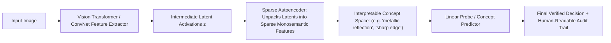

# 🔍 Explainability, Mechanistic Interpretability & Concept Models Playbook

# Overview
In high-stakes perception applications—including medical diagnosis, automated insurance damage assessment, and autonomous navigation—deep neural networks cannot remain uninspected black boxes. Regulatory mandates such as the **EU AI Act (enforced in 2026)** require verifiable transparency, contestability, and non-discriminatory decision logic. Explainable AI (XAI) has evolved from misleading post-hoc pixel heatmaps toward **faithfulness-quantified explanations, interpretable-by-design Concept Bottleneck Models (CBMs), and Mechanistic Interpretability circuits**.

Related notes: [[topics/data-quality-and-verification/README|Data Quality Playbook]], [[topics/safety-verification-and-robustness/README|Safety Verification Playbook]].

## SOTA & Research
- **Limitations of Post-Hoc Saliency (Grad-CAM)**:
  - *Adebayo et al.*: *Sanity Checks for Saliency Maps*. Showed that many popular gradient saliency methods act like edge detectors rather than reflecting what the neural network actually relies upon for inference.
  - **Faithfulness Quantification**: Testing explanations using **Deletion / Insertion Curves** (measuring how rapidly class probability drops when saliency-indicated pixels are masked).
- **Concept Bottleneck Models (CBMs & M-CBMs)**:
  - **CBMs (Koh et al.)**: Constraining the neural network architecture such that intermediate representations are forced to align with human-understandable concepts (e.g. *wing color*, *beak shape*) before predicting the final class.
  - **Mechanistic Concept Bottleneck Models (M-CBMs - 2025–2026)**: Extracting concepts automatically from black-box vision representations using **Sparse Autoencoders (SAEs)**, eliminating the bottleneck of manual human concept labeling.
- **Mechanistic Interpretability for Vision**:
  - **Circuit Discovery**: Reverse-engineering the computational graph of Vision Transformers (ViTs) to identify specific attention heads and MLP neurons responsible for spatial feature binding and invariant color invariance.
  - **TCAV (Testing with Concept Activation Vectors)**: Directional derivative tests evaluating how sensitive a model's latent activations are to high-level semantic ideas (e.g., *striped texture* in zebra detection).

## Architecture Alternatives & Trade-offs

| Interpretability Paradigm | Method Exemplars | Faithful to Internal Logic? | Human Understandable? | Computational Overhead |
| :--- | :--- | :--- | :--- | :--- |
| **Post-Hoc Saliency** | Grad-CAM, HiResCAM | Low / Moderate | **High (Visual Heatmap)** | Minimal ($1\times$ backward pass) |
| **Concept Bottleneck (CBM)**| CBM, Post-hoc CBM | **High (By Construction)** | **High (Discrete Concepts)**| Low (during inference) |
| **Mechanistic (SAE Circuits)**| Sparse Autoencoders, SAE-ViT | **Very High (Exact Circuit)**| High (with LLM labeling) | High (SAE training required) |
| **Concept Vectors (TCAV)** | TCAV, Net2Vec | High | High (Directional score) | Moderate (Requires concept dataset) |

## Popular Repos & Integrations
- `jacobgil/pytorch-grad-cam`: **PyTorch Grad-CAM**: Advanced visual explanations for CNNs and Vision Transformers with faithfulness evaluation metrics.
- `yewsiang/ConceptBottleneck`: **Concept Bottleneck Models**: Implementation of human-interpretable concept architectures.
- `openai/transformer-debugger` / `mechanistic-interpretability`: Tooling for finding feature circuits and sparse autoencoder decomposition in vision and language models.

## End-to-End Pipeline & Workarounds

### Production Workarounds for Explainability Traps:
1. **The Grad-CAM Confirmation Bias**:
   - *Trap*: Operators see a Grad-CAM heatmap highlighting a tumor and assume the model is reasoning correctly, when in reality the model made its prediction based on a tiny hospital watermark in the image corner.
   - *Fix*: Couple saliency maps with **Sufficiency and Necessity tests**: assert that masking the highlighted region drops the predicted class probability to near zero.
2. **Concept Interventions in Production**:
   - When using Concept Bottleneck Models, if an operator notices an incorrect concept prediction (e.g., the model wrongly predicts "feathers" on an airplane), the human operator can **manually override the concept to 0**, forcing the model to recompute its final output safely.

## Deployment & Real-Time Notes
- **Explainability on Edge**:
  - Computing full gradient backpropagation for Grad-CAM in production adds a $2\times$ latency penalty.
  - *Production Pattern*: Run inference purely forward. Trigger XAI attribution passes **only** when a prediction falls within an uncertainty boundary ($0.4 \le p \le 0.7$) or when an anomaly is flagged.
