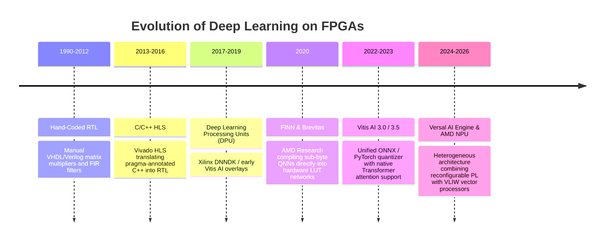

# 📜 FPGA Deployment: Historical Evolution & Paradigms

A didactic guide charting the progression of neural network acceleration on reconfigurable silicon: from hand-written RTL (VHDL/Verilog) and High-Level Synthesis (HLS) to coarse-grained DPU processor overlays (Vitis AI) and automated streaming dataflow compilation (FINN).

Related notes: [[topics/fpga-deployment/00-fpga-deployment-moc|FPGA Deployment MOC]], [[topics/gpu-deployment/00-gpu-deployment-moc|GPU Deployment MOC]].

---

## 1. Evolution Timeline: From RTL Hand-Coding to Foundation Quantization



---

## 2. Core Paradigm Breakthroughs Explained

### Breakthrough A: Overcoming Von Neumann Memory Bottlenecks
Traditional CPUs and GPUs are bound by the **Von Neumann bottleneck**: data must continuously traverse memory buses between off-chip RAM and compute ALUs.

FPGAs allow building **Spatial Compute Pipelines**:
- Data streams directly from the camera sensor into an on-chip pipeline of DSP multipliers and Block RAM (BRAM) FIFOs.
- Intermediate activation maps never leave the chip, reducing external memory bandwidth consumption and dynamic power draw by over 70%.

---

### Breakthrough B: DPU Overlays vs. Dedicated Synthesis
Historically, compiling a neural network onto an FPGA required full logic synthesis and place-and-route in Vivado, taking 4–12 hours per iteration.

The **DPU Overlay Paradigm** decoupled software from hardware:
1. Synthesize a parameterized multi-core DPU processor onto the FPGA fabric once.
2. Compile neural networks in software down to micro-instructions (`xmodel`).
3. Software updates take seconds without ever re-synthesizing the FPGA bitstream.

```mermaid
flowchart TD
    subgraph Traditional RTL / HLS Flow (4 to 12 Hours)
        Code[C++ / RTL Model Definition] --> VivadoSynth[Vivado Synthesis & Place-and-Route]
        VivadoSynth --> Bitstream[FPGA Bitstream (.bit)]
    end
    subgraph Modern DPU Overlay Flow (2 Minutes)
        FixedFabric[Pre-Instantiated DPU Hardware Overlay on FPGA]
        ONNX[Trained ONNX Model] --> VitisCompiler[Vitis AI Compiler]
        VitisCompiler --> Xmodel[Binary Instruction Stream (.xmodel)]
        Xmodel --> Execute[Execute on Static DPU Fabric at Runtime]
    end
```

---

### Breakthrough C: Sub-Byte Quantization (FINN & LUT-Net)
Standard architectures use 16-bit floating point or 8-bit integers. FINN demonstrates that for edge classification and anomaly detection, networks can be quantized down to **1-bit or 2-bit weights**.
- A 1-bit multiplication between weight $w \in \{-1, +1\}$ and activation $a \in \{-1, +1\}$ simplifies mathematically to a single **XNOR gate**.
- Thousands of operations execute concurrently inside the truth tables of 6-input FPGA Look-Up Tables (LUTs) with zero DSP slice utilization.
