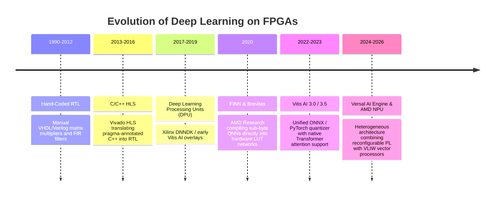
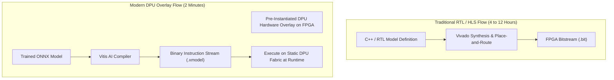
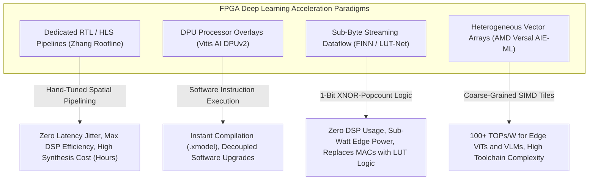

# 📜 FPGA Deployment: Historical Evolution & Paradigms

A didactic guide charting the progression of neural network acceleration on reconfigurable silicon: from hand-written RTL (VHDL/Verilog) and High-Level Synthesis (HLS) to coarse-grained DPU processor overlays (Vitis AI) and automated streaming dataflow compilation (FINN).

Related notes: [[topics/fpga-deployment/00-fpga-deployment-moc|FPGA Deployment MOC]], [[topics/gpu-deployment/00-gpu-deployment-moc|GPU Deployment MOC]].

---

## 1. Evolution Timeline: From RTL Hand-Coding to Foundation Quantization

---

## 2. Core Paradigm Breakthroughs Explained

### Breakthrough A: Overcoming Von Neumann Memory Bottlenecks
Traditional CPUs and GPUs are bound by the **Von Neumann bottleneck**: data must continuously traverse memory buses between off-chip RAM and compute ALUs.

FPGAs allow building **Spatial Compute Pipelines**:
- Data streams directly from the camera sensor into an on-chip pipeline of DSP multipliers and Block RAM (BRAM) FIFOs.
- Intermediate activation maps never leave the chip, reducing external memory bandwidth consumption and dynamic power draw by over 70%.

---

### Breakthrough B: DPU Overlays vs. Dedicated Synthesis
Historically, compiling a neural network onto an FPGA required full logic synthesis and place-and-route in Vivado, taking 4–12 hours per iteration.

The **DPU Overlay Paradigm** decoupled software from hardware:
1. Synthesize a parameterized multi-core DPU processor onto the FPGA fabric once.
2. Compile neural networks in software down to micro-instructions (`xmodel`).
3. Software updates take seconds without ever re-synthesizing the FPGA bitstream.

---

### Breakthrough C: Sub-Byte Quantization (FINN & LUT-Net)
Standard architectures use 16-bit floating point or 8-bit integers. FINN demonstrates that for edge classification and anomaly detection, networks can be quantized down to **1-bit or 2-bit weights**.
- A 1-bit multiplication between weight $w \in \{-1, +1\}$ and activation $a \in \{-1, +1\}$ simplifies mathematically to a single **XNOR gate**.
- Thousands of operations execute concurrently inside the truth tables of 6-input FPGA Look-Up Tables (LUTs) with zero DSP slice utilization.

---

## 3. Intensive Architectural Taxonomy: Convolutional vs Transformer vs Hybrid Sub-Modules

FPGA deep learning architectures have transitioned from bespoke register-transfer-level (RTL) pipelines and Vivado High-Level Synthesis (HLS) systolic arrays to parameterized Deep Processing Unit (DPU) processor overlays, sub-byte streaming dataflow engines (FINN), and heterogeneous coarse-grained AI Engine tiles.

### Comparative Sub-Module Architectural Matrix

| Model / System Name & Year | Architectural Paradigm | Backbone Sub-Module | Neck / Feature Aggregator | Encoder Sub-Module | Decoder / Head Sub-Module | Primary Bottleneck & Edge Suitability |
| :--- | :--- | :--- | :--- | :--- | :--- | :--- |
| **Roofline HLS 2D-CNN** (Zhang et al., 2015) | Dedicated Streaming Hardware / HLS | C++/Vivado HLS Unrolled 2D Convolution Stages | Dual-Port Block RAM (BRAM) Line-Buffer FIFO Neck | Systolic DSP48E2 Multiplier-Accumulator Array | On-Chip Classification Register & Hardwired Softmax Block | **DSP48 Slice Exhaustion**: Hardwired to fixed kernel shapes ($3\times3, 5\times5$); requires 4–8 hour re-synthesis per network architecture change. |
| **AMD Xilinx DPUv2 (DPUCZDX8G / Vitis AI)** (2020–2024) | Programmable DPU Processor Overlay | Parameterized Multi-Core Tensor Processing Engine (PE Array) | AXI4-Stream High-Performance Master Memory Crossbar | Reconfigurable INT8 Vector ALUs with Channel-Parallel DSP MACs | Instruction-Stream Driven Multi-Layer CNN Decoder (`.xmodel`) | **AXI Bus Memory Bandwidth**: Software-programmable in seconds; well-suited for industrial Zynq UltraScale+ edge vision ($15\text{--}30\,\text{W}$). |
| **FINN Dataflow Engine** (2018–2023) | Streaming Dataflow BNN Architecture | Streaming 1-bit / 2-bit Convolutional Pipeline Stages | On-Chip Inter-Layer Streaming FIFO Channels | Matrix-Vector Threshold Units (MVTU) mapped to Look-Up Tables (LUTs) | Popcount & Binary Sign Threshold Classification Head | **BRAM Capacity Bound**: Fully spatial pipeline; all weights stored in on-chip distributed RAM/BRAM; achieves $>100{,}000\,\text{FPS}$ at $<5\,\text{W}$. |
| **LUT-Net / LogicNet** (2020–2024) | Direct Boolean Logic Network | Direct mapping of trained quantized weights to 6-input FPGA LUTs (LUT6) | Skip-Connection Routing Crossbar Mesh | Truth-Table Parameterized Combinatorial Logic Gates | Single-Cycle Combinatorial Output Head ($<1\,\mu\text{s}$ latency) | **FPGA Routing Congestion**: Extreme logic minimization; zero DSP usage; routing density limits scalability to deep foundation backbones. |
| **DPU-Transformer (Vitis AI ViT)** (2023–2025) | Hybrid DPU + Soft-Attention IP | Fused INT8 GEMM DPU Engine + Softmax/LayerNorm Hardware Accelerator | AXI-Stream Ring Interconnect with Ping-Pong UltraRAM Buffers | Tiled Matrix Multiplication PE Array with Dynamic Scale Tracking | Multi-Head Self-Attention (MHSA) Query/Key Patch Decoder | **Softmax/LayerNorm Non-Linearity Bottleneck**: Non-linear activations require dedicated look-up table accelerators to prevent DSP pipeline stalls. |
| **AMD Versal AI Engine (AIE-ML)** (2024–2026) | Heterogeneous Coarse-Grained AI Array | 2D Array of VLIW/SIMD Vector AI Engine Tiles ($128\text{--}400$ Tiles) | Direct Streaming AXI-Stream Interconnect Grid with 32KB Local SRAM/Tile | Dual FP8 / INT8 Matrix Multiplication Accumulator Cores | Heterogeneous VLIW Multi-Modal Vision-Language Decoder | **Tile Mapping & Routing Bound**: State-of-the-art throughput-per-watt ($>100\,\text{TOPs/W}$); complex toolchain spatial compilation across tile memories. |

### Didactic Architectural Trade-Off Analysis

#### 1. Von Neumann Instruction Scheduling vs. Spatial Dataflow Hardware Pipelines
Unlike GPUs that time-multiplex a fixed pool of ALUs across instructions, FPGAs support **Spatial Dataflow Computing**. In a streaming dataflow pipeline (FINN), each layer of the neural network occupies a dedicated physical region of silicon fabric:

$$\text{Throughput} = f_{\text{clk}} \times \min_{l} \left( \frac{\text{Parallelism}_l}{\text{Work}_l} \right)$$

Inter-layer activations stream directly through on-chip BRAM FIFOs without ever writing back to external DRAM, slashing memory bus power consumption by $>75\%$.

In contrast, **DPU Overlays** trade spatial streaming for software flexibility. A single multi-core DPU IP core executes layer operations sequentially according to compiled micro-instructions, fetching weights and activations from off-chip LPDDR4/5 memory via AXI buses. This enables instant deployment of new ONNX models without FPGA re-synthesis, at the expense of memory bandwidth overhead.

#### 2. Sub-Byte Quantization: 1-Bit XNOR-Popcount vs. INT8 DSP Multipliers
- **XNOR-Net Logic Transformation**: In sub-byte quantized networks, floating-point inner products $\mathbf{w} \cdot \mathbf{a} = \sum w_i a_i$ with $w_i, a_i \in \{-1, +1\}$ are transformed into bitwise Boolean operations:

  $$\mathbf{w} \cdot \mathbf{a} = 2 \times \text{popcount}(\text{XNOR}(\mathbf{w}_{\text{bin}}, \mathbf{a}_{\text{bin}})) - N$$

  On an FPGA, a 6-input Look-Up Table (LUT6) computes the XNOR of multiple bit pairs in a single clock cycle ($<2\,\text{ns}$ propagation delay), allowing thousands of binary weights to evaluate simultaneously without consuming a single hardware DSP multiplier.
- **INT8 Non-Linear Scale Drift**: Modern DPU overlays utilize fixed-point INT8 quantization. Because transformer LayerNorm and Softmax operators contain exponential functions and division:

  $$\text{Softmax}(\mathbf{z})_i = \frac{e^{z_i - \max(\mathbf{z})}}{\sum_j e^{z_j - \max(\mathbf{z})}}$$

  FPGA architectures implement piecewise linear approximations (PWL) stored in dedicated BRAM lookup tables (LUTs) with FP32 accumulators to prevent numerical saturation.

#### 3. Hardware Deployment Friction on Edge Reconfigurable SoCs
- **BRAM / UltraRAM On-Chip Sizing**: On mid-range edge FPGAs (e.g., AMD Zynq UltraScale+ ZU3EG with 5.1 Mb BRAM), modern vision transformer backbones cannot store all weights on-chip. Designers must balance layer tiling parameters ($T_m, T_n, T_r, T_c$) to fit line buffers into BRAM while keeping DRAM AXI burst lengths optimal ($>64$ bytes).
- **Timing Closure & Clock Domain Crossing**: Integrating high-throughput MIPI-CSI2 camera pipelines ($200\,\text{MHz}$) with DPU processor cores ($300\text{--}400\,\text{MHz}$) requires asynchronous FIFO clock domain crossings (CDC) to guarantee zero frame drops and deterministic sub-millisecond real-time control.

---

Related notes: [[topics/fpga-deployment/00-fpga-deployment-moc|FPGA Deployment MOC]], [[topics/gpu-deployment/00-gpu-deployment-moc|GPU Deployment MOC]], [[topics/real-time-systems/00-real-time-systems-moc|Real-Time Systems MOC]].
