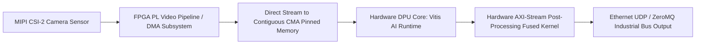

# 🛠️ FPGA Deployment: Production Pipeline, Traps & Workarounds

A practitioner's guide to compiling, debugging, and serving neural networks on Xilinx/AMD Zynq UltraScale+, Kria SoMs, and PCIe accelerator cards in production.

Related notes: [[topics/fpga-deployment/00-fpga-deployment-moc|FPGA Deployment MOC]], [[topics/real-time-systems/00-real-time-systems-moc|Real-Time Systems MOC]].

---

## 1. End-to-End Production Pipeline Architecture



---

## 2. Common Traps, Edge Cases & Hardware Bottlenecks

### Trap 1: Non-Standard Operators Falling Back to Host ARM CPU
- **Problem**: If an exported neural network contains an activation or layer unsupported by the DPU hardware architecture (e.g. dynamic shape slicing, certain GELU formulations, or custom deform convolutions), the Vitis AI compiler splits the graph. The unsupported layer falls back to the embedded ARM Cortex-A53 CPU, inducing severe memory bus round-trips and dropping frame rates by 90%.

### Trap 2: Contiguous Memory Allocation (CMA) Exhaustion
- **Problem**: The Linux kernel on embedded SoCs defaults to a small contiguous memory allocation pool (e.g., 64 MB). High-resolution image buffers and intermediate DPU tensors exceed this limit, causing runtime `bad_alloc` or kernel panic during video streaming.

### Trap 3: Thermal Throttling Induced Clock Gating
- **Problem**: Heavy DPU utilization can heat the FPGA die past $85^\circ\text{C}$ in passively cooled enclosures. The on-board PMIC throttles the PL clock frequency from 300 MHz down to 100 MHz, unexpectedly tripling inference latency.

---

## 3. Battle-Tested Engineering Workarounds

### Workaround 1: Operator Fusion & Layer Replacement Prior to Quantization
Before quantization, inspect model operators against the target DPU IP configuration table (e.g., DPUCZDX8G for Zynq UltraScale+). Swap unsupported operations in PyTorch:
- Replace non-standard activations with `ReLU` or `LeakyReLU`.
- Replace dynamic reshape operations with static flattening.

### Workaround 2: Expanding the Linux Kernel CMA Pool
Increase the contiguous memory pool in the bootloader device tree (`system-user.dtsi`) or Linux kernel command line:
```text
# Append to U-Boot bootargs / GRUB cmdline:
cma=512M
```
This guarantees contiguous physical memory pages for hardware DMA without page fault overhead.

### Workaround 3: Zero-Copy Direct DMA-BUF Ingestion
Never copy frames from V4L2 camera capture buffers into application user space and then back down to DPU memory. Export the camera V4L2 buffer as a file descriptor (`V4L2_MEMORY_MMAP`) and pass the physical DMA address directly to the Vitis AI runner:

```c++
// C++ Vitis AI Zero-Copy Ingestion Pattern
#include <vitis/ai/nnpp.hpp>
#include <xir/graph/graph.hpp>

// Bind camera physical DMA buffer directly to DPU input tensor address
vart::TensorBuffer* dpu_input_buf = runner->get_inputs()[0];
uint64_t dpu_physical_addr = dpu_input_buf->get_physical_addr();

// Trigger DMA transfer directly from sensor to DPU memory
ioctl(camera_fd, VIDIOC_QBUF, &v4l2_buf);
```
