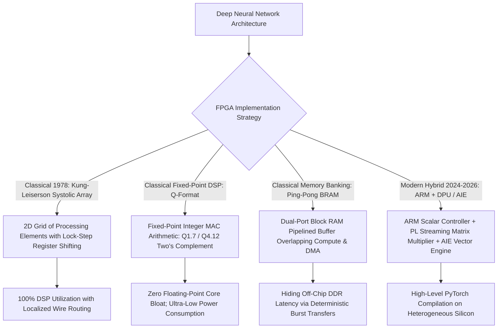

# 📐 FPGA Deployment: Fixed-Point Arithmetic, Systolic Arrays & Hybrids

A deep hardware-level examination of classical digital signal processing (DSP) techniques, fixed-point two's complement arithmetic ($Q$-format), Kung-Leiserson systolic array architectures, and hybrid CPU-FPGA dataflow pipelines.

Related notes: [[topics/fpga-deployment/00-fpga-deployment-moc|FPGA Deployment MOC]], [[topics/fpga-deployment/03-silicon-and-open-problems|AIE-ML Engines & Silicon Frontiers]].

---

## 1. Classical Digital Hardware DSP vs. Modern Deep Overlays

### Digital Arithmetic Implementation Trade-offs
| Arithmetic Format | Bit Width | Dynamic Range | Hardware Primitive Required | Latency (Clock Cycles) | Quantization Degradation |
| :--- | :--- | :--- | :--- | :--- | :--- |
| **IEEE-754 FP32** | 32-bit | $\sim 10^{\pm 38}$ | Multi-DSP Core Slice (Hard IP) | $3-5$ cycles | Baseline ($0.0\%$ drop) |
| **IEEE-754 FP16** | 16-bit | $\sim 10^{\pm 5}$ | Dedicated Vector Hard IP | $2-3$ cycles | $<0.1\%$ Top-1 drop |
| **Fixed-Point $Q4.12$**| 16-bit | $[-8.0, +7.9997]$ | Standard 18-bit DSP48E2 Multiplier | **1 cycle** | $<0.2\%$ Top-1 drop |
| **Fixed-Point $Q1.7$ (INT8)**| 8-bit | $[-1.0, +0.992]$ | 2 Multiplications packed in 1 DSP | **1 cycle (Dual MAC)** | $<0.5\%$ Top-1 drop |
| **Sub-Byte (Ternary / Binary)**| 1-2 bits| $\{-1, 0, +1\}$ | Zero DSPs (Pure 6-input LUTs) | **$<0.5$ cycles (Combinatorial)**| $1-3\%$ (Mitigated by QAT) |

---

## 2. Mathematical Formulations: Fixed-Point Arithmetic & Systolic Dataflow

### 1. Fixed-Point $Q_{m.n}$ Two's Complement Representation:
A signed real number $x \in \mathbb{R}$ is approximated as an integer $X \in \mathbb{Z}$ scaled by a fractional factor $2^{-n}$:
$$x \approx X \cdot 2^{-n} \implies X = \text{round}(x \cdot 2^n)$$
Where $m$ is the number of integer bits (defining dynamic range $[-2^{m-1}, 2^{m-1} - 2^{-n}]$) and $n$ is the fractional precision bit count.
- **Fixed-Point Multiplication**: Multiplying two $Q_{m.n}$ numbers yields a double-width product in $Q_{2m.2n}$:
  $$Z_{\text{raw}} = X \times Y \implies Z_{Q_{m.n}} = \left\lfloor \frac{Z_{\text{raw}}}{2^n} \right\rfloor = Z_{\text{raw}} \gg n$$
  Hardware implementation requires only a right bit-shift by $n$ bits, completely eliminating costly floating-point alignment units.

### 2. Kung-Leiserson Systolic Array Matrix Multiplication:
To compute $C = A \times B$ without memory bandwidth bottlenecks, a 2D grid of Processing Elements (PEs) executes lock-step Multiply-Accumulate (MAC) operations:
$$\text{At clock cycle } t: \quad c_{ij}^{(t+1)} = c_{ij}^{(t)} + a_{ik}^{(t)} \cdot b_{kj}^{(t)}$$
Inputs $a_{ik}$ stream horizontally from the left, while $b_{kj}$ stream vertically from the top. Every data element is reused across $N$ adjacent processing elements, reducing external memory access from $\mathcal{O}(N^3)$ to **$\mathcal{O}(N)$**, unlocking maximum clock frequencies ($>400\text{ MHz}$).

---

## 3. Production Hybrid Pattern: Classical Ping-Pong BRAM Pipelining

In edge FPGA accelerators (e.g. AMD Kria KV260), off-chip LPDDR4 memory access takes **$60-100\text{ ns}$**, which stalls systolic execution engines if data is read sequentially.

### The Classical Pipelining Solution:
1. Allocate two identical Dual-Port Block RAM buffers in the FPGA programmable logic fabric: **Bank A** and **Bank B**.
2. **Cycle $T$**:
   - DMA controller streams the next image tile from DDR into **Bank A** via AXI4-Master burst transfer.
   - Processing Engine computes convolution matrix multiplications out of **Bank B**.
3. **Cycle $T+1$ (Pointer Swap)**:
   - AXI crossbar swaps bank pointers in zero clock cycles.
   - DMA streams into **Bank B**, while Processing Engine reads from **Bank A**.
4. **Result**: 100% compute hardware saturation with zero pipeline stall bubbles.
