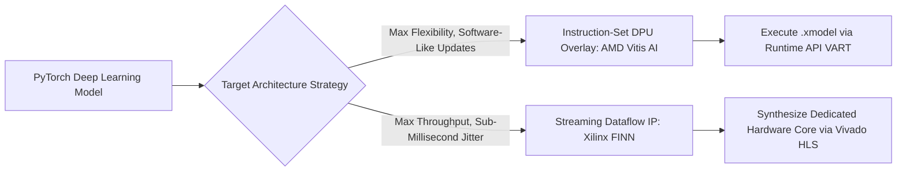

# FPGA Deployment: Historical Evolution & Reconfigurable Silicon

A didactic guide dissecting deep learning inference on reconfigurable silicon: contrasting traditional CPU/GPU Von Neumann architectures with spatial streaming dataflow, instruction-set DPU overlays, and extreme sub-byte quantization (FINN, Brevitas, LUTNet).

Related notes: [[topics/fpga-deployment/README|FPGA Deployment Playbook]], [[topics/gpu-deployment/README|GPU Deployment]].

---

## 1. Von Neumann vs Spatial Computing Architecture

Traditional CPUs and GPUs follow the **Von Neumann model**: instruction fetch -> decode -> execute -> memory writeback. This incurs massive energy and latency penalties fetching weights and activations back and forth across high-capacitance external buses (DDR/HBM).

```mermaid
flowchart TD
    subgraph Von Neumann (GPU / CPU)
        Memory[External DRAM / VRAM] <-->|Memory Bottleneck / Heat| Cache[L2/L3 Cache]
        Cache <--> ALU[ALU / CUDA Core Engine]
        Control[Instruction Decoder] --> ALU
    end
    subgraph Spatial Computing (FPGA Dataflow)
        Input[Sensor Input: MIPI / GigE] --> Layer1[Layer 1 Hardware Pipeline Registers]
        Layer1 --> Layer2[Layer 2 Hardware Pipeline Registers]
        Layer2 --> Layer3[Layer 3 Hardware Pipeline Registers]
        Layer3 --> Output[Actuation Output: PCIe / GPIO]
        WeightsOnChip[(On-Chip BRAM / URAM: Zero DDR Traffic)] -.-> Layer1
        WeightsOnChip -.-> Layer2
        WeightsOnChip -.-> Layer3
    end
```

---

## 2. The Two Dominant FPGA Deep Learning Paradigms



### Paradigm 1: Coarse-Grained DPU Overlays (AMD Vitis AI)
- **Concept**: Synthesizes a specialized domain-specific processor (Deep Learning Processing Unit - DPU) onto the FPGA fabric once.
- The DPU implements dedicated instructions for Convolution, Pooling, and Element-wise activation.
- Swapping models is as simple as compiling a model to an instruction stream (`.xmodel`) using the Vitis AI compiler.
- *Advantage*: Software engineers do not need to recompile the FPGA bitstream using Vivado HLS for each model tweak (which can take hours).

---

### Paradigm 2: Dedicated Streaming Dataflow (Xilinx FINN)
- **Concept**: Instantiates custom hardware logic for *every single layer* in the neural network.
- As activations exit Layer $k$, they stream directly into Layer $k+1$ via on-chip FIFOs without ever touching external memory.
- Enables extreme sub-millisecond execution (e.g. 4,200 FPS at 0.24ms for ResNet-50).


---

## 3. The Power of Sub-Byte Quantization (Brevitas & LUTNet)

Standard computing evaluates FP32 or INT8 math. However, FPGA fabric is fundamentally constructed from **Look-Up Tables (LUTs)** and **Flip-Flops (FFs)**.

- **Brevitas Quantization-Aware Training (QAT)**:
  - Models weights and activations down to 1-bit (Binarized Neural Networks - BNN) or 2-bit/4-bit representations.
  - Multiplication between a 1-bit activation and 1-bit weight simplifies from a massive DSP multiplier down to a single **XNOR logic gate**:
    $$\text{Bitwise XNOR: } 1 \times 1 = 1, \quad (-1) \times (-1) = 1, \quad 1 \times (-1) = -1$$
  - Accumulation reduces to a hardware **PopCount** (counting active high bits).
- **LUTNet**:
  - Compiles trained weights directly into the truth tables of 6-input LUTs (LUT6) on Xilinx UltraScale+ chips, bypassing arithmetic logic completely.
