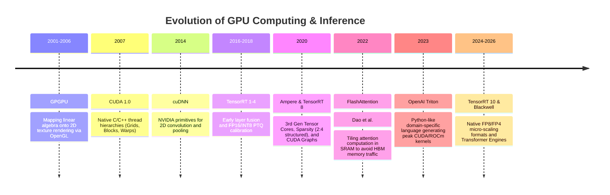
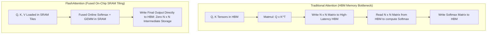
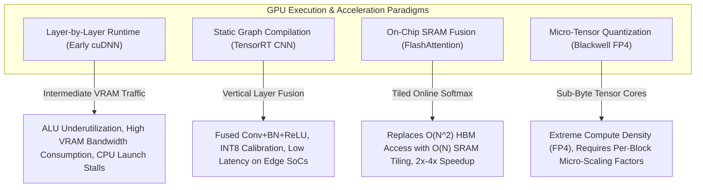

# 📜 GPU Deployment: Historical Evolution & Paradigms

A didactic review charting the journey of GPU acceleration: from early general-purpose computing with OpenGL/Cg shaders to native CUDA, layer-by-layer framework runtimes, static deep learning graph compilers (TensorRT), and automated kernel code generation (Triton).

Related notes: [[topics/gpu-deployment/00-gpu-deployment-moc|GPU Deployment MOC]], [[topics/real-time-systems/00-real-time-systems-moc|Real-Time Systems MOC]].

---

## 1. Evolution Timeline: From GPGPU Graphics Shaders to Triton & Blackwell



---

## 2. Core Paradigm Breakthroughs Explained

### Breakthrough A: Memory Hierarchy and the Roofline Model
GPU performance is fundamentally governed by two limits:
1. **Compute Bound**: The arithmetic processing ALUs/Tensor Cores are fully saturated (FLOPs/s).
2. **Memory Bandwidth Bound**: The ALUs are starved because data cannot be transferred from High-Bandwidth Memory (HBM/VRAM) to fast on-chip SRAM/Registers fast enough.

Most deep learning layers (LayerNorm, Softmax, ReLU, elementwise addition) are severely **memory bandwidth bound**. Stacking these layers sequentially wastes 80% of GPU clock cycles transferring intermediate tensors back and forth across the VRAM memory bus.

---

### Breakthrough B: FlashAttention Kernel Fusion (2022–2024)
Standard Multi-Head Attention computes $S = Q K^T$ and $P = \text{Softmax}(S)$, writing the massive $N \times N$ attention matrix out to slow HBM memory before multiplying by $V$.

Tri Dao et al. introduced **FlashAttention**:
- Splits queries, keys, and values into tiles that fit entirely inside fast on-chip **SRAM** (Shared Memory).
- Computes softmax incrementally using a running scaling factor (online softmax trick).
- Eliminates writing the intermediate $N \times N$ matrix to HBM entirely, accelerating attention by **$2\times - 4\times$** while cutting memory consumption from quadratic $O(N^2)$ to linear $O(N)$.



---

### Breakthrough C: CUDA Graphs (Zero CPU Launch Overhead)
In high-frame-rate or real-time pipelines, launching hundreds of small CUDA kernels sequentially from Python introduces severe CPU overhead ($5-10\mu\text{s}$ per kernel launch).

**CUDA Graphs** allow capturing the entire sequence of GPU kernels, memory copies, and stream events once. At runtime, the host CPU executes a single instruction:
```c++
cudaGraphLaunch(instance, stream);
```
The GPU executes the complete pipeline end-to-end without waiting for CPU instruction scheduling.

---

## 3. Intensive Architectural Taxonomy: Convolutional vs Transformer vs Hybrid Sub-Modules

GPU deep learning execution runtimes have evolved from naive layer-by-layer kernel launches and cuDNN convolution primitives to static graph-optimizing compilers (TensorRT), memory-hierarchy fused kernel engines (FlashAttention), Python-native block JIT compilers (Triton), and micro-scaled sub-byte hardware pipelines (Blackwell FP4).

### Comparative Sub-Module Architectural Matrix

| Model / System Name & Year | Architectural Paradigm | Backbone Sub-Module | Neck / Feature Aggregator | Encoder Sub-Module | Decoder / Head Sub-Module | Primary Bottleneck & Edge Suitability |
| :--- | :--- | :--- | :--- | :--- | :--- | :--- |
| **Layer-by-Layer cuDNN Engine** (2014–2017) | Primitive GPU Execution | cuDNN Standalone Convolution Forward Kernels | Sequential Global VRAM (HBM) Intermediate Buffers | Standard FP32 CUDA Cores (Scalar ALU Pipeline) | Unfused Softmax & Fully-Connected Classification Head | **Memory Bandwidth & Launch Bound**: Each layer writes intermediate tensors to VRAM; CPU kernel launch overhead ($5\text{--}10\,\mu\text{s}$/kernel) stalls GPU ALUs. |
| **TensorRT Static Fusion Engine** (2018–2022) | Static Graph Compiler (TRT-CNN) | Fused Conv-BatchNorm-ReLU Layer Nodes | Multi-Stream GPU Memory Allocator & Execution Graph | INT8 / FP16 Tensor Core GEMM Engines | Fused Plugin Non-Maximum Suppression (NMS) Head | **Static Tensor Shape Bound**: Eliminates intermediate VRAM writes via vertical/horizontal kernel fusion; runs at $>100\,\text{FPS}$ on Jetson Xavier/Orin. |
| **FlashAttention-1/2/3 Engine** (2022–2024) | Fused Memory-Hierarchy Kernel | Tiled On-Chip SRAM ($Q, K, V$) Buffer Loader | Shared Memory Online Softmax Rescaling Accumulator | Warp-Level Matrix Multiply and Accumulate (WMMA) Pipeline | Direct HBM Output Writer (Zero $N \times N$ VRAM Storage) | **SRAM Capacity & Register Pressure**: Transforms quadratic memory complexity $\mathcal{O}(N^2) \to \mathcal{O}(N)$; critical for high-resolution vision transformers. |
| **Triton JIT Compiler** (2022–2025) | Automated Block-Level GPU JIT | Python Block-Level SIMD Pointers & Tiling Engine | Automatic Shared Memory Bank-Conflict Free Aggregator | Parameterized MMA Hardware Instruction Generators | Custom High-Speed Fused LayerNorm / Attention Heads | **Compiler Heuristic Tuning**: Enables custom GPU kernel development without C++/CUDA; highly portable across diverse GPU micro-architectures. |
| **TensorRT-LLM / ViT-Foundation** (2024–2026) | Heterogeneous Foundation Runtime | Dual FP8 Tensor Core Engine with Transformer Engine Scale Factors | Paged Attention & Dynamic KV-Cache Memory Ring Neck | Fused Multi-Head Attention (FMHA) + SwiGLU MLP Kernels | Speculative Decoding & Continuous In-Flight Batching Head | **VRAM KV-Cache Capacity**: Sustains $>100\,\text{tokens/s}$ on 7B–14B vision-language models; fits within 30–60W embedded edge GPU budgets. |
| **Blackwell Micro-Tensor Engine** (2025–2026) | Micro-Scale Hardware Architecture | Dual-Die NVLink-C2C Streaming Interconnect Backbone | Micro-Tensor Scaling Block ($1\times16$ Vector Scale Factors) | 4-bit Floating Point (FP4/E2M1) Tensor Core Matrix ALUs | Hardware-Accelerated Multi-Modal Token Emission Head | **Arithmetic Intensity Bound**: Achieves $4\times$ throughput over FP8; micro-scale scaling preserves attention outlier precision on physical robotics. |

### Didactic Architectural Trade-Off Analysis



#### 1. Arithmetic Intensity & The GPU Roofline Model
The operational efficiency of any vision architecture on modern GPUs is governed by its **Arithmetic Intensity** ($I$):

$$I = \frac{\text{FLOPs}}{\text{Bytes of DRAM Transferred}} \quad \left[ \frac{\text{FLOP}}{\text{Byte}} \right]$$

On an NVIDIA Jetson AGX Orin (peak compute: $275\,\text{TOPS}$ INT8, memory bandwidth: $204.8\,\text{GB/s}$), the ridge point is:

$$I_{\text{ridge}} = \frac{275 \times 10^{12}}{204.8 \times 10^9} \approx 1342.7\,\text{FLOPs/Byte}$$

Standard convolutional layers ($3\times3$ with large channel counts) achieve high arithmetic intensity ($I > 200$) and operate near the compute-bound ceiling. In contrast, Transformer layers such as LayerNorm, GELU, and Softmax have an arithmetic intensity of $I \approx 1\text{--}2\,\text{FLOPs/Byte}$ — spending over 90% of execution time waiting for VRAM data transfers. Fusing these operators into single SRAM-resident kernels (FlashAttention) eliminates round-trip DRAM transactions, shifting memory-bound attention back toward the compute-bound regime.

#### 2. Numerical Precision Evolution: FP32 $\to$ FP16 $\to$ INT8 $\to$ FP8 $\to$ FP4
- **INT8 Post-Training Quantization (PTQ)**: Standard INT8 quantization maps FP32 activations $x \in [\alpha, \beta]$ to integers $q \in [-128, 127]$ via a single static scale factor $S$:

  $$q = \text{clip}\left( \left\lfloor \frac{x}{S} \right\rceil, -128, 127 \right)$$

  While effective for ConvNets, vision transformers exhibit severe activation outliers in specific channel dimensions (up to $100\times$ larger than median values). Static INT8 quantization causes massive clipping error, collapsing downstream accuracy.
- **FP8 / FP4 Micro-Scaling**: Modern architectures utilize FP8 formats (**E4M3** for forward activations, **E5M2** for gradient propagation) and FP4 (**E2M1**). By applying **micro-tensor block scaling** (assigning an independent FP8 scale factor to every contiguous group of 16 elements), Blackwell Tensor Cores preserve activation outlier dynamic range while delivering $4\times$ higher compute throughput.

#### 3. Real-Time Deployment Friction in Edge Vision Systems
- **CPU Kernel Launch Overhead**: Launching 150 individual CUDA kernels per frame at $10\,\mu\text{s}$ per launch consumes $1.5\,\text{ms}$ of CPU time. Capturing execution graphs into **CUDA Graphs** allows a single CPU ioctl command to trigger the entire pipeline, reducing CPU overhead to $<2\,\mu\text{s}$.
- **Dynamic Batching & Memory Allocation**: Uncontrolled `cudaMalloc` allocations inside video processing loops trigger GPU synchronization stalls. Production deployment requires pre-allocating static tensor memory pools or utilizing unified zero-copy memory pinned across CPU and GPU address spaces.

---

Related notes: [[topics/gpu-deployment/00-gpu-deployment-moc|GPU Deployment MOC]], [[topics/fpga-deployment/00-fpga-deployment-moc|FPGA Deployment MOC]], [[topics/real-time-systems/00-real-time-systems-moc|Real-Time Systems MOC]].
