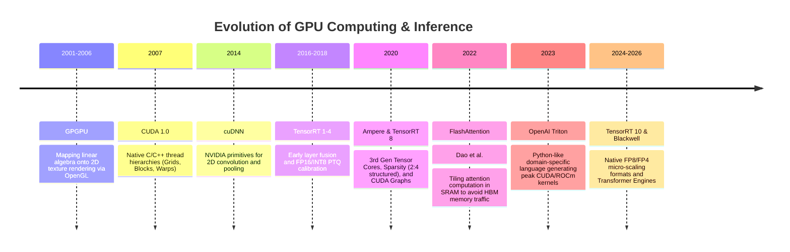

# 📜 GPU Deployment: Historical Evolution & Paradigms

A didactic review charting the journey of GPU acceleration: from early general-purpose computing with OpenGL/Cg shaders to native CUDA, layer-by-layer framework runtimes, static deep learning graph compilers (TensorRT), and automated kernel code generation (Triton).

Related notes: [[topics/gpu-deployment/00-gpu-deployment-moc|GPU Deployment MOC]], [[topics/real-time-systems/00-real-time-systems-moc|Real-Time Systems MOC]].

---

## 1. Evolution Timeline: From GPGPU Graphics Shaders to Triton & Blackwell



---

## 2. Core Paradigm Breakthroughs Explained

### Breakthrough A: Memory Hierarchy and the Roofline Model
GPU performance is fundamentally governed by two limits:
1. **Compute Bound**: The arithmetic processing ALUs/Tensor Cores are fully saturated (FLOPs/s).
2. **Memory Bandwidth Bound**: The ALUs are starved because data cannot be transferred from High-Bandwidth Memory (HBM/VRAM) to fast on-chip SRAM/Registers fast enough.

Most deep learning layers (LayerNorm, Softmax, ReLU, elementwise addition) are severely **memory bandwidth bound**. Stacking these layers sequentially wastes 80% of GPU clock cycles transferring intermediate tensors back and forth across the VRAM memory bus.

---

### Breakthrough B: FlashAttention Kernel Fusion (2022–2024)
Standard Multi-Head Attention computes $S = Q K^T$ and $P = \text{Softmax}(S)$, writing the massive $N \times N$ attention matrix out to slow HBM memory before multiplying by $V$.

Tri Dao et al. introduced **FlashAttention**:
- Splits queries, keys, and values into tiles that fit entirely inside fast on-chip **SRAM** (Shared Memory).
- Computes softmax incrementally using a running scaling factor (online softmax trick).
- Eliminates writing the intermediate $N \times N$ matrix to HBM entirely, accelerating attention by **$2\times - 4\times$** while cutting memory consumption from quadratic $O(N^2)$ to linear $O(N)$.

```mermaid
flowchart TD
    subgraph Traditional Attention (HBM Memory Bottleneck)
        Q1[Q, K Tensors in HBM] --> Matmul1[Matmul: Q x K^T]
        Matmul1 --> Write1[Write N x N Matrix to High-Latency HBM]
        Write1 --> Read1[Read N x N Matrix from HBM to compute Softmax]
        Read1 --> Write2[Write Softmax Matrix to HBM]
    end
    subgraph FlashAttention (Fused On-Chip SRAM Tiling)
        Q2[Q, K, V Loaded in SRAM Tiles] --> FusedKernel[Fused Online Softmax + GEMM in SRAM]
        FusedKernel --> Out[Write Final Output Directly to HBM: Zero N x N Intermediate Storage]
    end
```

---

### Breakthrough C: CUDA Graphs (Zero CPU Launch Overhead)
In high-frame-rate or real-time pipelines, launching hundreds of small CUDA kernels sequentially from Python introduces severe CPU overhead ($5-10\mu\text{s}$ per kernel launch).

**CUDA Graphs** allow capturing the entire sequence of GPU kernels, memory copies, and stream events once. At runtime, the host CPU executes a single instruction:
```c++
cudaGraphLaunch(instance, stream);
```
The GPU executes the complete pipeline end-to-end without waiting for CPU instruction scheduling.
