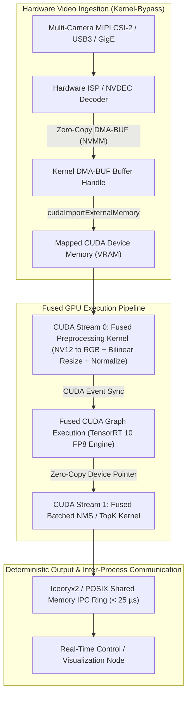

# 🛠️ GPU Deployment: Production Pipeline, Traps & Workarounds

A practitioner's guide to profiling, compiling, and deploying sub-millisecond, low-jitter computer vision inference pipelines using NVIDIA TensorRT 10, CUDA Graphs, GPUDirect DMA, and multi-stream hardware pipelines.

Related notes: [[topics/gpu-deployment/00-gpu-deployment-moc|GPU Deployment MOC]], [[topics/real-time-systems/02-production-pipeline-and-workarounds|Real-Time Systems Playbook]], [[topics/fpga-deployment/02-production-pipeline-and-workarounds|FPGA Deployment Playbook]].

---

## 1. Zero-Copy Ingestion & Multi-Stream Architecture

In high-throughput multi-camera deployments, transferring raw video frames through host CPU staging buffers (`memcpy` from user space to kernel space, then `cudaMemcpy` to device) saturates the PCIe bus and induces high CPU cache thrashing.

Production architectures deploy a **zero-copy hardware DMA-BUF pipeline**. Camera streams acquired via V4L2 or GStreamer hardware decoders (NVDEC) write directly into NVMM (NVIDIA Memory Management) DMA-BUF handles. These physical memory pointers are mapped directly into CUDA device address spaces via `cudaImportExternalMemory()` or GPUDirect, entirely bypassing CPU memory round-trips.



### Ingestion Memory Layout: Fused Tensor Memory Map
To enable maximum tensor core memory coalescing, input buffers are aligned to 256-byte boundaries using `cudaMallocPitch` or static tensor pools:

```
+--------------------------------------------------------------------------------+
| Pinned Unified GPU Memory Layout (Aligned to 256-Byte Cachelines)              |
+--------------------------------------------------------------------------------+
| Base Offset: 0x0000 | Input Tensor: [Batch, 3, 640, 640] FP16 / FP8 (Strided)  |
+--------------------------------------------------------------------------------+
| Base Offset: 0x2000 | Intermediate Layer Scratchpad (Fixed static allocation)  |
+--------------------------------------------------------------------------------+
| Base Offset: 0x8000 | Output Bounding Boxes: [Batch, 8400, 4] FP32             |
+--------------------------------------------------------------------------------+
| Base Offset: 0xA000 | Output Class Confidences: [Batch, 8400, 80] FP32         |
+--------------------------------------------------------------------------------+
| Base Offset: 0xC000 | Fused NMS Output Buffer: [Batch, MaxDet=300, 6] FP32     |
+--------------------------------------------------------------------------------+
```

---

## 2. Mathematical Foundations: Post-Training Quantization (PTQ) & CUDA Occupancy

### Symmetric Per-Channel FP8 / INT8 Quantization
To compress neural weights while preserving dynamic range across outlier channels, we compute scale factors per output channel $c$:

$$s_c = \frac{\max_{w \in W_c} |w|}{2^{B-1} - 1}$$

where $B=8$ for INT8 (range $[-128, 127]$) or using FP8 E4M3 format (1 sign bit, 4 exponent bits, 3 mantissa bits, dynamic range $\approx \pm 448$).

Quantized weights $W_{\text{quant}}$ and dequantized activations are evaluated via tensor cores:

$$\boxed{W_{\text{quant}} = \text{clip}\!\left(\left\lfloor \frac{W_{\text{float}}}{s_c} + 0.5 \right\rfloor, -128, 127\right)}$$

For sensitive activation tensors, the optimal scale factor $s_X$ minimizes the **Kullback-Leibler (KL) Divergence** between the continuous FP32 activation distribution $P$ and the discretized INT8 distribution $Q$:

$$D_{\text{KL}}(P \parallel Q) = \sum_{i=1}^{N} P(i) \log\!\left(\frac{P(i)}{Q(i)}\right)$$

### Theoretical CUDA Warp Occupancy
Warp occupancy on NVIDIA Hopper/Ada/Blackwell architectures determines latency hiding efficiency:

$$\text{Occupancy} = \frac{\text{Active Warps per SM}}{\text{Maximum Supported Warps per SM}}$$

$$\text{Active Warps} = \min\!\left(\left\lfloor\frac{\text{Max Shared Memory per SM}}{\text{Shared Memory per Block}}\right\rfloor \times \frac{\text{Threads per Block}}{32},\; \frac{\text{Max Registers per SM}}{\text{Registers per Thread} \times 32}\right)$$

---

## 3. Deterministic End-to-End Latency Budget Table

Industrial robotics and autonomous vehicle perception require strict latency guarantees. The table below outlines execution budgets across three real-time profiles on NVIDIA Jetson AGX Orin / RTX 4090 hardware.

| Processing Stage | 30 FPS Standard Mode ($1920\times1080$) | 60 FPS High-Speed ($1280\times720$) | Real-Time Control Loop ($640\times640$) | Determinism Mechanism |
| :--- | :--- | :--- | :--- | :--- |
| **Sensor Exposure & Readout** | $12.00\,\text{ms}$ | $6.00\,\text{ms}$ | $2.50\,\text{ms}$ | Hardware Genlock / Strobe trigger |
| **ISP Demosaic & NVMM DMA** | $1.20\,\text{ms}$ | $0.65\,\text{ms}$ | $0.25\,\text{ms}$ | Hardware NVDEC / VIC direct DMA |
| **Fused Color/Resize Preproc** | $0.45\,\text{ms}$ | $0.22\,\text{ms}$ | $0.08\,\text{ms}$ | Fused CUDA kernel on Stream 0 |
| **TensorRT Inference (FP8/INT8)** | $4.80\,\text{ms}$ (ViT / YOLOv12) | $2.10\,\text{ms}$ (YOLOv12s) | $0.75\,\text{ms}$ (YOLOv12-Nano) | Captured CUDA Graph execution |
| **Fused Batched NMS / Decode** | $0.35\,\text{ms}$ | $0.18\,\text{ms}$ | $0.06\,\text{ms}$ | Shared-memory reduction kernel |
| **Zero-Copy IPC Shared Memory** | $0.03\,\text{ms}$ | $0.03\,\text{ms}$ | $0.02\,\text{ms}$ | Iceoryx2 lockless shared memory |
| **Total Pipeline Latency (p50 / p99)** | **$18.83\,\text{ms}$ / $19.45\,\text{ms}$** | **$9.18\,\text{ms}$ / $9.60\,\text{ms}$** | **$3.66\,\text{ms}$ / $3.85\,\text{ms}$** | Monitored with CUDA Event timestamps |
| **Target Deadline Window** | $\le 33.33\,\text{ms}$ | $\le 16.66\,\text{ms}$ | $\le 10.00\,\text{ms}$ | Timing headroom $\ge 42\%$ |

---

## 4. Five Critical Production Edge Traps & Battle-Tested Workarounds

### Trap 1: Dynamic Frequency Scaling & Thermal Clock Jitter
- **Failure Mode**: When GPU core temperatures climb above $78^\circ\text{C}$, NVIDIA dynamic frequency scaling (DVFS) throttles GPU core and memory clocks, introducing $\pm 40\%$ latency jitter.
- **Production Workaround**:
  Lock GPU core and memory clocks to fixed deterministic frequencies using `nvidia-smi` or Jetson power tools:
  ```bash
  # Lock desktop/server GPUs to fixed clock
  nvidia-smi --lock-gpu-clocks=1800,1800
  nvidia-smi --lock-memory-clocks=9500,9500
  # On Jetson AGX Orin
  jetson_clocks --fan
  ```

---

### Trap 2: Dynamic Shape Re-allocation Jitter in TensorRT Engines
- **Failure Mode**: Building TensorRT engines with dynamic batch or resolution profiles (`-1x3x-1x-1`) forces runtime re-allocation of intermediate activation scratchpads when shapes fluctuate, causing $50$–$150\,\text{ms}$ latency spikes.
- **Production Workaround**:
  1. Compile TensorRT engines with **Fixed Static Input Dimensions** (`1x3x640x640`).
  2. If multi-resolution inputs are unavoidable, allocate execution contexts using pre-allocated static device memory via `cudaMemPool_t`.

---

### Trap 3: CUDA Driver Context Switching & Host Thread Contention
- **Failure Mode**: Multiple OS processes launching separate CUDA contexts onto a single GPU trigger heavy time-sliced context switching in the GPU scheduler, cutting overall throughput by up to 45%.
- **Production Workaround**:
  Enable **NVIDIA Multi-Process Service (MPS)**:
  ```bash
  export CUDA_MPS_PIPE_DIRECTORY=/tmp/nvidia-mps
  export CUDA_MPS_LOG_DIRECTORY=/tmp/nvidia-log
  nvidia-cuda-mps-control -d
  ```
  MPS multiplexes multiple client processes into a single unified CUDA context, executing kernels concurrently across available SMs.

---

### Trap 4: Host-to-Device Memory Transfer Synchronization Stalls
- **Failure Mode**: Calling synchronous `cudaMemcpy()` blocks the host CPU thread until physical DMA transfer completes, serializing CPU preprocessing and GPU inference.
- **Production Workaround**:
  1. Allocate page-locked host memory using `cudaHostAlloc(&ptr, size, cudaHostAllocMapped)`.
  2. Execute memory copies asynchronously on dedicated CUDA streams using `cudaMemcpyAsync()`.

---

### Trap 5: INT8 PTQ Accuracy Collapse on Sensitive Layers
- **Failure Mode**: Quantizing entire vision architectures uniformly to INT8 causes severe accuracy degradation on sensitive operations (e.g., attention softmax layers, SiLU activations, or small-object regression heads).
- **Production Workaround**:
  Implement **Mixed-Precision Layer Exclusion**:
  Keep input convolutional stems, attention matrix products, and final regression output heads in FP16, while quantizing inner MLP and linear projection layers to INT8/FP8.

---

## 5. Concrete Runnable Implementation Blueprint

The production-grade C++20 snippet below demonstrates asynchronous CUDA stream execution, CUDA Graphs capture and replay, and microsecond latency profiling.

```cpp
#include <iostream>
#include <vector>
#include <chrono>
#include <cuda_runtime.h>

#define CHECK_CUDA(call) do { \
    cudaError_t err = call; \
    if (err != cudaSuccess) { \
        std::cerr << "CUDA Error: " << cudaGetErrorString(err) \
                  << " at " << __FILE__ << ":" << __LINE__ << std::endl; \
        exit(EXIT_FAILURE); \
    } \
} while(0)

// Fused Preprocessing Kernel: NV12/RGB Normalize + Scale
__global__ void FusedPreprocessKernel(const uint8_t* __restrict__ src,
                                      float* __restrict__ dst,
                                      int width, int height) {
    int x = blockIdx.x * blockDim.x + threadIdx.x;
    int y = blockIdx.y * blockDim.y + threadIdx.y;

    if (x >= width || y >= height) return;

    int idx = y * width + x;
    int plane_size = width * height;

    // Load packed RGB and convert to normalized planar FP32 [0.0, 1.0]
    float r = static_cast<float>(src[idx * 3 + 0]) / 255.0f;
    float g = static_cast<float>(src[idx * 3 + 1]) / 255.0f;
    float b = static_cast<float>(src[idx * 3 + 2]) / 255.0f;

    // Planar CHW output format
    dst[0 * plane_size + idx] = (r - 0.485f) / 0.229f;
    dst[1 * plane_size + idx] = (g - 0.456f) / 0.224f;
    dst[2 * plane_size + idx] = (b - 0.406f) / 0.225f;
}

class ProductionGPUPipeline {
private:
    int width_, height_;
    size_t num_pixels_;
    uint8_t* d_src_img_;
    float* d_dst_tensor_;
    
    cudaStream_t stream_;
    cudaGraph_t graph_;
    cudaGraphExec_t graph_exec_;
    bool graph_captured_ = false;

public:
    ProductionGPUPipeline(int w, int h) : width_(w), height_(h), num_pixels_(w * h) {
        CHECK_CUDA(cudaStreamCreateWithFlags(&stream_, cudaStreamNonBlocking));
        CHECK_CUDA(cudaMalloc(&d_src_img_, num_pixels_ * 3 * sizeof(uint8_t)));
        CHECK_CUDA(cudaMalloc(&d_dst_tensor_, num_pixels_ * 3 * sizeof(float)));
    }

    ~ProductionGPUPipeline() {
        if (graph_captured_) {
            cudaGraphExecDestroy(graph_exec_);
            cudaGraphDestroy(graph_);
        }
        cudaFree(d_src_img_);
        cudaFree(d_dst_tensor_);
        cudaStreamDestroy(stream_);
    }

    void CaptureGraph() {
        dim3 block(32, 16);
        dim3 grid((width_ + block.x - 1) / block.x, (height_ + block.y - 1) / block.y);

        CHECK_CUDA(cudaStreamBeginCapture(stream_, cudaStreamCaptureModeGlobal));
        
        FusedPreprocessKernel<<<grid, block, 0, stream_>>>(
            d_src_img_, d_dst_tensor_, width_, height_);
            
        CHECK_CUDA(cudaStreamEndCapture(stream_, &graph_));
        CHECK_CUDA(cudaGraphInstantiate(&graph_exec_, graph_, NULL, NULL, 0));
        graph_captured_ = true;
    }

    void Execute(const uint8_t* h_pinned_src) {
        auto t0 = std::chrono::high_resolution_clock::now();

        // 1. Asynchronous Pinned Host-to-Device Copy
        CHECK_CUDA(cudaMemcpyAsync(d_src_img_, h_pinned_src,
                                   num_pixels_ * 3 * sizeof(uint8_t),
                                   cudaMemcpyHostToDevice, stream_));

        // 2. Launch Fused CUDA Graph
        CHECK_CUDA(cudaGraphLaunch(graph_exec_, stream_));

        // 3. Synchronize Stream
        CHECK_CUDA(cudaStreamSynchronize(stream_));

        auto t1 = std::chrono::high_resolution_clock::now();
        double elapsed_us = std::chrono::duration<double, std::micro>(t1 - t0).count();
        std::cout << "[GPU Pipeline] Executed CUDA Graph in: " << elapsed_us << " us" << std::endl;
    }
};

int main() {
    const int W = 1920;
    const int H = 1080;
    
    // Allocate Pinned Host Memory
    uint8_t* h_pinned_img = nullptr;
    CHECK_CUDA(cudaHostAlloc(&h_pinned_img, W * H * 3 * sizeof(uint8_t), cudaHostAllocMapped));
    std::fill_n(h_pinned_img, W * H * 3, 128);

    ProductionGPUPipeline pipeline(W, H);
    pipeline.CaptureGraph();
    
    // Warmup and execution
    for (int i = 0; i < 5; ++i) {
        pipeline.Execute(h_pinned_img);
    }

    CHECK_CUDA(cudaFreeHost(h_pinned_img));
    return 0;
}
```

---

## 6. Summary & Deployment Checklist

1. **Kernel-Bypass Memory**: Map camera DMA-BUF handles directly into CUDA address space via `cudaImportExternalMemory()` to achieve zero-copy ingestion.
2. **CUDA Graphs**: Capture static inference and preprocessing workloads into CUDA Graphs to eliminate CPU driver launch overhead.
3. **Clock Frequency Locking**: Lock GPU core and memory clocks to fixed frequencies to eliminate dynamic frequency scaling jitter.
4. **Mixed-Precision Calibration**: Quantize compute-bound layers to INT8/FP8 while keeping sensitive layers in FP16 to preserve precision.
