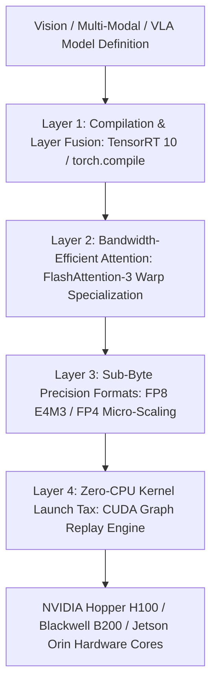

# ⚙️ GPU Deployment: Compilers, FP8/FP4 Precision & Open Frontiers

A deep systems investigation into modern four-layer GPU inference stacks, FlashAttention-3 Hopper/Blackwell hardware utilization, sub-byte FP8/FP4 precision formats, and unsolved deployment bottlenecks.

Related notes: [[topics/gpu-deployment/00-gpu-deployment-moc|GPU Deployment MOC]], [[architectures/real-time-unified/tensorrt-and-vulkan|TensorRT 10 & Vulkan Deep-Dive]].

---

## 1. The Modern Four-Layer GPU Inference Stack (2025–2026)

### Deep Component Breakdown
| Layer Component | Implementation Mechanism | Hardware Requirement | Throughput Impact | Primary Limitation |
| :--- | :--- | :--- | :--- | :--- |
| **FlashAttention-3** | Tensor Memory Accelerator (TMA) + Warp Specialization | NVIDIA Hopper+ (SM90+) | $1.5\times - 2.0\times$ over FA-2 | Requires fixed sequence shapes |
| **FP8 Precision (E4M3)**| 1 Sign, 4 Exponent, 3 Mantissa | Ada Lovelace, Hopper | $2.0\times$ over FP16 | Range spikes in norm/logit layers |
| **FP4 Micro-Scaling (NVFP4)**| 4-bit floating point with block scaling factors | Blackwell B200 / GB200 | $2.0\times$ over FP8 | Requires Blackwell Tensor Cores |
| **CUDA Graphs** | Host instruction replay bypassing Python driver | All CUDA GPUs | Saves $5-10\mu\text{s}$ per kernel | Dynamic shapes strictly forbidden |

---

## 2. FlashAttention-3 Mechanics on Hopper & Blackwell

FlashAttention-3 achieves up to **75% of theoretical peak GPU FLOPS** ($\sim 1.2\text{ PFLOPS}$ on H100) through two hardware upgrades:
1. **Asynchronous Tensor Memory Accelerator (TMA)**: Hardware DMA engine that transfers multidimensional tensors between global HBM and shared memory (SRAM) without wasting ALU registers.
2. **Warp Specialization**: Decouples GPU warps into dedicated "Producer Warps" (streaming data from TMA) and "Consumer Warps" (executing MMA matrix multiplication), eliminating synchronization stall bubbles.

---

## 3. Current Open Problems in GPU Inference Deployment

### 🔴 Problem 1: The "AOT Compilation Tax" (25–45 Minute Build Cycles)
- **The Failure Mode**: Ahead-of-Time (AOT) engine building in TensorRT (compiling layer fusions, kernel timing sweeps, and tactic selection) takes **25 to 45 minutes** for large multi-modal models.
- **Consequence**: Any change in production batch size, sequence profile, or PyTorch layer forces a costly recompilation build cycle, stalling CI/CD release pipelines.
- **Recent Frontier Solutions (2025–2026)**:
  - **Just-In-Time (JIT) Modular Compilation (Triton / SGLang)**: Compiling individual layer sub-graphs into cached shared objects, reducing iteration time to $<30\text{ seconds}$.

---

### 🔴 Problem 2: Dynamic Activation Outliers in Sub-Byte Quantization
- **The Failure Mode**: Quantizing vision-language models to FP8 or FP4 causes isolated activation channels to spike by $100\times$, exceeding the maximum representable dynamic range of E4M3 ($X_{\max} = 448$).
- **Consequence**: Clamping the outlier causes severe gradient clipping and classification degradation.
- **Recent Frontier Solutions**:
  - **Block-Level Micro-Scaling (NVFP4)**: Instead of a single scale factor for an entire tensor, assign independent 8-bit scale factors to micro-blocks of 16 contiguous elements.

---

### 🔴 Problem 3: Multi-Stream Contention & Triton Model Configuration Mismatch
- **The Failure Mode**: Deploying TensorRT engines inside Triton Inference Server frequently causes out-of-memory (OOM) crashes or CUDA driver locks when dynamic batching threads query multiple engines concurrently.
- **Active Research Direction**:
  - Coordinated hardware queue isolation using NVIDIA Multi-Instance GPU (MIG) and MPS process control daemons.
