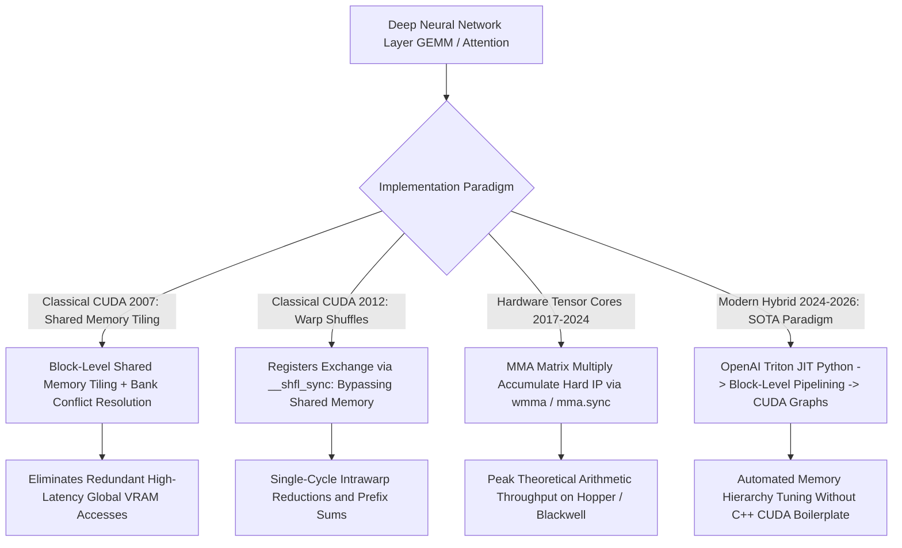

# 📐 GPU Deployment: Classical Memory Tiling, GEMM & Hybrids

A deep hardware-level investigation into classical parallel computing algorithms (Shared Memory Tiling, Memory Coalescing, Bank Conflict Avoidance, Warp Shuffles) and modern hybrid GPU compilation runtimes (TensorRT 10, Triton, FlashAttention).

Related notes: [[topics/gpu-deployment/00-gpu-deployment-moc|GPU Deployment MOC]], [[topics/gpu-deployment/03-compilers-and-open-problems|Compilers & Sub-Byte Quantization]].

---

## 1. Classical Parallel GPU Computing vs. Deep Learning Compilers



### GPU Compute Paradigms Compared
| Optimization Mechanism | Memory Hierarchy Level | Latency Tier | Primary Failure Mode | Typical Throughput Gain |
| :--- | :--- | :--- | :--- | :--- |
| **Global Memory Coalescing** | L2 Cache / Global VRAM | $200-400\text{ cycles}$ | Unaligned strided memory accesses | $5\times - 10\times$ vs. non-coalesced |
| **Shared Memory Tiling** | On-Chip SRAM (Shared Mem) | $20-30\text{ cycles}$ | 32-way Shared Memory Bank Conflicts | $4\times - 8\times$ vs. global memory |
| **Warp Shuffle Reductions** | Register File | **1 cycle** | Branch divergence within warp | $2\times - 3\times$ vs. shared memory reduce |
| **Tensor Cores (MMA)** | Hardened Matrix Multiplier | **Pipelined ALU** | Non-standard matrix dimensions (not multiple of 16)| $4\times - 16\times$ vs. CUDA FP32 cores |
| **CUDA Graphs Replay** | Host Driver Command Queue | **$<1\mu\text{s}$ (Zero CPU)**| Dynamic input shapes, host-side I/O | Eliminates $5-10\mu\text{s}$ launch tax per kernel |

---

## 2. Mathematical Formulations: Block-Tiled GEMM & Coalescing

### 1. Classical Block-Tiled General Matrix Multiply (GEMM):
To compute $C = A \times B$ where $A \in \mathbb{R}^{M \times K}$ and $B \in \mathbb{R}^{K \times N}$, naive execution performs $\mathcal{O}(M \cdot N \cdot K)$ global memory reads, causing catastrophic memory bus saturation.
By partitioning matrices into $B_{\text{size}} \times B_{\text{size}}$ tiles loaded into on-chip **Shared Memory (SRAM)**:
$$C_{\text{block}} = \sum_{k=0}^{K / B_{\text{size}} - 1} A_{\text{tile}}(k) \times B_{\text{tile}}(k)$$
Each global memory element is reused $B_{\text{size}}$ times by all threads in the thread block, cutting global DRAM bandwidth consumption by a factor of **$B_{\text{size}}$** (typically $32\times$ reduction).

### 2. Shared Memory Bank Conflict Elimination:
NVIDIA shared memory is divided into 32 independent memory banks of 4-byte (32-bit) words. If multiple threads in the same warp access different addresses within the same bank, accesses are serialized:
$$\text{Bank Index} = (\text{Byte Address} / 4) \pmod{32}$$
- **The Classical Padding Trick**: When allocating a shared memory array of width 32:
  ```cuda
  __shared__ float s_matrix[32][33]; // Pad stride by +1
  ```
  Adding $+1$ element offset guarantees that column accesses map to sequential banks: thread $i$ accesses bank $i$, completely eliminating bank conflict serialization.

---

## 3. Production Hybrid Pattern: Classical Coalesced Pre-Processing + TensorRT Execution

A common bottleneck in production computer vision (e.g. YOLOv12 or SAM 2 pipelines) is that **image pre-processing (bilinear resize, letterboxing, BGR-to-RGB conversion, normalization)** is executed on the CPU, causing the GPU to idle for $15\text{ ms}$ while waiting for tensors.

### The Production Hybrid Engine:
1. Ingest camera frames directly into a contiguous GPU buffer using NVIDIA V4L2 or DeepStream DMA-BUF.
2. Execute a hand-tuned **Fused Coalesced CUDA Kernel**:
   - Each thread computes one output pixel:
     $$I_{\text{norm}}(c, y, x) = \frac{I_{\text{raw}}(y, x, c) - \mu_c}{\sigma_c}$$
   - Memory loads use 128-bit vector reads (`float4` / `uchar4`) to saturate PCIe and L2 cache lines in $<0.25\text{ ms}$.
3. Pass the in-place device pointer directly to **TensorRT 10** via `enqueueV3()`.
4. **Result**: Replaces multi-millisecond OpenCV CPU transforms with a sub-millisecond, zero-copy, end-to-end GPU perception pipeline.
