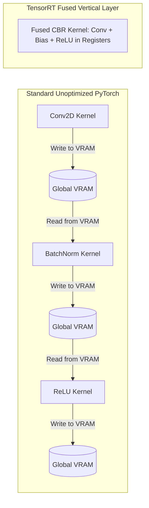

# GPU Deployment: Historical Evolution & Kernel Optimization

A didactic breakdown of high-performance GPU execution: analyzing the GPU memory hierarchy, kernel fusion in TensorRT, memory-bound vs compute-bound workloads, and the FlashAttention revolution.

Related notes: [[topics/gpu-deployment/README|GPU Deployment Playbook]], [[topics/real-time-systems/README|Real-Time Systems]].

---

## 1. The GPU Memory Wall & Roofline Model

Modern GPUs boast tens of thousands of compute ALUs (Streaming Multiprocessors - SMs). However, arithmetic execution speed has outpaced off-chip memory bandwidth (High Bandwidth Memory - HBM / VRAM).

### The Roofline Model:
A neural network layer is either:
1. **Compute-Bound**: Attains the peak mathematical throughput (FLOPs/sec) of the Tensor Cores (e.g. dense GEMM convolutions with large batch sizes).
2. **Memory-Bound**: Stalls waiting for memory buses to deliver weights/activations from VRAM to on-chip SRAM (e.g. LayerNorm, Softmax, Depthwise Convolutions, Pointwise Additions).

---

## 2. Kernel Fusion in TensorRT

In standard PyTorch, executing back-to-back operations launches separate CUDA kernels, each incurring global memory round-trips:

### What TensorRT Optimizes:
1. **Vertical Fusion**: Fuses Conv, Bias, and ReLU into a single CUDA threadblock. Activations remain in fast on-chip registers, eliminating 2 costly round-trips to off-chip VRAM.
2. **Horizontal Fusion**: Merges parallel convolutions operating on the same input into a single wider kernel.
3. **Precision Quantization (FP8 / INT8)**: Halves or quarters memory bandwidth requirements, doubling arithmetic operations executed per clock cycle.

---

## 3. The FlashAttention Revolution (Dao et al.)

Traditional Transformer Multi-Head Self-Attention is notoriously memory-bound:
$$\text{Attention}(Q, K, V) = \text{softmax}\left(\frac{QK^T}{\sqrt{d_k}}\right)V$$
In naive PyTorch implementations:
1. Compute $S = QK^T \in \mathbb{R}^{N \times N}$ and write it to global HBM memory.
2. Read $S$ from HBM, compute $P = \text{softmax}(S) \in \mathbb{R}^{N \times N}$, and write back to HBM.
3. Read $P$ and $V$ from HBM, compute $O = PV$, and write back to HBM.
For sequence length $N=4,000$, materializing $N \times N$ matrices in VRAM causes catastrophic memory traffic and $O(N^2)$ memory overhead.

### How FlashAttention Works:
- **Tiling**: Splits $Q, K, V$ into blocks that fit entirely inside fast on-chip **SRAM** (Shared Memory).
- **Online Softmax**: Computes softmax incrementally without writing the intermediate $N \times N$ attention matrix to global memory.
- Reduces memory accesses from $O(N^2)$ to $O(N)$, unlocking 2x–4x speedups on modern Ada Lovelace, Hopper, and Blackwell architectures.
