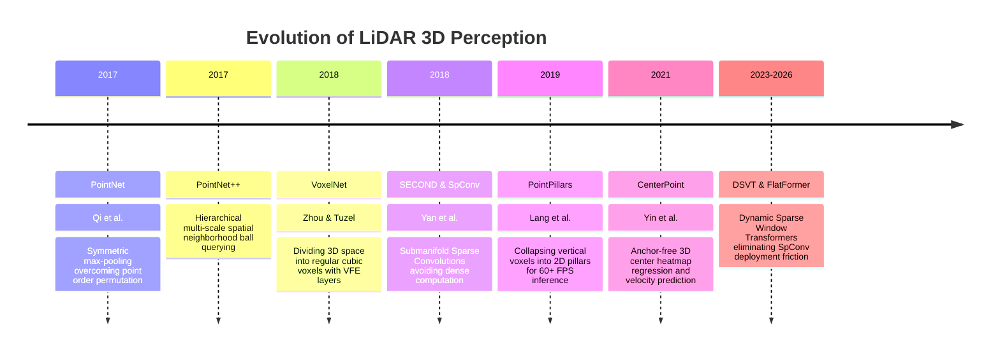

# 📜 LiDAR Perception: Historical Evolution & Paradigms

A didactic overview tracing the progression of 3D point cloud perception: from geometric KD-trees and PointNet permutation-invariant networks to Submanifold Sparse Convolutions (SpConv), Pillar BEV projection, and modern Dynamic Sparse Voxel Transformers.

Related notes: [[topics/lidar-perception/00-lidar-perception-moc|LiDAR Perception MOC]], [[topics/sensor-fusion/00-sensor-fusion-moc|Sensor Fusion MOC]].

---

## 1. Evolution Timeline: From PointNet to Sparse Voxel Transformers

---

## 2. Core Paradigm Breakthroughs Explained

### Breakthrough A: Permutation Invariance (PointNet, 2017)
A point cloud is an unordered set $\{p_1, \dots, p_N\}$. If the order of points is shuffled in memory, the underlying physical geometry remains unchanged. PointNet solved this using a symmetric aggregation function:
$$f(\{p_1, \dots, p_N\}) \approx g\left(\max_{i=1 \dots N} \{h(p_i)\}\right)$$
Where $h$ is a per-point multi-layer perceptron (MLP) and $\max$ is a channel-wise max pooling operation invariant to all $N!$ possible permutations.

---

### Breakthrough B: Submanifold Sparse Convolutions (SECOND / SpConv, 2018)
Standard 3D convolutions dilate sparse features into neighboring empty voxels. Within 2–3 convolutional layers, the entire 3D volume becomes dense, exhausting GPU memory.

Yan et al. introduced **Submanifold Sparse Convolutions**:
- An output site is computed **if and only if** the corresponding input site was non-empty.
- Maintains strict spatial sparsity throughout deep feature backbones, enabling training 20x faster than standard 3D CNNs.

---

### Breakthrough C: The 2D Pillar Representation (PointPillars, 2019)
Instead of operating in 3D, PointPillars collapses the vertical $Z$-axis into vertical columns (pillars):
1. Assign points to infinite vertical 2D grid cells $(x, y)$.
2. Compute a simplified PointNet on each pillar.
3. Scatter features back to a dense 2D Bird's-Eye-View (BEV) image.
4. Apply standard 2D CNN backbones.
- **Impact**: Enabled 60+ FPS 3D detection on embedded automotive hardware.

---

### Breakthrough D: Hardware-Friendly Sparse Transformers (DSVT, 2023–2026)
While SpConv dominated research, compiling custom sparse hash tables onto edge AI chips (e.g. automotive NPUs or FPGAs) was a deployment bottleneck. DSVT organizes sparse active voxels into uniform dynamic windows that compile natively into standard dense matrix multiplication operations (GEMM) supported by all hardware runtimes.
